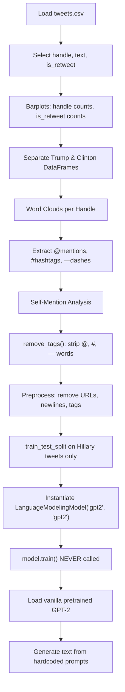

# Hillary Clinton and Donald Trump Tweets — EDA & Text Generation

> **Repository**: [https://github.com/pypi-ahmad/Natural-Language-Processing-Projects](https://github.com/pypi-ahmad/Natural-Language-Processing-Projects)

## 1. Project Overview

This project performs exploratory data analysis on tweets from Hillary Clinton (`HillaryClinton`) and Donald Trump (`realDonaldTrump`). It includes word clouds, mention/hashtag extraction, text preprocessing, and an attempt to set up GPT-2 fine-tuning for text generation using `simpletransformers`. The GPT-2 model is instantiated but **never trained** — text generation at the end uses the vanilla pretrained GPT-2, not a fine-tuned model.

## 2. Dataset

- **File**: `tweets.csv`
- **Source path**: `data/NLP Projects 24 - Hillary Clinton and Donald Trump Tweets/tweets.csv`
- **Key columns used**: `handle`, `text`, `is_retweet`
- The notebook filters to only these 3 columns: `df = df[['handle','text','is_retweet']]`

## 3. Pipeline Overview

1. Import libraries: `numpy`, `pandas`, `re`, `torch`, `seaborn`, `matplotlib`, `WordCloud`, `STOPWORDS`, `train_test_split`, `GPT2Config`, `GPT2LMHeadModel`, `GPT2Tokenizer`
2. Load CSV: `pd.read_csv(str(DATA_DIR / 'tweets.csv'))`
3. Explore: `.head()`, `.isna().sum()`
4. Select 3 columns: `handle`, `text`, `is_retweet`
5. Visualize: barplot of `handle` value counts, barplot of `is_retweet` value counts
6. Separate tweets: `realDonaldTrump = df[df.handle == 'realDonaldTrump']`, `hillaryClinton = df[df.handle == 'HillaryClinton']`
7. Generate word clouds for each handle using `get_word_cloud(df, c)` function
8. Extract words starting with `@` using `extract_words(df, c)` function
9. Extract words starting with `#` using `extract_words_(df, c)` function
10. Extract words starting with `—` (redefines `extract_words_`)
11. Self-mention analysis: filter tweets containing `'hillary'` / `'trump'` (case-insensitive via `.str.lower()`)
12. Define `remove_tags(t)` function: remove words starting with `@`, `#`, `—`
13. Text preprocessing: remove URLs (`http\S+|www.\S+`), newlines, and tags — applied to both `hillaryClinton` and `realDonaldTrump` DataFrames, stored in `text_prepro` column
14. `train_test_split(hillaryClinton['text_prepro'], test_size=0.05)` — splits Hillary tweets only
15. `!pip install simpletransformers==0.32.3`
16. Import `LanguageModelingModel` from `simpletransformers.language_modeling`
17. Instantiate `LanguageModelingModel('gpt2', 'gpt2', args=args)` with args including `num_train_epochs=10`, `train_batch_size=32`, `mlm=False`, `block_size=24`, `max_seq_length=24`
18. **No `model.train()` call** — the model is never trained
19. Reassign: `config, model, tokenizer = GPT2Config, GPT2LMHeadModel, GPT2Tokenizer` (overwrites the `model` variable)
20. Load pretrained GPT-2: `best_model = model.from_pretrained('gpt2')`
21. Generate text from 7 hardcoded prompts using `model.generate(...)` with `max_length=128`, `num_beams=2`, `repetition_penalty=5.0`
22. Two empty cells

## 4. Workflow Diagram



## 5. Core Logic Breakdown

| Step | Code | Details |
|------|------|---------|
| Load data | `pd.read_csv(str(DATA_DIR / 'tweets.csv'))` | No special encoding |
| Feature selection | `df = df[['handle','text','is_retweet']]` | 3 columns |
| Separate handles | `df[df.handle == 'realDonaldTrump']` | Two DataFrames |
| Word cloud | `get_word_cloud(df, c)` | Uses `STOPWORDS` from `wordcloud`, 800×400, black background |
| `extract_words` | Filters words starting with `@` | Prints first 10 |
| `extract_words_` | Filters words starting with `#`, later redefined for `—` | Function name reused |
| `remove_tags` | Removes words starting with `@`, `#`, `—` | Via list comprehension and `.split(" ")` |
| URL removal | `str.replace('http\S+\|www.\S+', '', case=False)` | Regex via pandas `.str.replace` |
| Train/test split | `train_test_split(hillaryClinton['text_prepro'], test_size=0.05)` | Hillary tweets only; X_train/X_test never used further |
| Model instantiation | `LanguageModelingModel('gpt2', 'gpt2', args=args)` | `LanguageModelingModel`, not `LanguageGenerationModel` |
| Model training | **Never called** | `model.train()` does not appear in the notebook |
| Variable overwrite | `config, model, tokenizer = GPT2Config, GPT2LMHeadModel, GPT2Tokenizer` | Overwrites `model` |
| Text generation | `model.generate(encoded_prompt, max_length=128, num_beams=2, repetition_penalty=5.0)` | Uses vanilla pretrained GPT-2 |

## 6. Model / Output Details

- No model is trained. The `LanguageModelingModel` is instantiated but `model.train()` is never called.
- Text generation uses the pretrained `GPT2LMHeadModel.from_pretrained('gpt2')` with no fine-tuning.
- No artifacts are saved. No LazyPredict or PyCaret pipeline is used.
- The 7 hardcoded prompts for generation are:
  - `"I will reduce Gun violence."`
  - `"Donald will build a wall"`
  - `"I will make our health care system better"`
  - `"Come rally with us"`
  - `"America is in financial stress"`
  - `"We have to preserve secularism"`
  - `"We will win the election"`

## 7. Project Structure

```
NLP Projects 24 - Hillary Clinton and Donald Trump Tweets/
├── Hillary Clinton and Donald Trump tweets (2).ipynb   # Main notebook
├── tweets.csv                                          # Dataset (also in data/ folder)
├── test_clinton_trump_tweets.py                        # Test file (95 lines)
└── README.md
```

## 8. Setup & Installation

```bash
pip install numpy pandas matplotlib seaborn wordcloud scikit-learn torch transformers simpletransformers==0.32.3
```

## 9. How to Run

1. Open `Hillary Clinton and Donald Trump tweets (2).ipynb` in Jupyter or VS Code
2. Run all cells sequentially
3. The notebook loads data from the `data/` directory (resolved via `_find_data_dir()`)
4. Text generation cells require a GPU or will run slowly on CPU

## 10. Testing

- **Test file**: `test_clinton_trump_tweets.py` (95 lines)
- **Test classes**:
  - `TestDataLoading` — verifies `tweets.csv` exists, loads without error, has `handle` and `text` columns
  - `TestPreprocessing` — checks text dtype, non-empty strings, basic cleaning, `handle` has multiple classes
  - `TestModel` — tests `TfidfVectorizer` and `MultinomialNB` fitting (note: the notebook does not use these — the tests are generic)
  - `TestPrediction` — tests prediction output and `predict_proba` shape

Run tests:
```bash
pytest "NLP Projects 24 - Hillary Clinton and Donald Trump Tweets/test_clinton_trump_tweets.py" -v
```

## 11. Limitations

- The GPT-2 model is **never trained** — `model.train()` is not called anywhere in the notebook, so the text generation uses the vanilla pretrained GPT-2 with no fine-tuning on the tweet data
- The `model` variable is overwritten: first assigned to a `LanguageModelingModel` instance, then reassigned to the `GPT2LMHeadModel` class
- `train_test_split` is called on Hillary tweets but the resulting `X_train` and `X_test` variables are never used
- The `extract_words_` function is defined twice (first for `#`, then for `—`), with the second definition silently overwriting the first
- The text generation loop has a bug: `token.encode(texts, ...)` encodes the entire `texts` list instead of the loop variable `text`
- No model persistence or metrics tracking
- `simpletransformers==0.32.3` is installed via `!pip install` inline, which may conflict with other packages
