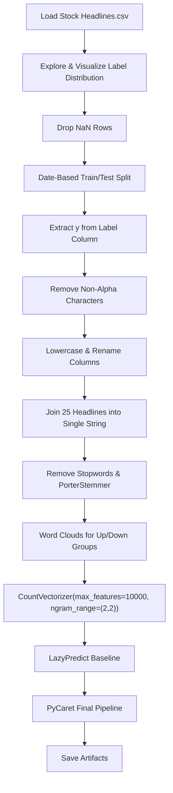

# Sentiment Analysis — Dow Jones (DJIA) Stock using News Headlines

> **Repository**: [https://github.com/pypi-ahmad/Natural-Language-Processing-Projects](https://github.com/pypi-ahmad/Natural-Language-Processing-Projects)

## 1. Project Overview

This project predicts whether the Dow Jones Industrial Average (DJIA) stock price went up or down/stayed the same on a given day, based on 25 daily news headlines. The notebook uses bigram bag-of-words features with `CountVectorizer` and selects a final model via LazyPredict and PyCaret.

## 2. Dataset

- **File**: `Stock Headlines.csv` (loaded with `encoding='ISO-8859-1'`)
- **Source path**: `data/NLP Project 21. Sentiment Analysis - Dow Jones (DJIA) Stock using News Headlines/Stock Headlines.csv`
- **Columns**: `Date`, `Label`, `Top1` through `Top25`
- `Label`: binary — `0` = stock price goes down or stays the same, `1` = stock price goes up

## 3. Pipeline Overview

1. Load CSV with `pd.read_csv(..., encoding='ISO-8859-1')`
2. Explore dataset: `.columns`, `.shape`, `.head(3)`
3. Visualize `Label` distribution with `sns.countplot`
4. Check for NaN values, drop NaN rows with `df.dropna(inplace=True)`
5. Copy dataframe, reset index
6. Date-based train/test split: train where `Date < '20150101'`, test where `Date > '20141231'`
7. Extract `y_train` / `y_test` from `Label`; keep headline columns `iloc[:, 3:28]`
8. Remove non-alphabetic characters with regex `[^a-zA-Z]`
9. Rename columns to `'0'` through `'24'`; convert all text to lowercase
10. Join all 25 headline columns into a single string per row
11. Build train and test corpus: tokenize by `.split()`, remove NLTK English stopwords, apply `PorterStemmer`
12. Generate word clouds for "up" and "down" headline groups
13. Create bag-of-words features with `CountVectorizer(max_features=10000, ngram_range=(2,2))` — bigrams only
14. LazyPredict baseline model comparison
15. PyCaret final pipeline (setup → compare → finalize)
16. Save model, vectorizer, and metrics to `artifacts/stock_sentiment_djia/`
17. Define `predict_text(text)` inference function
18. Run consistency checks and print summary

## 4. Workflow Diagram



## 5. Core Logic Breakdown

| Step | Code | Details |
|------|------|---------|
| Load data | `pd.read_csv(str(DATA_DIR / 'Stock Headlines.csv'), encoding='ISO-8859-1')` | ISO-8859-1 encoding |
| Date split | `train = df_copy[df_copy['Date'] < '20150101']` | String comparison, not datetime |
| Feature columns | `train.iloc[:, 3:28]` | 25 headline columns |
| Text cleaning | `train.replace(to_replace='[^a-zA-Z]', value=' ', regex=True, inplace=True)` | Removes all non-alpha chars |
| Stopword removal | `[word for word in words if word not in set(stopwords.words('english'))]` | Manual removal before vectorizer |
| Stemming | `PorterStemmer().stem(word)` | Applied to each word |
| Vectorizer | `CountVectorizer(max_features=10000, ngram_range=(2,2))` | Bigrams only; no `stop_words` param |
| LazyPredict | `LazyClassifier(verbose=0, ignore_warnings=True, custom_metric=None)` | Baseline comparison |
| PyCaret | `setup(data=df_ml, target='target', session_id=42, verbose=False)` | Final model selection |
| Persistence | `dump(final_model, ...)` / `dump(cv, ...)` | Saved to `artifacts/stock_sentiment_djia/` |

## 6. Model / Output Details

- LazyPredict selects the best baseline model by accuracy
- PyCaret trains and finalizes a model (exact model type depends on data at runtime)
- Artifacts saved: `model.joblib`, `vectorizer.joblib`, `metrics.json`
- Global registry updated at `artifacts/global_registry.json`

## 7. Project Structure

```
NLP Project 21. Sentiment Analysis - Dow Jones (DJIA) Stock using News Headlines/
├── Stock Sentiment Analysis.ipynb      # Main notebook
├── Stock Headlines.csv                 # Dataset (also in data/ folder)
├── test_stock_sentiment.py             # Test file (75 lines)
└── README.md
```

## 8. Setup & Installation

```bash
pip install numpy pandas matplotlib seaborn nltk scikit-learn wordcloud lazypredict pycaret joblib
```

NLTK data downloads used in the notebook:
```python
nltk.download('stopwords')
```

## 9. How to Run

1. Open `Stock Sentiment Analysis.ipynb` in Jupyter or VS Code
2. Run all cells sequentially
3. The notebook loads data from the `data/` directory (resolved via `_find_data_dir()`)
4. Trained model and metrics are saved to `artifacts/stock_sentiment_djia/`

## 10. Testing

- **Test file**: `test_stock_sentiment.py` (75 lines)
- **Test classes**:
  - `TestDataLoading` — verifies CSV file exists, loads without error, has `Label` and `Top1` columns, label is binary
  - `TestPreprocessing` — tests headline concatenation and text cleaning
  - `TestModel` — tests `CountVectorizer` on headlines and `RandomForestClassifier` fitting
  - `TestPrediction` — tests prediction output produces binary values

Run tests:
```bash
pytest "NLP Project 21. Sentiment Analysis - Dow Jones (DJIA) Stock using News Headlines/test_stock_sentiment.py" -v
```

## 11. Limitations

- Date-based split uses string comparison (`'20150101'`), not proper datetime parsing
- Stopwords are removed manually in the corpus-building loop, but `CountVectorizer` has no `stop_words` parameter — stopwords are already gone by that point
- `PorterStemmer` is instantiated once outside the train corpus loop but the identical stemming logic is duplicated separately for the test corpus
- Headline columns are selected by position `iloc[:, 3:28]` — fragile if column order changes
- Word cloud generation indexes into `down_words[1]` and `up_words[5]` with hardcoded indices — will fail if fewer rows exist in that label group
- The preprocessing loop joins columns via string iteration and `.split()` rather than using pandas vectorized operations
