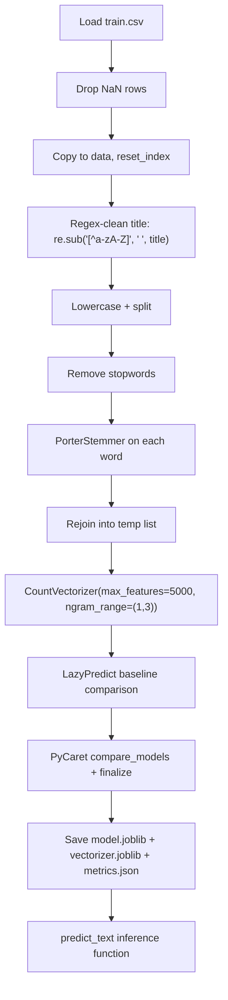

# Fake News Detection

> **Repository**: [https://github.com/pypi-ahmad/Natural-Language-Processing-Projects](https://github.com/pypi-ahmad/Natural-Language-Processing-Projects)

## 1. Project Overview

Classifies news articles as real or fake using their `title` text. The notebook cleans titles with regex and Porter stemming, vectorises with `CountVectorizer`, then runs LazyPredict and PyCaret to select and persist the best classifier.

## 2. Dataset

| Item | Value |
|------|-------|
| File | `train.csv` |
| Path | `data/NLP Projecct 15.FakeNews Detection Model/train.csv` |
| Key columns | `id`, `title`, `author`, `text`, `label` |
| Label encoding | `label` — 0 = reliable, 1 = unreliable |

## 3. Pipeline Overview

| Step | Cell(s) | Description |
|------|---------|-------------|
| 1 | 1 | Data-directory resolution (`_find_data_dir()`) |
| 2 | 2–4 | Import pandas, load `train.csv` into `df`, `df.head()` |
| 3 | 5–8 | Split features (`X = df.drop('label', axis=1)`) and target (`y = df['label']`) |
| 4 | 9 | Check `df.shape` |
| 5 | 10 | Import `CountVectorizer`, `TfidfVectorizer`, `HashingVectorizer` |
| 6 | 11–14 | Drop NaN rows, copy to `data`, `reset_index` |
| 7 | 15 | Inspect `data['title'][10]` |
| 8 | 16–17 | NLTK stopwords + `PorterStemmer`: regex-clean titles, lowercase, split, stem, rejoin into `temp` list |
| 9 | 18–19 | Print stopwords; inspect a cleaned title |
| 10 | 20–24 | `CountVectorizer(max_features=5000, ngram_range=(1,3))` → fit_transform `temp` → `X` array; extract `y = data['label']` |
| 11 | 25 | Import matplotlib |
| 12 | 27 | LazyPredict baseline comparison (`LazyClassifier`) |
| 13 | 28 | PyCaret `setup` / `compare_models` / `finalize_model` |
| 14 | 30 | Save `model.joblib`, `vectorizer.joblib`, `metrics.json`; update `global_registry.json` |
| 15 | 31 | Define `predict_text(text)` inference function |
| 16 | 32 | Consistency assertions and summary printout |

## 4. Workflow Diagram



## 5. Core Logic Breakdown

### Text cleaning (Cell 17)
```python
ps = PorterStemmer()
temp = []
for i in range(0, len(data)):
    review = re.sub('[^a-zA-Z]', ' ', data['title'][i])
    review = review.lower()
    review = review.split()
    review = [ps.stem(word) for word in review if not word in stopwords.words('english')]
    review = ' '.join(review)
    temp.append(review)
```
Operates on the `title` column only. The `text` column is not used for vectorisation.

### Vectorisation (Cell 20)
```python
cv = CountVectorizer(max_features=5000, ngram_range=(1,3))
X = cv.fit_transform(temp).toarray()
```

### Inference (Cell 31)
```python
def predict_text(text):
    vec = cv.transform([text])
    return final_model.predict(vec)
```

## 6. Model / Output Details

- **LazyPredict** selects best model by accuracy from dozens of classifiers.
- **PyCaret** runs `compare_models(n_select=1)` with `session_id=42`, then `finalize_model`.
- Artifacts saved to `artifacts/fake_news_detection/`:
  - `model.joblib` — finalized PyCaret model
  - `vectorizer.joblib` — fitted `CountVectorizer` (`cv`)
  - `metrics.json` — accuracy, F1, precision, recall from both pipelines

## 7. Project Structure

```
NLP Projecct 15.FakeNews Detection Model/
├── Fake News Detection.ipynb   # Main notebook
├── test_fake_news.py           # Test suite (95 lines)
├── train.csv                   # Dataset (local copy)
└── README.md
data/NLP Projecct 15.FakeNews Detection Model/
└── train.csv                   # Dataset (canonical location)
artifacts/fake_news_detection/
├── model.joblib
├── vectorizer.joblib
└── metrics.json
```

## 8. Setup & Installation

```
pip install pandas numpy scikit-learn nltk matplotlib lazypredict pycaret joblib
```

NLTK data required:
```python
import nltk
nltk.download('stopwords')
```

## 9. How to Run

1. Open `Fake News Detection.ipynb` in Jupyter.
2. Run all cells sequentially (the data-directory cell auto-resolves the CSV path).
3. The notebook saves artifacts to `artifacts/fake_news_detection/`.

## 10. Testing

| File | Classes | Line count |
|------|---------|------------|
| `test_fake_news.py` | `TestDataLoading`, `TestPreprocessing`, `TestModel`, `TestPrediction` | 95 |

Run:
```
pytest "NLP Projecct 15.FakeNews Detection Model/test_fake_news.py" -v
```

## 11. Limitations

- Only the `title` column is used for classification; the `text` body column is loaded but never vectorised.
- `CountVectorizer` is used despite importing `TfidfVectorizer` and `HashingVectorizer` — those two are unused.
- `ngram_range=(1,3)` with `max_features=5000` may produce a sparse feature space that under-represents trigrams.
- The cleaning loop variable is named `review` even though the data is news titles.
- No explicit train/test split before the LazyPredict step — the full cleaned dataset is passed to `CountVectorizer`, and splitting happens inside the standardised pipeline cells.
- `cv.get_feature_names()` is deprecated in newer scikit-learn; should use `get_feature_names_out()`.
