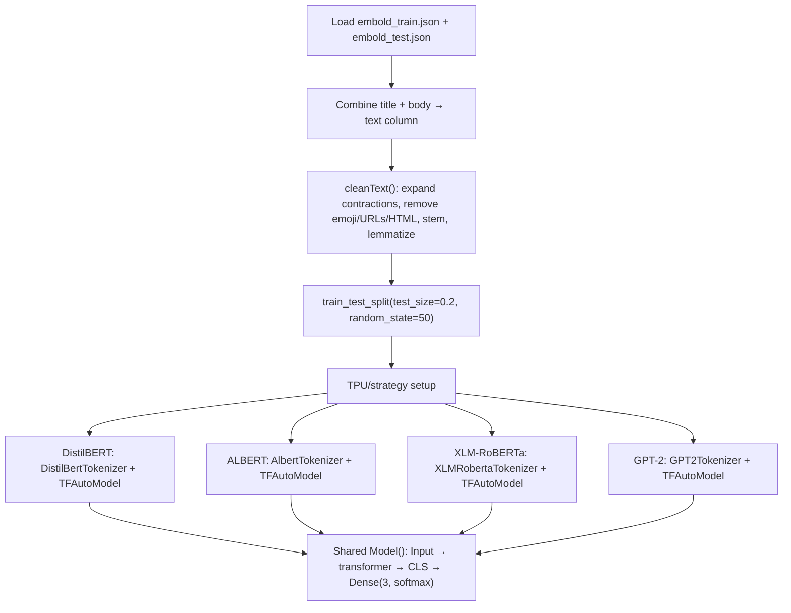

# GitHub Bugs Prediction using Transformers

> **Repository**: [https://github.com/pypi-ahmad/Natural-Language-Processing-Projects](https://github.com/pypi-ahmad/Natural-Language-Processing-Projects)

## 1. Project Overview

This notebook attempts **3-class bug priority classification** (labels 0, 1, 2) on GitHub issue data using four transformer models: DistilBERT, ALBERT, XLM-RoBERTa, and GPT-2. It loads JSON data from the Kaggle "GitHub Bugs Prediction" dataset, applies text preprocessing (contraction expansion, emoji removal, stemming, lemmatization), tokenizes with each model's tokenizer, and defines a shared `Model()` function for training. The notebook contains multiple runtime-breaking bugs that prevent execution.

## 2. Dataset

| Item | Value |
|------|-------|
| Source | [Kaggle: GitHub Bugs Prediction](https://www.kaggle.com/anmolkumar/github-bugs-prediction/download) |
| Files | `embold_train.json`, `embold_test.json`, `embold_train_extra.json` |
| Data path | `data/NLP Projects 33 - GitHub Bugs Prediction/` |
| Key columns | `title`, `body`, `label` (values: 0, 1, 2) |

The notebook creates a combined `text` column via `train['text'] = train['title'] + " " + train['body']`.

## 3. Pipeline Overview

1. **Data directory setup** — resolve path via `_find_data_dir()`
2. **Install dependencies** — `!pip install BeautifulSoup4` and `!pip install pydot`
3. **Import libraries** — pandas, numpy, nltk, sklearn, tensorflow, keras, transformers, tokenizers, BeautifulSoup
4. **Load JSON data** — `pd.read_json()` for train, test, and train_extra files
5. **Create text column** — concatenate `title` + `body`
6. **Define contraction dictionary** — `dictn` with ~120 entries
7. **Define preprocessing functions** — `expand_contractions()`, `removeEmoji()`, `removePunctuations()`, `remove_special_chars()`, `removeNonenglishCharac()`, `cleanText()`
8. **Apply text cleaning** — `train['text'].apply(lambda x: cleanText(x))`
9. **Train/val split** — `train_test_split(train['text'], y_train, test_size=0.2, random_state=50)`
10. **TPU/strategy setup** — attempt TPU, fallback to default strategy
11. **Define hyperparameters** — `epochs=3`, `bath_size=16 * replicas`, `max_len=192` (later overridden to 512)
12. **Define `quickEnc()`** — tokenize text using `batch_encode_plus(pad_to_max_length=True, max_length=max_len)`
13. **Define `Model()` function** — Input → transformer → CLS token → Dense(3, softmax), compiled with `sparse_categorical_crossentropy`
14. **DistilBERT block** — `DistilBertTokenizer` + `TFAutoModel` from `'distilbert-base-multilingual-cased'`
15. **ALBERT block** — `AlbertTokenizer` + `TFAutoModel` from `'albert-base-v1'`
16. **XLM-RoBERTa block** — `XLMRobertaTokenizer` + `TFAutoModel` from `'xlm-roberta-base'`
17. **GPT-2 block** — `GPT2Tokenizer` + `TFAutoModel` from `'gpt2-medium'`

## 4. Workflow Diagram



## 5. Core Logic Breakdown

### `func(x)`
Concatenates `x['title'] + " " + x['body']` to create the `text` column.

### `expand_contractions(text, c_re)`
Uses compiled regex from `dictn` keys. **Bug**: the inner `replace()` function references `cList` which is undefined — the dictionary is named `dictn`.

### `removeEmoji(s)`
Regex to strip Unicode emoji ranges.

### `remove_special_chars(d)`
Uses BeautifulSoup for HTML parsing, strips URLs, @mentions, `org.apache.`-style strings, and `#` prefixes.

### `cleanText(d)`
- Calls `unidecode(d)`, `expand_contractions(d)`, `TweetTokenizer().tokenize(d)`
- Filters tokens by length > 2 and not in `sw_list`
- Calls `remove_special_chars()`, `removeEmoji()`
- Applies `PorterStemmer` and `WordNetLemmatizer`
- **Bug**: calls `Porterstem()` instead of `PorterStemmer()`

### `quickEnc(t, token, maxlen)`
Calls `token.batch_encode_plus()` with `pad_to_max_length=True`, `max_length=max_len`, `truncation=True`. Returns numpy array of input IDs.

### `Model(transformer, X_train, X_val, batch_size, img_name, max_len=512)`
- Input layer → transformer output → extract CLS token `seq_out[:,0,:]` → `Dense(3, activation='softmax')`
- Loss: `sparse_categorical_crossentropy`
- Optimizer: `Adam(lr=1e-5)`
- **Bug**: uses `inp_words_ids` in `Model(inputs=...)` but the variable is named `inp_w`
- **Bug**: function name `Model` shadows `keras.Model`

### `delObects(*args)`
Deletes objects and calls `gc.collect()`.

## 6. Model / Output Details

- **Classification type**: 3-class (labels 0, 1, 2)
- **Output activation**: `Dense(3, activation='softmax')`
- **Loss**: `sparse_categorical_crossentropy`
- **Four transformer models attempted**:
  1. `distilbert-base-multilingual-cased` (DistilBertTokenizer)
  2. `albert-base-v1` (AlbertTokenizer)
  3. `xlm-roberta-base` (XLMRobertaTokenizer)
  4. `gpt2-medium` (GPT2Tokenizer)
- **Note**: `BertWordPieceTokenizer` is imported from `tokenizers` but never used
- No model is saved to disk; no evaluation metrics are computed

## 7. Project Structure

```
NLP Projects 33 - GitHub Bugs Prediction/
├── github-bugs-prediction-using-transformer.ipynb  # Main notebook
├── test_github_bugs.py                             # Test file (89 lines)
├── Link to dataset .txt                            # Kaggle download URL
└── README.md
data/NLP Projects 33 - GitHub Bugs Prediction/
├── embold_train.json
├── embold_test.json
├── embold_train_extra.json
├── sample submission.csv
└── Link to dataset .txt
```

## 8. Setup & Installation

```
pip install pandas numpy nltk scikit-learn tensorflow transformers tokenizers beautifulsoup4 unidecode tqdm pydot
```

NLTK data required:
```python
import nltk
nltk.download('punkt')
nltk.download('stopwords')
nltk.download('wordnet')
```

## 9. How to Run

1. Place dataset files in `data/NLP Projects 33 - GitHub Bugs Prediction/`
2. Open `github-bugs-prediction-using-transformer.ipynb` in Jupyter
3. **The notebook will not run successfully** — see Limitations for the list of runtime bugs that must be fixed first

## 10. Testing

| Item | Value |
|------|-------|
| Test file | `test_github_bugs.py` |
| Line count | 89 |
| Framework | pytest |

**Test classes:**

- `TestDataLoading` — checks `embold_train.json` and `embold_test.json` exist and load, verifies columns `title`, `body`, `label`
- `TestPreprocessing` — checks `title` column is string dtype, non-empty, label has ≥2 unique values
- `TestModel` — `TfidfVectorizer(max_features=100)` on 200 title rows, fits `MultinomialNB`
- `TestPrediction` — verifies `MultinomialNB` prediction output length on 10 samples

Run:
```
pytest "NLP Projects 33 - GitHub Bugs Prediction/test_github_bugs.py" -v
```

## 11. Limitations

The notebook contains **multiple runtime-breaking bugs**:

1. **`expand_contractions()`** — references `cList` but the dictionary variable is named `dictn`; raises `NameError`
2. **`cleanText()`** — calls `Porterstem()` instead of `PorterStemmer()`; raises `NameError`
3. **`Model()` function** — uses `inp_words_ids` in `Model(inputs=inp_words_ids, ...)` but the actual variable is `inp_w`; raises `NameError`
4. **`Model` name collision** — the function `Model()` shadows the imported `from tensorflow.keras.models import Model`
5. **`train_df` undefined** — `y_train = train_df['label']` but only `train` is defined; raises `NameError`
6. **`BATCH_SIZE` undefined** — all transformer blocks use `BATCH_SIZE` but the variable is defined as `bath_size` (typo); raises `NameError`
7. **ALBERT block syntax error** — mismatched parentheses in `tf.data.Dataset.from_tensor_slices((X_train_enc, y_train)` — missing closing `)` before `.repeat()`
8. **ALBERT block typo** — `max+len` instead of `max_len`; raises `TypeError`
9. **DistilBERT block** — `delObects(..., X_val_enc, ...)` but variable is named `X_val_ebc`; raises `NameError`
10. **Import syntax** — `from tensorflow.keras.layers import LSTM, Dense,` has trailing comma with no next element
11. **`BertWordPieceTokenizer`** — imported but never used (dead import)
12. **`embold_train_extra.json`** — loaded but never used
13. **`max_len`** — initially set to 192 then overridden to 512 without explanation
14. **`epochs`** — set to 3, hardcoded
15. **No model saving or evaluation** — no accuracy metrics, no saved model files
