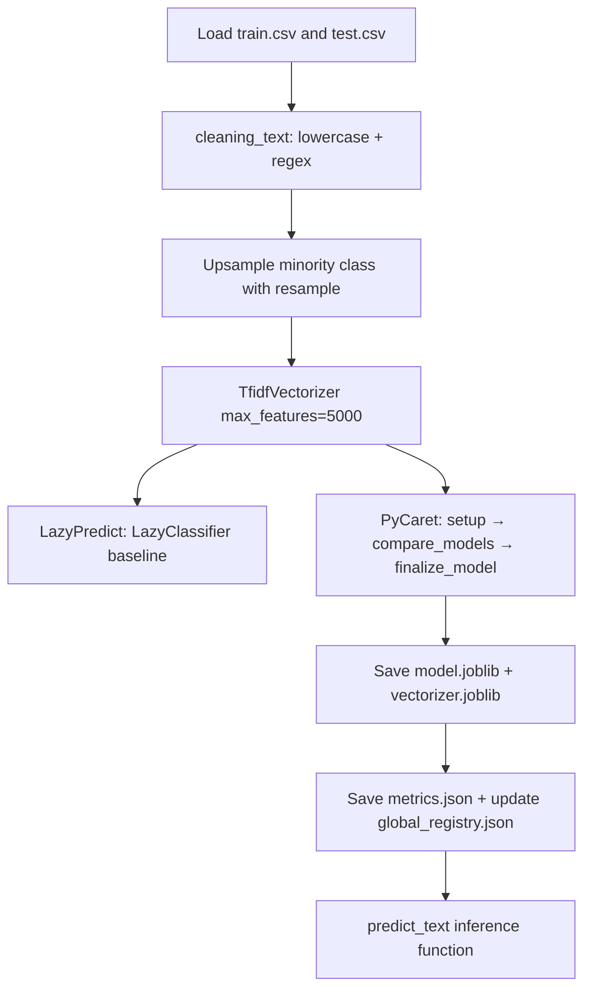

# Hate Speech Detection

> **Repository**: [https://github.com/pypi-ahmad/Natural-Language-Processing-Projects](https://github.com/pypi-ahmad/Natural-Language-Processing-Projects)

## 1. Project Overview

This project classifies tweets as hate speech (label 1) or not (label 0). It cleans text with regex, upsamples the minority class using `sklearn.utils.resample`, vectorizes with TF-IDF, then runs automated model selection via LazyPredict and PyCaret. The final model and vectorizer are saved as joblib artifacts.

## 2. Dataset

| Item | Value |
|------|-------|
| Training file | `train.csv` |
| Test file | `test.csv` |
| Path | `data/NLP Projecct 11.HateSpeechDetection/` |
| Columns | `id`, `label`, `tweet` |
| Label 0 | Not hate speech (majority) |
| Label 1 | Hate speech (minority) |

## 3. Pipeline Overview

1. **Data directory setup** — `_find_data_dir()` resolves path
2. **Import** pandas, re
3. **Load** `train.csv` → `train`, `test.csv` → `test`
4. **Define `cleaning_text(df, text_field)`** — lowercase, regex to remove @mentions, non-alphanumeric characters, URLs, and "rt" prefix
5. **Apply cleaning** to both train and test DataFrames
6. **Upsample minority class** — split `train_clean` by label, upsample label==1 with `resample(replace=True, n_samples=len(train_major), random_state=123)`, concatenate
7. **TF-IDF vectorization** — `TfidfVectorizer(max_features=5000, stop_words='english')` on `train_upsampled['tweet']`
8. **LazyPredict baseline** — `LazyClassifier` with `train_test_split(test_size=0.2, random_state=42)`, prints model comparison table
9. **PyCaret pipeline** — `setup(session_id=42)`, `compare_models(n_select=1)`, `finalize_model()`
10. **Save artifacts** — `model.joblib`, `vectorizer.joblib`, `metrics.json` to `artifacts/hate_speech_detection/`; update `artifacts/global_registry.json`
11. **Inference function** — `predict_text(text)` transforms input with `_tfidf` and predicts with `final_model`
12. **Consistency checks** — assert model/files exist, print summary

## 4. Workflow Diagram



## 5. Core Logic Breakdown

### `cleaning_text(df, text_field)`
```python
df[text_field] = df[text_field].str.lower()
df[text_field] = df[text_field].apply(
    lambda elem: re.sub(r"(@[A-Za-z0-9]+)|([^0-9A-Za-z \t])|(\w+:\/\/\S+)|^rt|http.+?", "", elem)
)
```
Removes @mentions, non-alphanumeric characters (except spaces/tabs), URLs, "rt" prefix, and http strings.

### Upsampling
```python
train_major = train_clean[train_clean.label == 0]
train_minor = train_clean[train_clean.label == 1]
train_minor_upsampled = resample(train_minor, replace=True, n_samples=len(train_major), random_state=123)
train_upsampled = pd.concat([train_minor_upsampled, train_major])
```
Uses `sklearn.utils.resample` with replacement to match the majority class count.

### `predict_text(text)`
```python
def predict_text(text):
    vec = _tfidf.transform([text])
    return final_model.predict(vec)
```

## 6. Model / Output Details

- LazyPredict runs dozens of classifiers and selects the best by accuracy
- PyCaret runs its own comparison, selects top model, and finalizes it
- Saved metrics: accuracy, precision, recall, F1 (from PyCaret), plus LazyPredict accuracy and F1
- Artifacts saved to `artifacts/hate_speech_detection/`: `model.joblib`, `vectorizer.joblib`, `metrics.json`

## 7. Project Structure

```
NLP Projecct 11.HateSpeechDetection/
├── HateSpeechDetection.ipynb
├── test_hate_speech.py
└── README.md

data/NLP Projecct 11.HateSpeechDetection/
├── train.csv
└── test.csv
```

## 8. Setup & Installation

```bash
pip install pandas numpy scikit-learn lazypredict pycaret joblib
```

## 9. How to Run

1. Place `train.csv` and `test.csv` in `data/NLP Projecct 11.HateSpeechDetection/`
2. Open `HateSpeechDetection.ipynb` and run all cells sequentially

## 10. Testing

| Item | Value |
|------|-------|
| Test file | `test_hate_speech.py` |
| Line count | 95 |
| Framework | pytest |

**Test classes:**

| Class | Tests | Description |
|-------|-------|-------------|
| `TestDataLoading` | 5 | File existence, load, non-empty, expected columns (`id`, `label`, `tweet`), no fully-null columns |
| `TestPreprocessing` | 4 | String dtype, non-empty text, basic cleaning, multiple label classes |
| `TestModel` | 2 | TF-IDF vectorizer shape, MultinomialNB fit |
| `TestPrediction` | 2 | Prediction output values, predict_proba shape |

```bash
pytest "NLP Projecct 11.HateSpeechDetection/test_hate_speech.py" -v
```

## 11. Limitations

- Regex `^rt` only matches "rt" at the very start of the string, not after other content
- `test.csv` is loaded and cleaned but never used in training or evaluation
- `predict_text()` depends on notebook-scoped variables (`_tfidf`, `final_model`) — not portable outside the notebook
- PyCaret input is capped at `_max_rows=5000` and `_max_cols=2000`
- `cleaning_text` mutates the input DataFrame in-place
