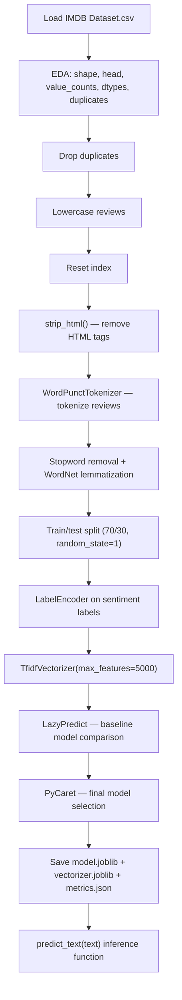

# IMDB Sentiment Analysis (ML Pipeline)

> **Repository**: [https://github.com/pypi-ahmad/Natural-Language-Processing-Projects](https://github.com/pypi-ahmad/Natural-Language-Processing-Projects)

## 1. Project Overview

This project performs sentiment analysis on the IMDB movie review dataset using a TF-IDF + ML pipeline. The notebook applies text preprocessing (lowercasing, HTML stripping, tokenization, stopword removal, WordNet lemmatization), then runs LazyPredict for baseline model comparison and PyCaret for final model selection. Despite the folder name mentioning "Deep Learning", the notebook (`sentiment-analysis-with-ml.ipynb`) uses traditional ML models.

## 2. Dataset

| Item | Value |
|------|-------|
| **File** | `IMDB Dataset.csv` |
| **Data path** | `data/NLP Projects 26 - IMDB Sentiment Analysis using Deep Learning/IMDB Dataset.csv` |
| **Columns** | `review`, `sentiment` |
| **Also present** | `IMDB Review Dataset.zip`, `Link to the Dataset.txt` |

Loaded via:

```python
data = pd.read_csv(str(DATA_DIR / "IMDB Dataset.csv"))
```

## 3. Pipeline Overview

| Step | Cell(s) | Description |
|------|---------|-------------|
| 1 | 1 | Resolve `DATA_DIR` using `_find_data_dir()` |
| 2 | 2 | Import libraries (pandas, numpy, matplotlib, re, nltk, sklearn, gensim) |
| 3 | 3 | Load `IMDB Dataset.csv` into `data` |
| 4 | 4–9 | EDA: `shape`, `head()`, `unique()`, `value_counts()`, `dtypes`, duplicate check |
| 5 | 10 | Drop duplicates: `data.drop_duplicates(keep="first", inplace=True)` |
| 6 | 11 | Check NaN: `data.isna().sum()` |
| 7 | 12 | Lowercase: `data.review.apply(lambda x: str(x).lower())` |
| 8 | 13–14 | Reset index, drop old `index` column |
| 9 | 16–17 | HTML stripping via `strip_html(raw_text)` using `re.sub('<.*?>', '', raw_text)` |
| 10 | 19 | Tokenization: `WordPunctTokenizer()` → `data["review_tokenized"]` |
| 11 | 21–22 | Stopword removal + WordNet lemmatization → `data["review_tokenized_cleaned"]` |
| 12 | 25 | Train/test split: `test_size=0.3, random_state=1` |
| 13 | 29 | Label encoding: `LabelEncoder().fit_transform()` |
| 14 | 31–32 | TF-IDF vectorization: `TfidfVectorizer(max_features=5000)` |
| 15 | 34 | LazyPredict baseline comparison |
| 16 | 35 | PyCaret final model selection |
| 17 | 37 | Save artifacts: `model.joblib`, `vectorizer.joblib`, `metrics.json` |
| 18 | 38 | Define `predict_text(text)` inference function |
| 19 | 39 | Consistency checks and summary |

## 4. Workflow Diagram



## 5. Core Logic Breakdown

### `strip_html(raw_text)`

Removes HTML tags using `re.compile('<.*?>')` and `re.sub`.

### Tokenization

Uses `WordPunctTokenizer()` from NLTK:

```python
wpTokenizer = WordPunctTokenizer()
data["review_tokenized"] = [wpTokenizer.tokenize(text) for text in data["review"]]
```

### Lemmatization with POS tags

Defines a `tag_map` mapping POS tag prefixes to WordNet types (`J`→ADJ, `V`→VERB, `R`→ADV, default→NOUN). Iterates all rows, applies `WordNetLemmatizer().lemmatize(word, tag_map[tag[0]])`, filters stopwords and non-alpha tokens.

### TF-IDF Vectorization

```python
tfidf_vect = TfidfVectorizer(max_features=5000)
tfidf_vect.fit(data.review_tokenized_cleaned)
```

Fitted on the full dataset (not just training set), then transforms train and test separately.

### `predict_text(text)`

Transforms a single text input through the saved TF-IDF vectorizer and runs prediction via the final PyCaret model.

## 6. Model / Output Details

| Item | Value |
|------|-------|
| **Vectorizer** | `TfidfVectorizer(max_features=5000)` |
| **Model selection** | LazyPredict (baseline) + PyCaret (final) |
| **Artifacts directory** | `artifacts/imdb_sentiment_ml/` |
| **Saved files** | `model.joblib`, `vectorizer.joblib`, `metrics.json` |
| **Project name** | `imdb_sentiment_ml` |

## 7. Project Structure

```
NLP Projects 26 - IMDB Sentiment Analysis using Deep Learning/
├── sentiment-analysis-with-ml.ipynb   # Main notebook
├── IMDB Dataset.csv                   # Dataset (also in data/)
├── IMDB Review Dataset.zip            # Zipped dataset
├── Link to the Dataset.txt            # Dataset source link
├── test_imdb_deep_learning.py         # Test file (122 lines)
└── README.md
```

## 8. Setup & Installation

```bash
pip install numpy pandas matplotlib nltk scikit-learn gensim lazypredict pycaret joblib
```

NLTK data required:

```python
import nltk
nltk.download('averaged_perceptron_tagger')
nltk.download('stopwords')
nltk.download('wordnet')
nltk.download('punkt')
```

## 9. How to Run

1. Ensure `IMDB Dataset.csv` is in the `data/NLP Projects 26 - IMDB Sentiment Analysis using Deep Learning/` directory.
2. Open `sentiment-analysis-with-ml.ipynb` in Jupyter/VS Code.
3. Run all cells. The lemmatization loop (cell 22) is slow — it prints progress every 100 rows.

## 10. Testing

| File | Lines | Classes |
|------|-------|---------|
| `test_imdb_deep_learning.py` | 122 | `TestDataLoading`, `TestPreprocessing`, `TestModel`, `TestPrediction` |

```bash
pytest "NLP Projects 26 - IMDB Sentiment Analysis using Deep Learning/test_imdb_deep_learning.py" -v
```

## 11. Limitations

- **Unused imports**: `gensim`, `sent_tokenize`, `word_tokenize`, `regexp_tokenize`, `svm`, `naive_bayes`, `linear_model`, `confusion_matrix`, `classification_report`, `accuracy_score`, `os`, `matplotlib.pyplot` are imported but never used.
- **TF-IDF fitted on full data**: `tfidf_vect.fit(data.review_tokenized_cleaned)` fits on the entire dataset (including test rows) before transforming train/test, which is a form of data leakage.
- **Preprocessing order**: Lowercasing is applied before HTML stripping. HTML tags like `<br>` become `<br>` in lowercase before `strip_html` removes them, which still works but is an unusual order.
- **Notebook filename mismatch**: The folder says "Deep Learning" but the notebook is `sentiment-analysis-with-ml.ipynb` and uses traditional ML (LazyPredict/PyCaret), not deep learning.
