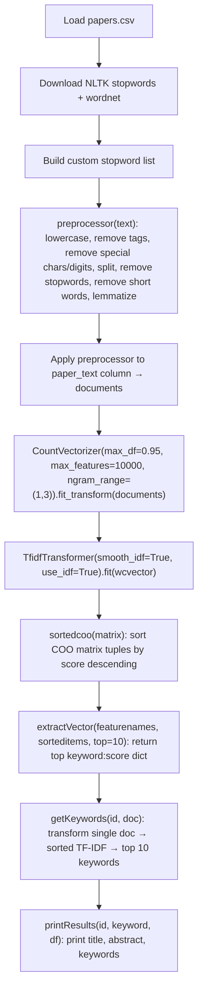

# Keyword Extraction with Python

> **Repository**: [https://github.com/pypi-ahmad/Natural-Language-Processing-Projects](https://github.com/pypi-ahmad/Natural-Language-Processing-Projects)

## 1. Project Overview

This project extracts keywords from research papers using TF-IDF scoring. It loads a CSV dataset of papers, preprocesses the text (lowercasing, stopword removal, lemmatization), builds a vocabulary with `CountVectorizer`, computes TF-IDF scores with `TfidfTransformer`, and returns the top-scoring terms for a given document.

## 2. Dataset

- **File:** `papers.csv` (located at `data/NLP Projecct 4.Keyword Extraction/papers.csv`)
- **Columns used:** `id`, `title`, `abstract`, `paper_text`
- Additional files in the data directory: `authors.csv`, `paper_authors.csv`, `database.sqlite`

## 3. Pipeline Overview

1. Set up data directory path via `_find_data_dir()` helper
2. Load `papers.csv` into a DataFrame with `pd.read_csv(..., engine='c', error_bad_lines=False)`
3. Download NLTK resources (`stopwords`, `wordnet`)
4. Build a custom stopword list by merging NLTK English stopwords with a hardcoded `new_words` list
5. Define `preprocessor(text)` for text cleaning and lemmatization
6. Apply `preprocessor` to the `paper_text` column → `documents` Series
7. Fit `CountVectorizer(max_df=0.95, max_features=10000, ngram_range=(1,3))` on `documents` → `wcvector`
8. Fit `TfidfTransformer(smooth_idf=True, use_idf=True)` on `wcvector`
9. Extract `feature_names` via `countvector.get_feature_names()`
10. For a given document ID, transform through TF-IDF, sort scores, and extract top 10 keywords
11. Print title, abstract, and extracted keywords

## 4. Workflow Diagram



## 5. Core Logic Breakdown

### `preprocessor(text)`
- Lowercases text
- Removes HTML-like tags via `re.sub("&lt;/?.*?&gt;"," &lt;&gt; ", text)`
- Removes digits and non-word characters via `re.sub("(\\d|\\W)+"," ", text)`
- Splits into word list
- Filters out words in `stop_words`
- Filters out words shorter than 3 characters
- Lemmatizes each word with `WordNetLemmatizer().lemmatize(word)`
- Returns joined string

### `sortedcoo(matrix)`
- Takes a COO sparse matrix
- Zips `matrix.col` and `matrix.data` into tuples
- Returns tuples sorted by `(score, index)` in descending order

### `extractVector(featurenames, sorteditems, top=10)`
- Slices `sorteditems` to the first `top` items
- Maps each `(index, score)` tuple to `(feature_name, rounded_score)`
- Returns a dict of `{feature_name: score}`

### `getKeywords(id, doc)`
- Transforms `doc[id]` through `cv.transform()` then `transformer.transform()`
- Calls `sortedcoo()` on the resulting COO matrix
- Calls `extractVector()` with `feature_names` and top=10
- Returns keyword dict

### `printResults(id, keyword, df)`
- Prints `df['title'][id]`, `df['abstract'][id]`, and each keyword with its score

## 6. Model / Output Details

- No trained ML model is saved; TF-IDF scoring is computed in-memory
- `CountVectorizer` parameters: `max_df=0.95`, `max_features=10000`, `ngram_range=(1,3)`
- `TfidfTransformer` parameters: `smooth_idf=True`, `use_idf=True`
- Output: top 10 keywords with TF-IDF scores for a given document ID (hardcoded as `id=941`)

## 7. Project Structure

```
NLP Projecct 4.Keyword Extraction/
├── 4.KeywordExtraction.ipynb      # Main notebook (18 cells)
├── test_keyword_extraction.py     # Test suite (63 lines)
├── README.md
├── authors.csv
├── paper_authors.csv
└── __pycache__/

data/NLP Projecct 4.Keyword Extraction/
├── papers.csv
├── authors.csv
├── paper_authors.csv
└── database.sqlite
```

## 8. Setup & Installation

```bash
pip install pandas scikit-learn nltk
```

NLTK data downloads (handled in the notebook):
```python
nltk.download('stopwords')
nltk.download('wordnet')
```

## 9. How to Run

Open `4.KeywordExtraction.ipynb` in Jupyter and run all cells sequentially. The notebook expects `data/NLP Projecct 4.Keyword Extraction/papers.csv` to exist relative to the workspace root.

## 10. Testing

- **Test file:** `test_keyword_extraction.py` (63 lines)
- **Test classes:**
  - `TestDataLoading` — checks `papers.csv` exists, loads without error, is non-empty, and has expected columns (`id`, `title`, `abstract`, `paper_text`)
  - `TestPreprocessing` — checks `abstract` column type, non-emptiness, and basic regex cleaning
  - `TestModel` — fits a `TfidfVectorizer` on the first 50 abstracts and verifies feature extraction; checks word frequency analysis
  - `TestPrediction` — fits `TfidfVectorizer`, extracts top keywords for the first document, asserts at least 1 keyword found

Run tests:
```bash
pytest "NLP Projecct 4.Keyword Extraction/test_keyword_extraction.py" -v
```

## 11. Limitations

- **`getKeywords` references undefined `cv`:** The function body uses `cv.transform(...)` but the `CountVectorizer` instance is named `countvector`. This causes a `NameError` at runtime.
- **`getKeywords` call uses undefined `docs`:** Cell 17 calls `getKeywords(id, docs)` but the preprocessed Series is named `documents`, not `docs`.
- **Deprecated API:** `countvector.get_feature_names()` is deprecated in scikit-learn ≥1.0; should use `get_feature_names_out()`.
- **Hardcoded document ID:** The demo uses `id=941`, which will fail if the dataset has fewer rows.
- **`error_bad_lines` parameter:** Deprecated in newer pandas; replaced by `on_bad_lines='skip'`.
- **Custom stopwords are hardcoded** in the notebook rather than loaded from a config file.
- **`id` variable shadows Python builtin** `id()`.
