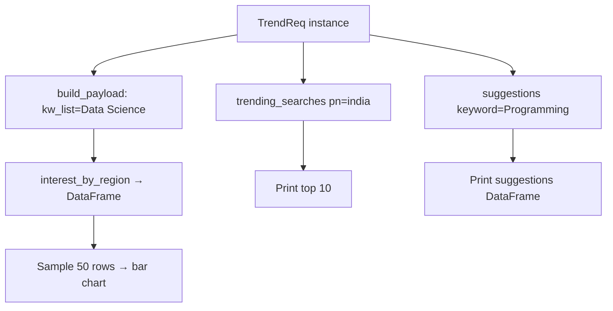

# Keyword Research

> **Repository**: [https://github.com/pypi-ahmad/Natural-Language-Processing-Projects](https://github.com/pypi-ahmad/Natural-Language-Processing-Projects)

## 1. Project Overview

This project uses the `pytrends` library to query Google Trends data. It retrieves interest-by-region data for "Data Science", fetches trending searches for India, and gets keyword suggestions for "Programming". Results are displayed as a bar chart and printed tables.

## 2. Dataset

No local dataset files. All data is fetched live from the Google Trends API via `pytrends`.

## 3. Pipeline Overview

1. **Install pytrends** — `!pip install pytrends`
2. **Import** pandas, `TrendReq` from `pytrends.request`
3. **Build payload** — `trends.build_payload(kw_list=["Data Science"])`
4. **Get interest by region** — `trends.interest_by_region()` → `data` DataFrame
5. **Check type** — `type(data)`
6. **Plot bar chart** — sample 50 rows, plot `geoName` vs `Data Science` (color `"orange"`)
7. **Trending searches** — `trends.trending_searches(pn="india")`
8. **Print top 10** trending searches
9. **Keyword suggestions** — `trends.suggestions(keyword="Programming")` → DataFrame
10. **Print suggestions**

## 4. Workflow Diagram



## 5. Core Logic Breakdown

### TrendReq API calls
```python
trends = TrendReq()
trends.build_payload(kw_list=["Data Science"])
data = trends.interest_by_region()
```
`interest_by_region()` returns a DataFrame indexed by `geoName` with the keyword as a column.

### Trending searches
```python
data = trends.trending_searches(pn="india")
```

### Keyword suggestions
```python
keyword = trends.suggestions(keyword="Programming")
data = pd.DataFrame(keyword)
```

### Plotting
```python
df = data.sample(50)
df.reset_index().plot(x="geoName", y="Data Science", figsize=(10, 5), kind="bar", color="orange")
```

## 6. Model / Output Details

No ML model. Outputs are:
- A bar chart of Google Trends interest by region (50 sampled countries)
- A list of trending searches in India
- A table of keyword suggestions for "Programming"

## 7. Project Structure

```
NLP Projecct 12.KeywordResearch/
├── KeywordResearch.ipynb
├── test_keyword_research.py
└── README.md
```

No local data directory is used.

## 8. Setup & Installation

```bash
pip install pytrends pandas matplotlib
```

## 9. How to Run

1. Ensure internet connectivity (Google Trends API requires live access)
2. Open `KeywordResearch.ipynb` and run all cells sequentially

## 10. Testing

| Item | Value |
|------|-------|
| Test file | `test_keyword_research.py` |
| Line count | 41 |
| Framework | pytest |

**Test classes:**

| Class | Tests | Description |
|-------|-------|-------------|
| `TestProjectStructure` | 4 | Project dir exists, notebook exists, valid JSON, has code cells |
| `TestPreprocessing` | 2 | Basic text cleaning, tokenization |

Tests are marked `@pytest.mark.no_local_data` since this project has no local dataset.

```bash
pytest "NLP Projecct 12.KeywordResearch/test_keyword_research.py" -v
```

## 11. Limitations

- `matplotlib.pyplot` is used as `plt` (for `plt.title`, `plt.show`) but is never imported — causes `NameError` at runtime
- `df` variable name in the plotting cell shadows the `data` DataFrame from `interest_by_region()`
- All data comes from live API calls with no caching — results vary between runs and may fail due to rate limiting
- No error handling for network failures or API throttling
- `data.sample(50)` will fail if fewer than 50 regions have data
