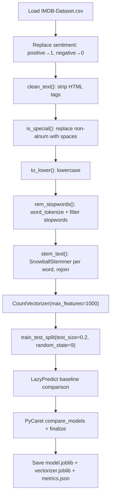

# Movie Review Sentiment Analysis

> **Repository**: [https://github.com/pypi-ahmad/Natural-Language-Processing-Projects](https://github.com/pypi-ahmad/Natural-Language-Processing-Projects)

## 1. Project Overview

Classifies IMDB movie reviews as positive or negative. The notebook applies HTML stripping, special-character removal, lowercasing, stopword removal, and Snowball stemming, then vectorises with `CountVectorizer` and runs LazyPredict and PyCaret to select and persist the best classifier.

## 2. Dataset

| Item | Value |
|------|-------|
| File | `IMDB-Dataset.csv` |
| Path | `data/NLP Projecct 19. MoviesReviewSentiments/IMDB-Dataset.csv` |
| Key columns | `review`, `sentiment` |
| Label encoding | `positive → 1`, `negative → 0` |

## 3. Pipeline Overview

| Step | Cell(s) | Description |
|------|---------|-------------|
| 1 | 1 | Data-directory resolution (`_find_data_dir()`) |
| 2 | 2–3 | Import pandas/numpy, load `IMDB-Dataset.csv` |
| 3 | 4–5 | `data.info()`, `data["sentiment"].value_counts()` |
| 4 | 6 | Replace `positive → 1`, `negative → 0` in `sentiment` column |
| 5 | 7 | Inspect `data.review[0]` |
| 6 | 8–9 | Define `clean_text(text)` — regex strip HTML tags; apply to `data["review"]` |
| 7 | 10–11 | Define `is_special(text)` — replace non-alphanumeric with spaces; apply to `data["review"]` |
| 8 | 12–13 | Define `to_lower(text)` — lowercase; apply to `data["review"]` |
| 9 | 14 | Import NLTK, download `stopwords` and `punkt` |
| 10 | 15 | Define `rem_stopwords(text)` — tokenise with `word_tokenize`, filter stopwords; apply to `data["review"]` |
| 11 | 16–17 | Define `stem_text(text)` — `SnowballStemmer('english')` on word list, rejoin; apply to `data["review"]` |
| 12 | 18 | `data.head()` |
| 13 | 19 | Import `CountVectorizer`, `GaussianNB`, `MultinomialNB`, `BernoulliNB`, `accuracy_score`, `pickle` |
| 14 | 20 | `counvec = CountVectorizer(max_features=1000)`, `X = counvec.fit_transform(data.review).toarray()` |
| 15 | 22 | `train_test_split(X, y, test_size=0.2, random_state=9)` → `trainx, testx, trainy, testy` |
| 16 | 23 | Print train/test shapes |
| 17 | 25 | LazyPredict baseline comparison |
| 18 | 26 | PyCaret `setup` / `compare_models` / `finalize_model` |
| 19 | 28 | Save `model.joblib`, `vectorizer.joblib` (`counvec`), `metrics.json`; update `global_registry.json` |
| 20 | 29 | Define `predict_text(text)` inference function |
| 21 | 30 | Consistency assertions and summary |

## 4. Workflow Diagram



## 5. Core Logic Breakdown

### HTML cleaning (Cell 8)
```python
def clean_text(text):
    clean = re.compile(r'<.*?>')
    return re.sub(clean, '', text)
```

### Special character removal (Cell 10)
```python
def is_special(text):
    temp = ''
    for i in text:
        if i.isalnum():
            temp = temp + i
        else:
            temp = temp + ' '
    return temp
```

### Lowercase (Cell 12)
```python
def to_lower(text):
    return text.lower()
```

### Stopword removal (Cell 15)
```python
def rem_stopwords(text):
    stop_words = set(stopwords.words('english'))
    words = word_tokenize(text)
    return [w for w in words if w not in stop_words]
```
Returns a list (not a string). The next step (`stem_text`) expects a list.

### Stemming (Cell 16)
```python
def stem_text(text):
    ss = SnowballStemmer('english')
    return " ".join([ss.stem(w) for w in text])
```

### Vectorisation (Cell 20)
```python
X = np.array(data.iloc[:, 0].values)
y = np.array(data["sentiment"].values)
counvec = CountVectorizer(max_features=1000)
X = counvec.fit_transform(data.review).toarray()
```

### Train/test split (Cell 22)
```python
trainx, testx, trainy, testy = train_test_split(X, y, test_size=0.2, random_state=9)
```

### Inference (Cell 29)
```python
def predict_text(text):
    vec = counvec.transform([text])
    return final_model.predict(vec)
```

## 6. Model / Output Details

- **LazyPredict** selects best model by accuracy.
- **PyCaret** runs `compare_models(n_select=1)` with `session_id=42`, then `finalize_model`.
- Artifacts saved to `artifacts/movie_review_sentiments/`:
  - `model.joblib` — finalized PyCaret model
  - `vectorizer.joblib` — fitted `CountVectorizer` (`counvec`)
  - `metrics.json` — accuracy, F1, precision, recall

## 7. Project Structure

```
NLP Projecct 19. MoviesReviewSentiments/
├── MoviewReviewSentiment.ipynb   # Main notebook (typo in filename)
├── test_movie_sentiment.py       # Test suite (95 lines)
├── IMDB-Dataset.csv              # Dataset (local copy)
└── README.md
data/NLP Projecct 19. MoviesReviewSentiments/
└── IMDB-Dataset.csv
artifacts/movie_review_sentiments/
├── model.joblib
├── vectorizer.joblib
└── metrics.json
```

## 8. Setup & Installation

```
pip install pandas numpy scikit-learn nltk matplotlib lazypredict pycaret joblib
```

NLTK data required:
```python
import nltk
nltk.download('stopwords')
nltk.download('punkt')
```

## 9. How to Run

1. Open `MoviewReviewSentiment.ipynb` in Jupyter.
2. Run all cells sequentially.
3. Artifacts are saved to `artifacts/movie_review_sentiments/`.

## 10. Testing

| File | Classes | Line count |
|------|---------|------------|
| `test_movie_sentiment.py` | `TestDataLoading`, `TestPreprocessing`, `TestModel`, `TestPrediction` | 95 |

Run:
```
pytest "NLP Projecct 19. MoviesReviewSentiments/test_movie_sentiment.py" -v
```

## 11. Limitations

- `GaussianNB`, `BernoulliNB`, `accuracy_score`, and `pickle` are imported (Cell 19) but never used — the standardised pipeline uses LazyPredict/PyCaret instead.
- `CountVectorizer(max_features=1000)` is relatively low for 50K IMDB reviews; important terms may be dropped.
- `data.iloc[:, 0]` is assigned to `X` but immediately overwritten by `counvec.fit_transform(data.review).toarray()`.
- `rem_stopwords` returns a list, which `stem_text` iterates correctly, but the implicit type change between steps is undocumented.
- `SnowballStemmer` is instantiated inside `stem_text` on every function call rather than once.
- `predict_text` expects raw text but the training pipeline applies HTML cleaning, special-char removal, lowercasing, stopword removal, and stemming before vectorisation — none of which are replicated in `predict_text`.
