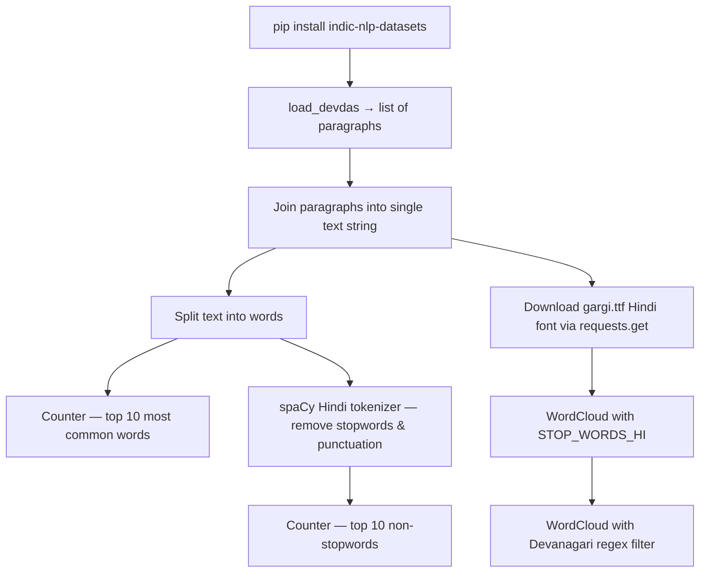

# NLP for Other Languages — Hindi Text Analysis

> **Repository**: [https://github.com/pypi-ahmad/Natural-Language-Processing-Projects](https://github.com/pypi-ahmad/Natural-Language-Processing-Projects)

## 1. Project Overview

This notebook demonstrates NLP on Hindi text using the `indic-nlp-datasets` package. It loads the Devdas Hindi novel, removes stopwords using spaCy's Hindi language model, and generates word clouds with a downloaded Hindi font.

## 2. Dataset

| Source | Description |
|--------|-------------|
| `indic-nlp-datasets` package (`load_devdas()`) | Hindi text of the novel Devdas, loaded as a generator of paragraphs |

No local CSV files are used. The data is loaded programmatically via `from idatasets import load_devdas`.

## 3. Pipeline Overview

1. Install `indic-nlp-datasets==0.1.2` via pip
2. Import `load_devdas` from `idatasets` and instantiate it
3. Join paragraphs into a single `text` string, then split into `words`
4. Count word frequencies using `collections.Counter` and display top 10
5. Remove stopwords and punctuation using `spacy.lang.hi.Hindi` tokenizer
6. Count non-stopword frequencies and display top 10
7. Download Hindi font `gargi.ttf` from `https://hindityping.info/download/assets/Hindi-Fonts-Unicode/gargi.ttf` using `requests.get()`
8. Generate word cloud using `WordCloud` with `STOP_WORDS_HI` stopwords
9. Generate a second word cloud with `regexp=r"[\u0900-\u097F]+"` to filter for Devanagari characters only

## 4. Workflow Diagram



## 5. Core Logic Breakdown

### Data loading
```python
from idatasets import load_devdas
devdas = load_devdas()
para = list(devdas.data)
text = " ".join(para)
words = text.split(" ")
```

### Stopword removal with spaCy Hindi
```python
from spacy.lang.hi import Hindi
lang = Hindi()
doc = lang(text)
not_stopwords = []
for token in doc:
    if token.is_stop:
        continue
    if token.is_punct or token.text == "|":
        continue
    not_stopwords.append(token.text)
```

### Hindi font download
```python
import requests
url = "https://hindityping.info/download/assets/Hindi-Fonts-Unicode/gargi.ttf"
r = requests.get(url, allow_redirects=True)
font_path = "gargi.ttf"
with open(font_path, "wb") as fw:
    fw.write(r.content)
```

### Word cloud generation
```python
wordcloud = WordCloud(
    width=400, height=300, max_font_size=50, max_words=1000,
    background_color="white", stopwords=STOP_WORDS_HI, font_path=font_path
).generate(text)
```
A second word cloud adds `regexp=r"[\u0900-\u097F]+"` to restrict output to Devanagari script characters.

## 6. Model / Output Details

No ML model is trained. Outputs are:
- Top-10 word frequency lists (with and without stopwords)
- Two word cloud images rendered with `matplotlib.pyplot.imshow`

## 7. Project Structure

```
NLP Projecct 8.NLP for other languages/
├── NLP_for_Other_languages.ipynb    # Main notebook
├── test_nlp_other_languages.py      # Test file (41 lines)
└── README.md
```

No local data files — the dataset is loaded from the `indic-nlp-datasets` package at runtime.

## 8. Setup & Installation

```bash
pip install indic-nlp-datasets==0.1.2 spacy wordcloud matplotlib requests
```

Packages imported in the notebook: `idatasets` (from `indic-nlp-datasets`), `collections.Counter`, `spacy.lang.hi` (Hindi), `wordcloud`, `matplotlib`, `requests`.

The notebook also downloads `gargi.ttf` at runtime, which requires internet access.

## 9. How to Run

1. Install dependencies listed above.
2. Open `NLP_for_Other_languages.ipynb` and run all cells sequentially.
3. Internet access is required for the font download and (on first run) the `indic-nlp-datasets` data download.

## 10. Testing

Test file: `test_nlp_other_languages.py` (41 lines)

| Test Class | Description |
|------------|-------------|
| `TestProjectStructure` | Verifies project directory exists, notebook exists, notebook is valid JSON, and contains code cells |
| `TestPreprocessing` | Tests basic regex text cleaning and whitespace tokenization (standalone, no data dependency) |

All tests are marked `@pytest.mark.no_local_data`.

Run:
```bash
pytest "NLP Projecct 8.NLP for other languages/test_nlp_other_languages.py" -v
```

## 11. Limitations

- **External font URL dependency**: The notebook downloads `gargi.ttf` from `hindityping.info` at runtime — will fail if the URL is unavailable.
- **No error handling**: No try/except around the font download or data loading.
- **Font file written to working directory**: `gargi.ttf` is saved to the current directory without cleanup.
- **Last cell is empty**: Cell 13 contains no code.
- **No data persistence**: All data is loaded into memory from the package; nothing is saved to disk besides the font file.
