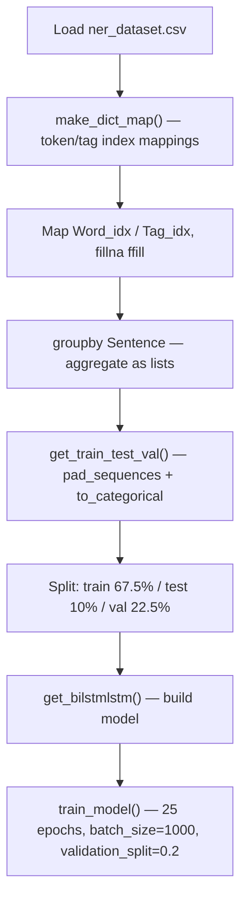

# Named Entity Recognition with Python

> **Repository**: [https://github.com/pypi-ahmad/Natural-Language-Processing-Projects](https://github.com/pypi-ahmad/Natural-Language-Processing-Projects)

## 1. Project Overview

This project implements Named Entity Recognition (NER) using a BiLSTM-LSTM deep learning model built with Keras/TensorFlow. The notebook is `NameEnitityRecognition.ipynb`. It processes a CoNLL-style NER dataset, constructs vocabulary mappings, pads sequences, and trains a four-layer Sequential model to predict entity tags for each token.

## 2. Dataset

- **File**: `ner_dataset.csv`
- **Data path**: `data/NLP Projecct 2.Named Entity Recognition/ner_dataset.csv`
- **Encoding**: `unicode_escape`
- **Columns**: `Sentence #`, `Word`, `POS`, `Tag`
- Derived columns: `Word_idx` (mapped via `token_to_idx`), `Tag_idx` (mapped via `tag_to_idx`)

## 3. Pipeline Overview

| Step | Cell(s) | Description |
|------|---------|-------------|
| 1 | 1–2 | Data directory setup via `_find_data_dir()` |
| 2 | 3 | Load CSV with `encoding='unicode_escape'` |
| 3 | 4 | Define `make_dict_map(data, tokentag)` — builds `token_to_idx`/`idx_to_token` dicts |
| 4 | 5 | Call `make_dict_map` for both tokens and tags |
| 5 | 6 | Map `Word_idx` and `Tag_idx` columns; `fillna(method='ffill')` |
| 6 | 7 | `groupby('Sentence #')`, aggregate `Word`, `POS`, `Tag`, `Word_idx`, `Tag_idx` as lists |
| 7 | 8 | Display grouped data head |
| 8 | 9 | Import `train_test_split`, `pad_sequences`, `to_categorical` |
| 9 | 10 | Define `get_train_test_val(data_group, datas)` — pad, split into train/test/val |
| 10 | 11 | Call `get_train_test_val` and unpack results |
| 11 | 12 | Import Keras layers: `LSTM`, `Embedding`, `Dense`, `TimeDistributed`, `Dropout`, `Bidirectional` |
| 12 | 13 | Set `input_dim`, `output_dim = 64`, `input_length` |
| 13 | 14 | Compute `ntags = len(tag_to_idx)` |
| 14 | 15 | Define `get_bilstmlstm()` — build 4-layer Sequential model |
| 15 | 16 | Define `train_model(X, y, model)` — train for 25 epochs |
| 16 | 17 | Instantiate model, `plot_model`, run training |

## 4. ML Workflow



## 5. Core Logic Breakdown

### `_find_data_dir()`
Searches parent and current directories for `data/NLP Projecct 2.Named Entity Recognition`. Falls back to `.` if not found.

### `make_dict_map(data, tokentag)`
- If `tokentag == 'token'`: builds vocabulary from `data['Word']`
- Otherwise: builds vocabulary from `data['Tag']`
- Returns `(token_to_idx, idx_to_token)` dictionaries

### `get_train_test_val(data_group, datas)`
1. Extracts `Word_idx` lists, computes `maxlen`
2. Pads tokens with `pad_sequences(..., padding='post', value=ntoken-1)`
3. Pads tags with `pad_sequences(..., padding='post', value=tag_to_idx["O"])`
4. Converts tags to one-hot via `to_categorical`
5. First split: `train_test_split(test_size=0.1, train_size=0.9, random_state=2020)`
6. Second split: `train_test_split(test_size=0.25, train_size=0.75, random_state=2020)` on training portion

Effective split ratios: ~67.5% train / ~22.5% val / ~10% test.

### `get_bilstmlstm()`
Builds a Keras `Sequential` model with 4 layers:
```
1. Embedding(input_dim, output_dim=64, input_length)
2. Bidirectional(LSTM(units=64, return_sequences=True, dropout=0.2, recurrent_dropout=0.2), merge_mode='concat')
3. LSTM(units=64, return_sequences=True, dropout=0.5, recurrent_dropout=0.5)
4. TimeDistributed(Dense(n_tags, activation="relu"))
```
Compiled with `loss='categorical_crossentropy'`, `optimizer='adam'`, `metrics=['accuracy']`.

### `train_model(X, y, model)`
Trains the model in a loop of 25 iterations, each calling `model.fit()` with:
- `batch_size=1000`
- `epochs=1`
- `validation_split=0.2`

Returns a list of loss values per iteration.

## 6. Model Details

- **Architecture**: Embedding → Bidirectional(LSTM) → LSTM → TimeDistributed(Dense)
- **Embedding**: `output_dim=64`
- **BiLSTM**: `dropout=0.2`, `recurrent_dropout=0.2`, `merge_mode='concat'`
- **LSTM**: `dropout=0.5`, `recurrent_dropout=0.5`
- **Output Dense**: activation=`relu`, units=`ntags`
- **Loss**: `categorical_crossentropy`
- **Optimizer**: `adam`
- **Training**: 25 epochs, `batch_size=1000`, `validation_split=0.2`
- No model persistence — the trained model is not saved to disk

## 7. Project Structure

```
NLP Projecct 2.Named Entity Recognition/
├── NameEnitityRecognition.ipynb   # Main notebook
├── ner_dataset.csv                # Dataset (local copy)
├── test_ner.py                    # Test suite (95 lines)
└── README.md
data/NLP Projecct 2.Named Entity Recognition/
└── ner_dataset.csv                # Dataset (canonical location)
```

## 8. Setup & Installation

```bash
pip install pandas numpy scikit-learn tensorflow keras
```

## 9. How to Run

1. Ensure the dataset exists at `data/NLP Projecct 2.Named Entity Recognition/ner_dataset.csv`
2. Open `NameEnitityRecognition.ipynb` and run all cells sequentially
3. Training output (loss per epoch) is printed in the notebook

## 10. Testing

- **Test file**: `test_ner.py` (95 lines)
- **Test classes**:
  - `TestDataLoading` — verifies file exists, loads without error, not empty, expected columns (`Sentence #`, `Word`, `POS`, `Tag`), no fully-null columns
  - `TestPreprocessing` — checks `Word` dtype is string, non-empty strings, basic text cleaning, multiple `Tag` classes
  - `TestModel` — tests `TfidfVectorizer` fit/transform and `MultinomialNB` fit on words/tags
  - `TestPrediction` — tests prediction output length and `predict_proba` shape/sum

Run tests:
```bash
pytest "NLP Projecct 2.Named Entity Recognition/test_ner.py" -v
```

## 11. Limitations

- **Variable name bug in `get_train_test_val()`**: the function assigns to `traintokens`, `testtokens`, `valtokens`, `traintags`, `testtags`, `valtags` but the print statements inside reference `train_tokens`, `test_tokens`, `val_tokens`, `train_tags`, `test_tags`, `val_tags` (with underscores) — causes `NameError` at runtime
- **Variable name bug in training cell**: calls `train_model(train_tokens, np.array(train_tags), ...)` but the unpacked variables from `get_train_test_val()` are `traintokens` and `traintags`
- **Variable name bug in `get_bilstmlstm()`**: references `n_tags` but the defined variable is `ntags`
- `itertools.chain` is imported but never used
- `Dropout` is imported from `tensorflow.keras.layers` but never used as a standalone layer (dropout is applied via LSTM layer parameters instead)
- `Model` and `Input` are imported from `tensorflow.keras` but not used
- Dense activation is `relu` rather than a typical `softmax` for multi-class tag prediction — this means the output is not a probability distribution
- The model is not saved to disk after training
- Two empty cells at the end of the notebook
