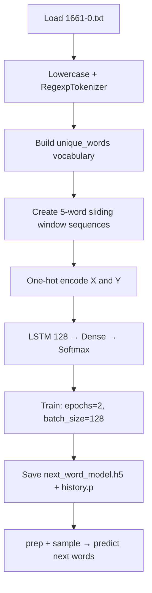

# Next Word Prediction Model

> **Repository**: [https://github.com/pypi-ahmad/Natural-Language-Processing-Projects](https://github.com/pypi-ahmad/Natural-Language-Processing-Projects)

## 1. Project Overview

This project builds a word-level next-word prediction model using an LSTM neural network in Keras. It reads a text file (`1661-0.txt`), tokenizes into words, creates 5-word input sequences with one-hot encoding, trains an LSTM, and defines functions to predict the most likely next words using `heapq`.

## 2. Dataset

| Item | Value |
|------|-------|
| File | `1661-0.txt` |
| Path | `data/NLP Projecct 14.Next Word prediction Model/1661-0.txt` |
| Format | Plain text (Project Gutenberg book) |

## 3. Pipeline Overview

1. **Data directory setup** — `_find_data_dir()` resolves path
2. **Import** numpy, matplotlib, pickle, heapq
3. **Load text** — `open(link).readlines()` then re-read with `open(link).read().lower()`
4. **Import tokenizer** — `RegexpTokenizer` from `nltk.tokenize`
5. **Tokenize** — `RegexpTokenizer(r'\w+')` on lowercased text → `words` list
6. **Build vocabulary** — `np.unique(words)` → `unique_words`, build `unique_word_index` mapping dict
7. **Create sequences** — `LENGTH = 5`; slide a window of 5 words (`prev`) with the next word (`next`)
8. **One-hot encode** — `X` shape `(n_samples, 5, vocab_size)`, `Y` shape `(n_samples, vocab_size)`, both `dtype=bool`
9. **Populate X and Y** — set bits using `unique_word_index`
10. **Build LSTM model** — `Sequential`: `LSTM(128, input_shape=(LENGTH, len(unique_words)))` → `Dense(len(unique_words))` → `Activation('softmax')`
11. **Compile** — `loss='categorical_crossentropy'`, optimizer `RMSprop(learning_rate=0.01)`, `metrics=['accuracy']`
12. **Train** — `model.fit(X, Y, validation_split=0.05, batch_size=128, epochs=2, shuffle=True)`
13. **Save** — `model.save('next_word_model.h5')`, `pickle.dump(history, open("history.p", "wb"))`; then reload both
14. **Define `prep(text)`** — one-hot encodes a 5-word input string for model input
15. **Define `sample(preds, top_n=3)`** — log-softmax normalization, then `heapq.nlargest(top_n, range(len(preds)), preds.take)`
16. **Define `completion(text)` and `completions(text, n=3)`** — prediction functions
17. **Test prediction** — tokenize sample sentence, take first 5 words, call prediction function

## 4. Workflow Diagram



## 5. Core Logic Breakdown

### Sequence creation
```python
LENGTH = 5
prev = []
next = []
for i in range(len(words) - LENGTH):
    prev.append(words[i:i + LENGTH])
    next.append(words[i + LENGTH])
```
Sliding window of 5 consecutive words as input, with the 6th word as the target.

### `prep(text)`
```python
def prep(text):
    x = np.zeros((1, LENGTH, len(unique_words)))
    for a, word in enumerate(text.split()):
        x[0, a, unique_word_index[word]] = 1
    return x
```
Converts a 5-word string into a one-hot encoded 3D array for model input.

### `sample(preds, top_n=3)`
```python
def sample(preds, top_n=3):
    preds = np.asarray(preds).astype('float64')
    preds = np.log(preds)
    exp_preds = np.exp(preds)
    preds = exp_preds / np.sum(exp_preds)
    return heapq.nlargest(top_n, range(len(preds)), preds.take)
```
Applies log then exp (effectively a re-normalization), then uses `heapq.nlargest` to return indices of the top-n predictions.

### `completions(text, n=3)` (final version)
```python
def completions(text, n=3):
    if text == "":
        return("0")
    x = prep(text)
    preds = model.predict(x, verbose=0)[0]
    next_indices = sample(preds, n)
    return [unique_words[idx] for idx in next_indices]
```

### Model architecture
| Layer | Config |
|-------|--------|
| LSTM | 128 units, `input_shape=(5, vocab_size)` |
| Dense | `vocab_size` units |
| Activation | softmax |
| Optimizer | RMSprop, `learning_rate=0.01` |
| Loss | categorical_crossentropy |

## 6. Model / Output Details

- **Model type**: Word-level LSTM (not character-level)
- **Sequence length**: 5 words
- **Training**: 2 epochs, batch_size=128, validation_split=0.05
- **Saved artifacts**: `next_word_model.h5` (Keras model), `history.p` (pickle of training history)
- **Output**: Top-n predicted next words for a given 5-word input sequence

## 7. Project Structure

```
NLP Projecct 14.Next Word prediction Model/
├── NextWordPrediction.ipynb
├── test_next_word.py
└── README.md

data/NLP Projecct 14.Next Word prediction Model/
└── 1661-0.txt
```

## 8. Setup & Installation

```bash
pip install numpy matplotlib nltk keras tensorflow
```

## 9. How to Run

1. Place `1661-0.txt` in `data/NLP Projecct 14.Next Word prediction Model/`
2. Open `NextWordPrediction.ipynb` and run all cells sequentially

## 10. Testing

| Item | Value |
|------|-------|
| Test file | `test_next_word.py` |
| Line count | 67 |
| Framework | pytest |

**Test classes:**

| Class | Tests | Description |
|-------|-------|-------------|
| `TestDataLoading` | 3 | File exists, not empty, loads as text |
| `TestPreprocessing` | 3 | Tokenization, unique words, sequence creation with length 5 |
| `TestModel` | 1 | Input/output split shapes and index bounds |
| `TestPrediction` | 1 | Softmax probability distribution sums to 1 |

```bash
pytest "NLP Projecct 14.Next Word prediction Model/test_next_word.py" -v
```

## 11. Limitations

- `predict_completions(seq, 5)` is called in the final cell but the function is named `completions` — causes `NameError` at runtime
- `completion()` function references `indices_char` which is initialized as an empty dict `{}` — will raise `KeyError` on any call
- The text file is read twice: once with `readlines()` (unused result), then with `read().lower()`
- Only 2 training epochs — likely insufficient for convergence
- One-hot encoding creates arrays of shape `(n_samples, 5, vocab_size)` with `dtype=bool` — very large for big vocabularies
- Model files (`next_word_model.h5`, `history.p`) are saved to the current working directory, not a configurable path
- `next` is used as a variable name, shadowing the Python built-in
