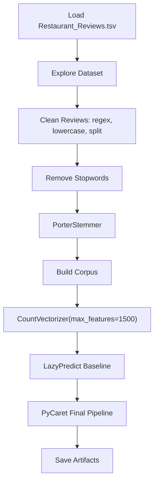

# Sentiment Analysis — Restaurant Reviews

> **Repository**: [https://github.com/pypi-ahmad/Natural-Language-Processing-Projects](https://github.com/pypi-ahmad/Natural-Language-Processing-Projects)

## 1. Project Overview

This project classifies restaurant reviews as positive or negative (binary sentiment) using a bag-of-words approach. The notebook preprocesses review text with regex cleaning, stopword removal, and Porter stemming, then vectorizes with `CountVectorizer` and selects a final model via LazyPredict and PyCaret.

## 2. Dataset

- **File**: `Restaurant_Reviews.tsv` (loaded with `delimiter='\t', quoting=3`)
- **Source path**: `data/NLP Project 22. - Sentiment Analysis - Restaurant Reviews/Restaurant_Reviews.tsv`
- **Columns**: `Review` (text), `Liked` (binary: 0 or 1)

## 3. Pipeline Overview

1. Load TSV with `pd.read_csv(..., delimiter='\t', quoting=3)`
2. Explore dataset: `.shape`, `.columns`, `.head()`
3. Import NLP libraries: `nltk`, `re`, `stopwords`, `PorterStemmer`
4. Clean reviews in a loop over `range(0, 1000)`:
   - Remove non-alpha characters with `re.sub(pattern='[^a-zA-Z]', repl=' ', string=...)`
   - Convert to lowercase
   - Tokenize by `.split()`
   - Remove stopwords using `set(stopwords.words('english'))`
   - Apply `PorterStemmer` to each word
   - Join and append to `corpus`
5. Create bag-of-words: `CountVectorizer(max_features=1500)`, `X = cv.fit_transform(corpus).toarray()`, `y = df.iloc[:, 1].values`
6. LazyPredict baseline model comparison (80/20 split, `random_state=42`)
7. PyCaret final pipeline (setup → compare → finalize)
8. Save model, vectorizer, and metrics to `artifacts/restaurant_reviews/`
9. Define `predict_text(text)` inference function
10. Run consistency checks and print summary

## 4. Workflow Diagram



## 5. Core Logic Breakdown

| Step | Code | Details |
|------|------|---------|
| Load data | `pd.read_csv(str(DATA_DIR / 'Restaurant_Reviews.tsv'), delimiter='\t', quoting=3)` | Tab-separated, quoting=3 (QUOTE_NONE) |
| Text cleaning | `re.sub(pattern='[^a-zA-Z]', repl=' ', string=df['Review'][i])` | Removes non-alpha chars |
| Stopword removal | `[word for word in review_words if not word in set(stopwords.words('english'))]` | Default NLTK English stopwords (includes "not") |
| Stemming | `PorterStemmer().stem(word)` | Instantiated inside the loop on each iteration |
| Vectorizer | `CountVectorizer(max_features=1500)` | No `stop_words` param, no `ngram_range` param (defaults to unigrams) |
| Target | `y = df.iloc[:, 1].values` | Second column (`Liked`) |
| LazyPredict | `LazyClassifier(verbose=0, ignore_warnings=True, custom_metric=None)` | 80/20 split |
| PyCaret | `setup(data=df_ml, target='target', session_id=42, verbose=False)` | Final model selection |
| Persistence | `dump(final_model, ...)` / `dump(cv, ...)` | Saved to `artifacts/restaurant_reviews/` |

## 6. Model / Output Details

- LazyPredict selects the best baseline model by accuracy
- PyCaret trains and finalizes a model (exact model type depends on data at runtime)
- Artifacts saved: `model.joblib`, `vectorizer.joblib`, `metrics.json`
- Global registry updated at `artifacts/global_registry.json`

## 7. Project Structure

```
NLP Project 22. - Sentiment Analysis - Restaurant Reviews/
├── Sentiment Analysis of Restaurant Reviews.ipynb   # Main notebook
├── Restaurant_Reviews.tsv                           # Dataset (also in data/ folder)
├── test_restaurant_reviews.py                       # Test file (95 lines)
└── README.md
```

## 8. Setup & Installation

```bash
pip install numpy pandas nltk scikit-learn lazypredict pycaret joblib
```

NLTK data downloads used in the notebook:
```python
nltk.download('stopwords')
```

## 9. How to Run

1. Open `Sentiment Analysis of Restaurant Reviews.ipynb` in Jupyter or VS Code
2. Run all cells sequentially
3. The notebook loads data from the `data/` directory (resolved via `_find_data_dir()`)
4. Trained model and metrics are saved to `artifacts/restaurant_reviews/`

## 10. Testing

- **Test file**: `test_restaurant_reviews.py` (95 lines)
- **Test classes**:
  - `TestDataLoading` — verifies TSV file exists, loads without error, has `Review` and `Liked` columns
  - `TestPreprocessing` — checks text column dtype, non-empty strings, basic cleaning, label has multiple classes
  - `TestModel` — tests `TfidfVectorizer` and `MultinomialNB` fitting (note: test uses TF-IDF/NB, notebook uses CountVectorizer + LazyPredict/PyCaret)
  - `TestPrediction` — tests prediction output and `predict_proba` shape

Run tests:
```bash
pytest "NLP Project 22. - Sentiment Analysis - Restaurant Reviews/test_restaurant_reviews.py" -v
```

## 11. Limitations

- The preprocessing loop is hardcoded to `range(0, 1000)` — will fail or silently skip rows if the dataset has more or fewer than 1000 rows
- `PorterStemmer()` is instantiated inside the loop on every iteration instead of once outside
- Stopwords are removed using the default NLTK English set, which includes "not" — negation words like "not" are removed, which can degrade sentiment classification accuracy
- `CountVectorizer(max_features=1500)` uses only default unigrams; no bigram or trigram features
- `y = df.iloc[:, 1].values` selects by position rather than by column name — fragile if column order changes
