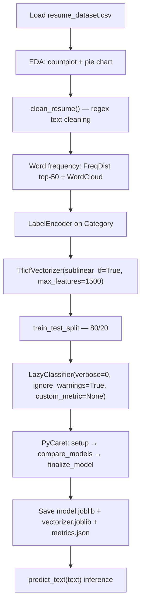

# Resume Screening with Python

> **Repository**: [https://github.com/pypi-ahmad/Natural-Language-Processing-Projects](https://github.com/pypi-ahmad/Natural-Language-Processing-Projects)

## 1. Project Overview

This project classifies resumes into job categories using TF-IDF features and automated model selection via LazyPredict and PyCaret. The notebook is `resumeScreening.ipynb`. Text preprocessing uses regex-based cleaning, and the final model is persisted as a joblib artifact.

## 2. Dataset

- **File**: `resume_dataset.csv`
- **Data path**: `data/NLP Projecct 1.ResumeScreening/resume_dataset.csv`
- **Columns**: `Category`, `Resume`
- A derived column `structured_resume` is created by applying `clean_resume()` to `Resume`.

## 3. Pipeline Overview

| Step | Cell(s) | Description |
|------|---------|-------------|
| 1 | 1–2 | Data directory setup via `_find_data_dir()` |
| 2 | 3 | Import numpy, pandas, matplotlib, warnings |
| 3 | 4 | Load CSV into `resumeData`, create empty `structured_resume` column |
| 4 | 5 | Print unique `Category` values |
| 5 | 6 | Print category value counts |
| 6 | 7 | Seaborn `countplot` — Category vs Count bar chart |
| 7 | 8–9 | Matplotlib pie chart — Category Distribution (using `GridSpec`, `Wistia` colormap) |
| 8 | 10 | Define `clean_resume(Text)` and apply to `Resume` → `structured_resume` |
| 9 | 11 | Import NLTK stopwords, WordCloud; download `stopwords` and `punkt` |
| 10 | 12 | Build word frequency list from first 160 resumes using `nltk.word_tokenize` |
| 11 | 13 | `nltk.FreqDist` — print top-50 most common words |
| 12 | 14 | WordCloud visualization of `cleaned_Sentences` |
| 13 | 15 | `LabelEncoder` to encode `Category` column as integers |
| 14 | 16 | `TfidfVectorizer` to build feature matrix `WordFeatures` |
| 15 | 18 | LazyPredict baseline model comparison |
| 16 | 19 | PyCaret final pipeline (setup → compare_models → finalize_model) |
| 17 | 21 | Save model, vectorizer, metrics to `artifacts/resume_screening/` |
| 18 | 22 | Define `predict_text(text)` inference function |
| 19 | 23 | Consistency checks and summary printout |

## 4. ML Workflow



## 5. Core Logic Breakdown

### `_find_data_dir()`
Searches parent and current directories for `data/NLP Projecct 1.ResumeScreening`. Falls back to `.` if not found.

### `clean_resume(Text)`
Applies regex substitutions in order:
1. Remove URLs (`http\S+\s*`)
2. Remove @mentions (`@\S+`)
3. Remove punctuation characters
4. Remove `RT` and `cc`
5. Remove hashtags (`#\S+`)
6. Remove non-ASCII characters (`[^\x00-\x7f]`)
7. Collapse extra whitespace (`\s+`)

### TF-IDF Vectorization
```python
word_vectorizer = TfidfVectorizer(sublinear_tf=True, stop_words='english', max_features=1500)
```

### LazyPredict
```python
clf = LazyClassifier(verbose=0, ignore_warnings=True, custom_metric=None)
models, predictions = clf.fit(X_train, X_test, y_train, y_test)
```
Selects the best model by sorting on `Accuracy`.

### PyCaret
```python
s = setup(data=df_ml, target='target', session_id=42, verbose=False)
best = compare_models(n_select=1)
final_model = finalize_model(best)
```

### `predict_text(text)`
Transforms input text with `word_vectorizer` and calls `final_model.predict()`.

## 6. Model Details

- **Feature extraction**: `TfidfVectorizer` with `sublinear_tf=True`, `stop_words='english'`, `max_features=1500`
- **Model selection**: LazyPredict compares multiple classifiers; PyCaret selects and finalizes the best
- **Metrics saved**: Accuracy, F1, Precision, Recall (from PyCaret); Accuracy, F1 (from LazyPredict)
- **No specific classifier is hardcoded** — the best model is selected automatically at runtime

## 7. Project Structure

```
NLP Projecct 1.ResumeScreening/
├── resumeScreening.ipynb          # Main notebook
├── resume_dataset.csv             # Dataset (local copy)
├── test_resume_screening.py       # Test suite (95 lines)
└── README.md
data/NLP Projecct 1.ResumeScreening/
└── resume_dataset.csv             # Dataset (canonical location)
artifacts/resume_screening/        # Generated after running notebook
├── model.joblib
├── vectorizer.joblib
└── metrics.json
```

## 8. Setup & Installation

```bash
pip install numpy pandas matplotlib seaborn nltk wordcloud scikit-learn scipy lazypredict pycaret joblib
```

NLTK data downloads (executed in notebook):
```python
nltk.download('stopwords')
nltk.download('punkt')
```

## 9. How to Run

1. Ensure the dataset exists at `data/NLP Projecct 1.ResumeScreening/resume_dataset.csv`
2. Open `resumeScreening.ipynb` and run all cells sequentially
3. Artifacts are saved to `artifacts/resume_screening/`

## 10. Testing

- **Test file**: `test_resume_screening.py` (95 lines)
- **Test classes**:
  - `TestDataLoading` — verifies file exists, loads without error, not empty, expected columns (`Category`, `Resume`), no fully-null columns
  - `TestPreprocessing` — checks `Resume` dtype is string, non-empty strings, basic regex cleaning, multiple label classes
  - `TestModel` — tests `TfidfVectorizer` fit/transform and `MultinomialNB` fit
  - `TestPrediction` — tests prediction output length and `predict_proba` shape/sum

Run tests:
```bash
pytest "NLP Projecct 1.ResumeScreening/test_resume_screening.py" -v
```

## 11. Limitations

- Word frequency analysis only processes the first 160 resumes (hardcoded `range(0, 160)`)
- `scipy.sparse.hstack` is imported but never used
- `LabelEncoder` is fit in-place on `resumeData` but not saved to disk — only `TfidfVectorizer` and the final model are persisted
- No cross-validation or hyperparameter tuning outside of PyCaret's internal process
- The `structured_resume` column is initialized as empty string then overwritten — the initial assignment is redundant
