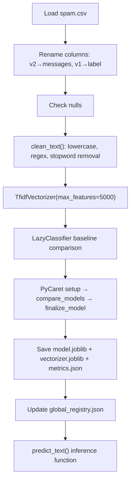

# SMS Spam Detection Analysis

> **Repository**: [https://github.com/pypi-ahmad/Natural-Language-Processing-Projects](https://github.com/pypi-ahmad/Natural-Language-Processing-Projects)

## 1. Project Overview

This notebook classifies SMS messages as **spam** or **ham** (legitimate) using TF-IDF vectorization and an automated ML pipeline. It uses LazyPredict for baseline model comparison and PyCaret for final model selection, then persists the trained model and metrics to the `artifacts/` directory.

## 2. Dataset

| Item | Value |
|------|-------|
| File | `spam.csv` |
| Source path | `data/NLP Projects 31 - SMS Spam Detection Analysis/spam.csv` |
| Key columns | `v1` (label: spam/ham), `v2` (message text) |
| Size | 5,574 messages |

The notebook renames `v2` → `messages` and `v1` → `label` after loading.

## 3. Pipeline Overview

1. **Data directory setup** — resolve path to `spam.csv` via `_find_data_dir()`
2. **Import modules** — pandas, numpy, nltk, re, stopwords
3. **Load dataset** — `pd.read_csv(DATA_DIR / 'spam.csv')`
4. **Select and rename columns** — keep `v2`/`v1`, rename to `messages`/`label`
5. **Check for null values** — `df.isnull().sum()`
6. **Text cleaning** — `clean_text()` function: lowercase, remove non-alphanumeric, remove extra spaces, remove English stopwords
7. **Apply cleaning** — new column `clean_text`
8. **Define features/target** — `X = df['clean_text']`, `y = df['label']`
9. **TF-IDF vectorization** — `TfidfVectorizer(max_features=5000, stop_words='english')`
10. **LazyPredict baseline** — `LazyClassifier` on 80/20 split, reports best model by accuracy
11. **PyCaret pipeline** — `setup()` → `compare_models()` → `finalize_model()`
12. **Save artifacts** — model (`model.joblib`), vectorizer (`vectorizer.joblib`), metrics (`metrics.json`)
13. **Update global registry** — append entry to `artifacts/global_registry.json`
14. **Inference function** — `predict_text(text)` transforms input via `_tfidf` and predicts with `final_model`
15. **Consistency checks** — assert model and files exist, print summary

## 4. Workflow Diagram



## 5. Core Logic Breakdown

### `clean_text(text)`
- Lowercases input
- `re.sub(r'[^0-9a-zA-Z]', ' ', text)` — remove non-alphanumeric characters
- `re.sub(r'\s+', ' ', text)` — collapse whitespace
- Filters out NLTK English stopwords

### TF-IDF Vectorization
- `TfidfVectorizer(max_features=5000, stop_words='english')`
- NaN rows are dropped before vectorization

### LazyPredict Step
- 80/20 train/test split with `random_state=42`
- `LazyClassifier(verbose=0, ignore_warnings=True, custom_metric=None)`
- Selects best model by `Accuracy`

### PyCaret Step
- Caps input at 5000 rows × 2000 features
- `setup(data=df_ml, target='target', session_id=42, verbose=False)`
- `compare_models(n_select=1)` → `finalize_model(best)`

### `predict_text(text)`
- Transforms single text via the fitted `_tfidf` vectorizer
- Returns `final_model.predict(vec)`

## 6. Model / Output Details

- **Artifacts directory**: `artifacts/sms_spam_analysis/`
- **Saved files**: `model.joblib`, `vectorizer.joblib`, `metrics.json`
- **Metrics tracked**: accuracy, F1, precision, recall (PyCaret), plus LazyPredict accuracy and F1
- **Global registry**: `artifacts/global_registry.json` — records project name, best model, accuracy, timestamp

## 7. Project Structure

```
NLP Projects 31 - SMS Spam Detection Analysis/
├── SMS Spam Detection Analysis - NLP.ipynb   # Main notebook
├── test_sms_spam_analysis.py                 # Test file (122 lines)
└── README.md
data/NLP Projects 31 - SMS Spam Detection Analysis/
└── spam.csv                                  # Dataset
artifacts/sms_spam_analysis/
├── model.joblib
├── vectorizer.joblib
└── metrics.json
```

## 8. Setup & Installation

```
pip install pandas numpy nltk scikit-learn lazypredict pycaret joblib
```

NLTK data required:
```python
import nltk
nltk.download('stopwords')
```

## 9. How to Run

1. Place `spam.csv` in `data/NLP Projects 31 - SMS Spam Detection Analysis/`
2. Open `SMS Spam Detection Analysis - NLP.ipynb` in Jupyter
3. Run all cells sequentially
4. Trained model and metrics are saved to `artifacts/sms_spam_analysis/`

## 10. Testing

| Item | Value |
|------|-------|
| Test file | `test_sms_spam_analysis.py` |
| Line count | 122 |
| Framework | pytest |

**Test classes:**

- `TestDataLoading` — checks `spam.csv` exists, loads, has columns `v1`/`v2`, no fully-null columns
- `TestPreprocessing` — checks `v2` is string dtype, non-empty, basic regex cleaning, label has ≥2 classes
- `TestModel` — builds `TfidfVectorizer(max_features=100)` on 200 rows, fits `MultinomialNB`
- `TestPrediction` — verifies prediction output length and class membership, checks `predict_proba` shape sums to 1.0

Run:
```
pytest "NLP Projects 31 - SMS Spam Detection Analysis/test_sms_spam_analysis.py" -v
```

## 11. Limitations

- Stopword removal is applied twice: once in `clean_text()` via NLTK stopwords, and again in `TfidfVectorizer(stop_words='english')`
- PyCaret input is capped at 5000 rows and 2000 features — with 5,574 messages this silently drops ~574 rows
- The `project_name` is hardcoded as `'sms_spam_analysis'`
- `predict_text()` relies on module-level variables `_tfidf` and `final_model` — only works within the active notebook session
- LazyPredict and PyCaret may select different "best" models; only the PyCaret model is saved
