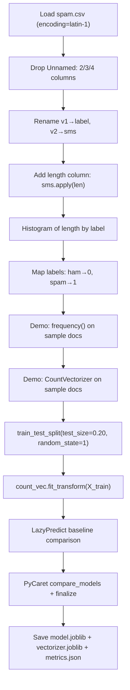

# SMS Spam Detection

> **Repository**: [https://github.com/pypi-ahmad/Natural-Language-Processing-Projects](https://github.com/pypi-ahmad/Natural-Language-Processing-Projects)

## 1. Project Overview

Classifies SMS messages as spam or ham. The notebook renames columns from `v1`/`v2` to `label`/`sms`, adds a message-length feature, demonstrates `CountVectorizer` on sample documents, then uses the same vectoriser for the real dataset with LazyPredict and PyCaret to select and persist the best classifier.

## 2. Dataset

| Item | Value |
|------|-------|
| File | `spam.csv` |
| Path | `data/NLP Projecct 18.SMS spam detection/spam.csv` |
| Encoding | `latin-1` |
| Original columns | `v1` (label), `v2` (message text), `Unnamed: 2`, `Unnamed: 3`, `Unnamed: 4` |
| After rename | `label`, `sms` (unnamed columns are dropped) |
| Added column | `length` — character count of `sms` |
| Label encoding | `ham → 0`, `spam → 1` |

## 3. Pipeline Overview

| Step | Cell(s) | Description |
|------|---------|-------------|
| 1 | 1 | Data-directory resolution (`_find_data_dir()`) |
| 2 | 2–3 | Import pandas/numpy/nltk, load `spam.csv` with `encoding='latin-1'`, drop unnamed columns, rename `v1→label`, `v2→sms` |
| 3 | 4 | Add `length` column: `data['sms'].apply(len)` |
| 4 | 5–6 | Import matplotlib, plot histogram of `length` grouped by `label` (50 bins, orange, figsize 10×4) |
| 5 | 8 | Map labels: `{'ham': 0, 'spam': 1}` |
| 6 | 9–10 | Import `string`, `Counter`; define `frequency(documents)` function |
| 7 | 11–12 | Demo `frequency()` on hardcoded sample `documents` list |
| 8 | 13–16 | `CountVectorizer()` demo: fit on sample docs, `get_feature_names()`, transform to array, build `frequency_matrix` DataFrame |
| 9 | 17–18 | `train_test_split(data['sms'], data['label'], test_size=0.20, random_state=1)`, then `count_vec.fit_transform(X_train)` and `count_vec.transform(X_test)` |
| 10 | 20 | LazyPredict baseline comparison |
| 11 | 21 | PyCaret `setup` / `compare_models` / `finalize_model` |
| 12 | 23 | Save `model.joblib`, `vectorizer.joblib` (`count_vec`), `metrics.json`; update `global_registry.json` |
| 13 | 24 | Define `predict_text(text)` inference function |
| 14 | 25 | Consistency assertions and summary |

## 4. Workflow Diagram



## 5. Core Logic Breakdown

### Column processing (Cell 3)
```python
data = pd.read_csv(str(DATA_DIR / 'spam.csv'), encoding='latin-1')
data = data.drop(["Unnamed: 2", "Unnamed: 3", "Unnamed: 4"], axis=1)
data = data.rename(columns={"v1": "label", "v2": "sms"})
```

### Length feature (Cell 4)
```python
data['length'] = data['sms'].apply(len)
```

### Histogram (Cell 6)
```python
data.hist(column='length', by='label', bins=50, figsize=(10, 4), color="orange")
```

### `frequency()` helper (Cell 10)
```python
def frequency(documents):
    lower_case_documents = [d.lower() for d in documents]
    sans_punctuation_documents = []
    for i in lower_case_documents:
        sans_punctuation_documents.append(i.translate(str.maketrans("", "", string.punctuation)))
    preprocessed_documents = [[w for w in d.split()] for d in sans_punctuation_documents]
    frequency_list = [Counter(d) for d in preprocessed_documents]
    return lower_case_documents, preprocessed_documents, frequency_list
```

### Vectorisation & split (Cell 18)
```python
X_train, X_test, y_train, y_test = train_test_split(
    data['sms'], data['label'], test_size=0.20, random_state=1)
training_data = count_vec.fit_transform(X_train)
testing_data = count_vec.transform(X_test)
```
`count_vec` is a default `CountVectorizer()` (no `max_features` or `ngram_range` set).

### Inference (Cell 24)
```python
def predict_text(text):
    vec = count_vec.transform([text])
    return final_model.predict(vec)
```

## 6. Model / Output Details

- **LazyPredict** selects best model by accuracy.
- **PyCaret** runs `compare_models(n_select=1)` with `session_id=42`, then `finalize_model`.
- Artifacts saved to `artifacts/sms_spam_detection/`:
  - `model.joblib` — finalized PyCaret model
  - `vectorizer.joblib` — fitted `CountVectorizer` (`count_vec`)
  - `metrics.json` — accuracy, F1, precision, recall

## 7. Project Structure

```
NLP Projecct 18.SMS spam detection/
├── SMSspam detection.ipynb   # Main notebook (space in filename)
├── test_sms_spam.py          # Test suite (95 lines)
├── spam.csv                  # Dataset (local copy)
└── README.md
data/NLP Projecct 18.SMS spam detection/
└── spam.csv
artifacts/sms_spam_detection/
├── model.joblib
├── vectorizer.joblib
└── metrics.json
```

## 8. Setup & Installation

```
pip install pandas numpy scikit-learn nltk matplotlib lazypredict pycaret joblib
```

## 9. How to Run

1. Open `SMSspam detection.ipynb` in Jupyter.
2. Run all cells sequentially.
3. Artifacts are saved to `artifacts/sms_spam_detection/`.

## 10. Testing

| File | Classes | Line count |
|------|---------|------------|
| `test_sms_spam.py` | `TestDataLoading`, `TestPreprocessing`, `TestModel`, `TestPrediction` | 95 |

Run:
```
pytest "NLP Projecct 18.SMS spam detection/test_sms_spam.py" -v
```

## 11. Limitations

- The `CountVectorizer` used for actual training is default (no `max_features`, no `ngram_range`) — the earlier demo vectoriser is the same `count_vec` object that gets re-fitted on `X_train`, overwriting the demo fit.
- The `frequency()` function is only used on a hardcoded sample of 4 sentences — never called on the actual dataset.
- NLTK is imported (Cell 2) but never used for any text processing.
- The `length` column is added for EDA histograms but is not used as a model feature.
- No text preprocessing (lowercasing, stemming, stopword removal) is applied to SMS text before vectorisation.
