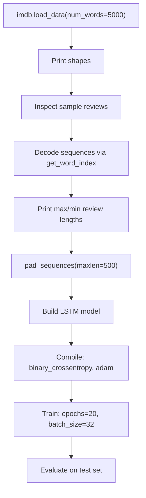

# Sentiment Analysis — IMDB (Keras LSTM)

> **Repository**: [https://github.com/pypi-ahmad/Natural-Language-Processing-Projects](https://github.com/pypi-ahmad/Natural-Language-Processing-Projects)

## 1. Project Overview

This project builds a binary sentiment classifier on the IMDB dataset using a Keras LSTM model. The dataset is loaded directly from `keras.datasets.imdb` (no local CSV file). Reviews are padded to a fixed length of 500, then fed through an Embedding → Dropout → LSTM → Dropout → Dense(sigmoid) architecture. Despite the folder name referencing a Flask web app, no Flask application files exist in this project.

## 2. Dataset

| Item | Value |
|------|-------|
| **Source** | `keras.datasets.imdb` (downloaded by Keras at runtime) |
| **Vocabulary size** | `num_words=5000` |
| **No local data file** | The dataset is loaded programmatically, not from a CSV/TSV |

Loaded via:

```python
words = 5000
(X_train, y_train), (X_test, y_test) = imdb.load_data(num_words=words)
```

## 3. Pipeline Overview

| Step | Cell(s) | Description |
|------|---------|-------------|
| 1 | 1 | Import libraries (re, nltk, warnings, numpy, tensorflow, keras) |
| 2 | 2 | Load IMDB data: `imdb.load_data(num_words=5000)` |
| 3 | 3 | Print train/test shapes |
| 4 | 4–6 | Inspect sample reviews and labels (indices 0, 1, 5) |
| 5 | 7–9 | Decode integer sequences back to words using `imdb.get_word_index()` |
| 6 | 10–11 | Display `words_idx` and `idx_words` dictionaries |
| 7 | 12–13 | Print max and min review lengths |
| 8 | 14 | Pad sequences: `sequence.pad_sequences(maxlen=500)` |
| 9 | 15 | Build model: Embedding(5000, 32) → Dropout(0.2) → LSTM(100) → Dropout(0.2) → Dense(1, sigmoid) |
| 10 | 16 | Compile: `binary_crossentropy`, `adam`, `accuracy` |
| 11 | 17 | `model.summary()` |
| 12 | 18 | Train: `model.fit(X_train, y_train, validation_data=(X_test, y_test), epochs=20, batch_size=32)` |
| 13 | 19 | Evaluate: `model.evaluate(X_test, y_test)` |
| 14 | 20 | Empty cell |

## 4. Workflow Diagram



## 5. Core Logic Breakdown

### Word index decoding

```python
words_idx = imdb.get_word_index()
idx_words = {i: word for word, i in words_idx.items()}
```

Used to convert integer-encoded reviews back to readable text for inspection.

### Sequence padding

```python
max_len = 500
X_train = sequence.pad_sequences(X_train, maxlen=max_len)
X_test = sequence.pad_sequences(X_test, maxlen=max_len)
```

### Model architecture

```python
emb_len = 32
model = Sequential()
model.add(Embedding(words, emb_len, input_length=max_len))  # Embedding(5000, 32, input_length=500)
model.add(Dropout(0.2))
model.add(LSTM(100))
model.add(Dropout(0.2))
model.add(Dense(1, activation='sigmoid'))
```

### Training

```python
model.fit(X_train, y_train, validation_data=(X_test, y_test), epochs=20, batch_size=32)
```

### Evaluation

```python
result = model.evaluate(X_test, y_test, verbose=0)
print("Accuracy: {:.2f}".format(result[1]*100))
```

## 6. Model / Output Details

| Item | Value |
|------|-------|
| **Architecture** | Embedding → Dropout(0.2) → LSTM(100) → Dropout(0.2) → Dense(1, sigmoid) |
| **Loss** | `binary_crossentropy` |
| **Optimizer** | `adam` |
| **Epochs** | 20 |
| **Batch size** | 32 |
| **Max sequence length** | 500 |
| **Vocabulary size** | 5000 |
| **Embedding dimension** | 32 |
| **No model saved** | The trained model is not saved to disk |

## 7. Project Structure

```
NLP Projects 28 - Build_Sentiment_Analysis_Flask_Web_App/
├── Sentiment_Analysis_IMDB.ipynb   # Main notebook
├── test_flask_sentiment.py         # Test file (53 lines)
└── README.md
```

No Flask app files (no `app.py`, no `templates/`, no `static/`) exist in this directory.

## 8. Setup & Installation

```bash
pip install numpy matplotlib tensorflow keras nltk
```

No local dataset download is needed — `keras.datasets.imdb` handles this automatically.

## 9. How to Run

1. Open `Sentiment_Analysis_IMDB.ipynb` in Jupyter/VS Code.
2. Run all cells. Training with 20 epochs on LSTM may take significant time without a GPU.

## 10. Testing

| File | Lines | Classes |
|------|-------|---------|
| `test_flask_sentiment.py` | 53 | `TestProjectStructure`, `TestPreprocessing` |

```bash
pytest "NLP Projects 28 - Build_Sentiment_Analysis_Flask_Web_App/test_flask_sentiment.py" -v
```

`TestProjectStructure` verifies the notebook exists and is valid JSON with code cells. `TestPreprocessing` tests basic regex text cleaning and tokenization independently of the notebook.

## 11. Limitations

- **Unused imports**: `re`, `nltk`, and `word_tokenize` are imported but never used in the notebook.
- **Data leakage**: The test set (`X_test`, `y_test`) is passed as `validation_data` during training, meaning the model sees test data at every epoch for validation metrics.
- **No model persistence**: The trained model is not saved to disk (`load_model` is imported but never used).
- **No Flask app**: Despite the folder name "Build_Sentiment_Analysis_Flask_Web_App", no Flask application code exists. The project is a standalone Keras notebook.
- **No preprocessing of input text**: The notebook does not include any function to preprocess new raw text input for inference (converting text to integer sequences and padding).
