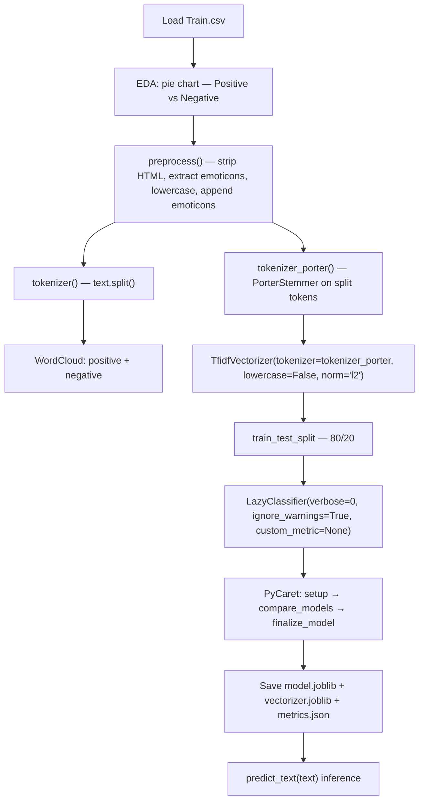

# Sentiment Analysis with Python

> **Repository**: [https://github.com/pypi-ahmad/Natural-Language-Processing-Projects](https://github.com/pypi-ahmad/Natural-Language-Processing-Projects)

## 1. Project Overview

This project performs binary sentiment classification (positive vs. negative) on text data using TF-IDF features with Porter stemming and automated model selection via LazyPredict and PyCaret. The notebook is `centimentAnalysis.ipynb`. Preprocessing extracts and preserves emoticons as features.

## 2. Dataset

- **Files**: `Train.csv`, `Test.csv`, `Valid.csv`
- **Data path**: `data/NLP Projecct 3.Sentiment Analysis/`
- **Loaded file**: `Train.csv`
- **Columns**: `text`, `label` (1 = positive, 0 = negative)

## 3. Pipeline Overview

| Step | Cell(s) | Description |
|------|---------|-------------|
| 1 | 1–2 | Data directory setup via `_find_data_dir()` |
| 2 | 3 | Import pandas, `CountVectorizer` (unused); load `Train.csv` |
| 3 | 4 | Filter positive (`label==1`) and negative (`label==0`) subsets |
| 4 | 5 | Pie chart — Positive vs Negative distribution |
| 5 | 6 | Define `preprocess(text)` — HTML strip, emoticon extraction, lowercase + append emoticons |
| 6 | 7 | Apply `preprocess` to `data['text']` |
| 7 | 8 | Display preprocessed data |
| 8 | 9 | Define `tokenizer(text)` — simple `text.split()` |
| 9 | 10 | Import `PorterStemmer`; define `tokenizer_porter(text)` |
| 10 | 11 | Import NLTK stopwords, WordCloud |
| 11 | 12 | Separate `positive_data` and `negative_data` text columns |
| 12 | 13 | Define `plot_wordcloud(data, color)` |
| 13 | 14 | Positive word cloud |
| 14 | 15 | Negative word cloud |
| 15 | 16 | `TfidfVectorizer` with `tokenizer=tokenizer_porter`; fit/transform `data.text` |
| 16 | 18 | LazyPredict baseline model comparison |
| 17 | 19 | PyCaret final pipeline (setup → compare_models → finalize_model) |
| 18 | 21 | Save model, vectorizer, metrics to `artifacts/sentiment_analysis/` |
| 19 | 22 | Define `predict_text(text)` inference function |
| 20 | 23 | Consistency checks and summary printout |

## 4. ML Workflow



## 5. Core Logic Breakdown

### `_find_data_dir()`
Searches parent and current directories for `data/NLP Projecct 3.Sentiment Analysis`. Falls back to `.` if not found.

### `preprocess(text)`
Three operations in sequence:
1. Strip HTML tags: `re.sub('<[^>]*>', '', text)`
2. Extract emoticons: `re.findall('(?::|;|=)(?:-)?(?:\)|\(|D|P)', text)`
3. Remove non-word characters + lowercase + append emoticons: `re.sub('[\W]+', ' ', text.lower()) + ' '.join(emoji).replace('-', '')`

Emoticons are preserved and appended to the cleaned text, making them available as TF-IDF features.

### `tokenizer(text)`
Simple whitespace split:
```python
def tokenizer(text):
    return text.split()
```

### `tokenizer_porter(text)`
Applies `PorterStemmer` to each token:
```python
def tokenizer_porter(text):
    return [porter.stem(word) for word in text.split()]
```

### `plot_wordcloud(data, color)`
Joins text data, removes `'movie'` and `'film'` tokens, generates and displays a `WordCloud` with `stopwords=stop`.

### TF-IDF Vectorization
```python
tfid = TfidfVectorizer(
    strip_accents=None,
    preprocessor=None,
    lowercase=False,
    use_idf=True,
    norm='l2',
    tokenizer=tokenizer_porter,
    smooth_idf=True
)
```
No `max_features` parameter is set. The `tokenizer` parameter (not `analyzer`) is set to `tokenizer_porter`.

### LazyPredict
```python
clf = LazyClassifier(verbose=0, ignore_warnings=True, custom_metric=None)
models, predictions = clf.fit(X_train, X_test, y_train, y_test)
```

### PyCaret
```python
s = setup(data=df_ml, target='target', session_id=42, verbose=False)
best = compare_models(n_select=1)
final_model = finalize_model(best)
```

### `predict_text(text)`
Transforms input text with the saved `tfid` vectorizer and calls `final_model.predict()`.

## 6. Model Details

- **Feature extraction**: `TfidfVectorizer` with `tokenizer=tokenizer_porter`, `lowercase=False`, `norm='l2'`, `use_idf=True`, `smooth_idf=True`, no `max_features`
- **Model selection**: LazyPredict compares multiple classifiers; PyCaret selects and finalizes the best
- **Metrics saved**: Accuracy, F1, Precision, Recall (from PyCaret); Accuracy, F1 (from LazyPredict)
- **No specific classifier is hardcoded** — the best model is selected automatically at runtime

## 7. Project Structure

```
NLP Projecct 3.Sentiment Analysis/
├── centimentAnalysis.ipynb        # Main notebook (filename has typo)
├── Train.csv                      # Training dataset (local copy)
├── Test.csv                       # Test dataset (local copy)
├── Valid.csv                      # Validation dataset (local copy)
├── test_sentiment_analysis.py     # Test suite (95 lines)
└── README.md
data/NLP Projecct 3.Sentiment Analysis/
├── Train.csv
├── Test.csv
└── Valid.csv
artifacts/sentiment_analysis/      # Generated after running notebook
├── model.joblib
├── vectorizer.joblib
└── metrics.json
```

## 8. Setup & Installation

```bash
pip install numpy pandas matplotlib nltk wordcloud scikit-learn lazypredict pycaret joblib
```

NLTK data downloads (executed in notebook):
```python
nltk.download('stopwords')
```

## 9. How to Run

1. Ensure the dataset exists at `data/NLP Projecct 3.Sentiment Analysis/Train.csv`
2. Open `centimentAnalysis.ipynb` and run all cells sequentially
3. Artifacts are saved to `artifacts/sentiment_analysis/`

## 10. Testing

- **Test file**: `test_sentiment_analysis.py` (95 lines)
- **Test classes**:
  - `TestDataLoading` — verifies file exists, loads without error, not empty, expected columns (`text`, `label`), no fully-null columns
  - `TestPreprocessing` — checks `text` dtype is string, non-empty strings, basic text cleaning, multiple label classes
  - `TestModel` — tests `TfidfVectorizer` fit/transform and `MultinomialNB` fit
  - `TestPrediction` — tests prediction output length and `predict_proba` shape/sum

Run tests:
```bash
pytest "NLP Projecct 3.Sentiment Analysis/test_sentiment_analysis.py" -v
```

## 11. Limitations

- `CountVectorizer` is imported but never used in the pipeline
- Only `Train.csv` is loaded; `Test.csv` and `Valid.csv` are not used in the notebook
- No `accuracy_score`, `confusion_matrix`, or `classification_report` evaluation — metrics come solely from LazyPredict/PyCaret
- No `WordNetLemmatizer` is used despite this being a common NLP preprocessing step
- `preprocess()` does not remove URLs or stopwords — it only strips HTML tags, extracts emoticons, removes non-word characters, and lowercases
- NLTK stopwords are imported and used only in the `plot_wordcloud()` function, not in the main text preprocessing pipeline
- No cross-validation or hyperparameter tuning outside of PyCaret's internal process
