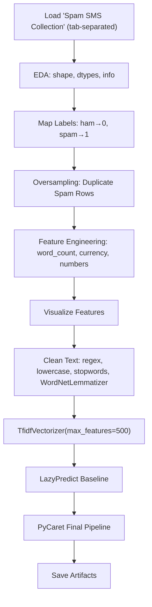

# Spam SMS Classification

> **Repository**: [https://github.com/pypi-ahmad/Natural-Language-Processing-Projects](https://github.com/pypi-ahmad/Natural-Language-Processing-Projects)

## 1. Project Overview

This project classifies SMS messages as spam or ham (not spam). The notebook handles class imbalance via manual oversampling, engineers three additional features (`word_count`, `contains_currency_symbol`, `contains_number`), preprocesses text with `WordNetLemmatizer`, vectorizes with `TfidfVectorizer`, and selects a final model via LazyPredict and PyCaret.

## 2. Dataset

- **File**: `Spam SMS Collection` (no file extension; tab-separated)
- **Source path**: `data/NLP Project 23. - Spam SMS Classification/Spam SMS Collection`
- **Load call**: `pd.read_csv(..., sep='\t', names=['label', 'message'])`
- **Columns**: `label` (text: `ham` / `spam`, mapped to `0` / `1`), `message` (SMS text)

## 3. Pipeline Overview

1. Load data with `pd.read_csv(..., sep='\t', names=['label', 'message'])`
2. EDA: `.shape`, `.columns`, `.dtypes`, `.head()`, `.tail()`, `.info()`, `.describe(include='object')`
3. Map labels: `df['label'].map({'ham': 0, 'spam': 1})`
4. Visualize: countplot showing class imbalance
5. **Oversampling**: duplicate spam rows to balance classes — `pd.concat([df, only_spam])` repeated `count-1` times where `count = int(ham_count / spam_count)`
6. Feature engineering:
   - `word_count`: `df['message'].apply(lambda x: len(x.split()))`
   - `contains_currency_symbol`: checks for `€`, `$`, `¥`, `£`, `₹`
   - `contains_number`: checks if any character has ASCII ordinal 48–57
7. Visualize: distribution plots of `word_count`, countplots of `contains_currency_symbol` and `contains_number`
8. NLP imports: `nltk`, `re`, `stopwords`, `WordNetLemmatizer`
9. Clean messages: `re.sub(pattern='[^a-zA-Z]', repl=' ', string=...)`, lowercase, split, remove stopwords, lemmatize with `WordNetLemmatizer`, join
10. Vectorize: `TfidfVectorizer(max_features=500)` on `corpus`; `X = pd.DataFrame(vectors, columns=feature_names)`, `y = df['label']`
11. LazyPredict baseline model comparison (80/20 split, `random_state=42`)
12. PyCaret final pipeline (setup → compare → finalize)
13. Save model, vectorizer (`tfidf`), and metrics to `artifacts/spam_sms_classification/`
14. Define `predict_text(text)` inference function
15. Run consistency checks and print summary

## 4. Workflow Diagram



## 5. Core Logic Breakdown

| Step | Code | Details |
|------|------|---------|
| Load data | `pd.read_csv(str(DATA_DIR / 'Spam SMS Collection'), sep='\t', names=['label', 'message'])` | No file extension |
| Label mapping | `df['label'].map({'ham': 0, 'spam': 1})` | Binary encoding |
| Oversampling | `pd.concat([df, only_spam])` in loop | count = `int(ham_count / spam_count)`, repeated `count-1` times |
| `word_count` | `df['message'].apply(lambda x: len(x.split()))` | Word count per message |
| `contains_currency_symbol` | Custom `currency(x)` function | Checks for €, $, ¥, £, ₹ |
| `contains_number` | Custom `numbers(x)` function | Checks ASCII ordinals 48–57 |
| Text cleaning | `re.sub(pattern='[^a-zA-Z]', repl=' ', string=sms_string)` | Removes non-alpha chars |
| Lemmatizer | `WordNetLemmatizer().lemmatize(word)` | Not PorterStemmer |
| Vectorizer | `TfidfVectorizer(max_features=500)` | TF-IDF, not CountVectorizer |
| Features | `X = pd.DataFrame(vectors, columns=feature_names)` | TF-IDF features only |
| Target | `y = df['label']` | After oversampling |
| Persistence | `dump(final_model, ...)` / `dump(tfidf, ...)` | Saved to `artifacts/spam_sms_classification/` |

## 6. Model / Output Details

- LazyPredict selects the best baseline model by accuracy
- PyCaret trains and finalizes a model (exact model type depends on data at runtime)
- Artifacts saved: `model.joblib`, `vectorizer.joblib`, `metrics.json`
- Global registry updated at `artifacts/global_registry.json`

## 7. Project Structure

```
NLP Project 23. - Spam SMS Classification/
├── Spam SMS Classication.ipynb            # Main notebook (note: "Classication" typo in filename)
├── dataset/
│   └── Spam SMS Collection                # Local copy of data (no extension)
├── test_spam_sms_classification.py        # Test file (95 lines)
└── README.md
```

## 8. Setup & Installation

```bash
pip install numpy pandas matplotlib seaborn nltk scikit-learn lazypredict pycaret joblib
```

NLTK data downloads used in the notebook:
```python
nltk.download('stopwords')
nltk.download('wordnet')
```

## 9. How to Run

1. Open `Spam SMS Classication.ipynb` in Jupyter or VS Code
2. Run all cells sequentially
3. The notebook loads data from the `data/` directory (resolved via `_find_data_dir()`)
4. Trained model and metrics are saved to `artifacts/spam_sms_classification/`

## 10. Testing

- **Test file**: `test_spam_sms_classification.py` (95 lines)
- **Test classes**:
  - `TestDataLoading` — verifies data file exists, loads without error, has `label` and `message` columns
  - `TestPreprocessing` — checks text dtype, non-empty strings, basic cleaning, label has multiple classes
  - `TestModel` — tests `TfidfVectorizer` and `MultinomialNB` fitting
  - `TestPrediction` — tests prediction output and `predict_proba` shape

Run tests:
```bash
pytest "NLP Project 23. - Spam SMS Classification/test_spam_sms_classification.py" -v
```

## 11. Limitations

- The three engineered features (`word_count`, `contains_currency_symbol`, `contains_number`) are computed and added to `df` but are **never concatenated** with the TF-IDF feature matrix `X` — the model trains only on TF-IDF features
- Oversampling is done before train/test split (in LazyPredict/PyCaret steps), which means duplicate spam rows can leak into both train and test sets
- The `contains_number` function checks ASCII ordinals character-by-character instead of using regex or `str.contains`
- The `currency` function uses a hardcoded list of 5 currency symbols
- Notebook filename has a typo: `Spam SMS Classication.ipynb` (missing "fi" in "Classification")
- `WordNetLemmatizer` is called without a POS tag, so it defaults to noun lemmatization only
