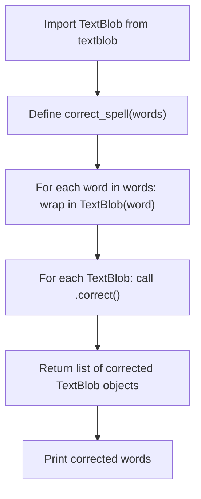

# Correct Spellings with Python

> **Repository**: [https://github.com/pypi-ahmad/Natural-Language-Processing-Projects](https://github.com/pypi-ahmad/Natural-Language-Processing-Projects)

## 1. Project Overview

This project uses the `textblob` library to correct misspelled English words. It defines a single function, `correct_spell`, that takes a list of misspelled words and returns a list of corrected `TextBlob` objects. There is no dataset or ML model involved.

## 2. Dataset

No dataset is used. The notebook operates on a hardcoded list of misspelled words passed directly to the correction function.

## 3. Pipeline Overview

1. Import `TextBlob` from `textblob`
2. Define `correct_spell(words)` — iterates over a list of words, wraps each in `TextBlob`, calls `.correct()` on each
3. Call `correct_spell(["learnig", "learnre", "leatn"])` and print the corrected words

## 4. Workflow Diagram



## 5. Core Logic Breakdown

### `correct_spell(words)`
- **Input:** a list of strings (misspelled words)
- Iterates over `words`, wrapping each in `TextBlob(i)` → appends to `correct_words` list
- Prints the original `words` list as "Wrong words"
- Iterates over `correct_words`, calls `.correct()` on each `TextBlob` → appends to `corrected_words` list
- **Returns:** a list of `TextBlob` objects (the corrected words)

### Usage in notebook
```python
words = ["learnig", "learnre", "leatn"]
correct_words = correct_spell(words)
for i in correct_words:
    print(i, end=" ")
```

## 6. Model / Output Details

No ML model. TextBlob's `.correct()` method uses an internal spelling correction algorithm based on Peter Norvig's approach. Output is printed to stdout.

## 7. Project Structure

```
NLP Projecct 5.correct Spelling/
├── CorrectSpelling.ipynb          # Main notebook (5 cells)
├── test_correct_spelling.py       # Test suite (41 lines)
├── README.md
└── __pycache__/

data/NLP Projecct 5.correct Spelling/
└── (empty)
```

## 8. Setup & Installation

```bash
pip install textblob
```

## 9. How to Run

Open `CorrectSpelling.ipynb` in Jupyter and run all cells sequentially. No external data files are needed.

## 10. Testing

- **Test file:** `test_correct_spelling.py` (41 lines)
- **Test classes:**
  - `TestProjectStructure` — checks project directory exists, notebook exists, notebook is valid JSON with cells, and has code cells
  - `TestPreprocessing` — tests basic text cleaning with regex and simple tokenization (these are standalone tests, not exercising notebook code directly)

Run tests:
```bash
pytest "NLP Projecct 5.correct Spelling/test_correct_spelling.py" -v
```

## 11. Limitations

- **`correct_spell` returns `TextBlob` objects, not plain strings.** Callers must convert with `str()` if strings are needed.
- **No input validation:** passing non-string elements in the list will raise an error.
- **Two unnecessary loops:** the function first wraps all words in `TextBlob`, then iterates again to call `.correct()`. This could be done in a single loop.
- **Prints inside the function:** `correct_spell` prints "Wrong words" as a side effect, mixing I/O with logic.
- **Cell 2 is a comment-only cell** (no executable code — just describes TextBlob).
