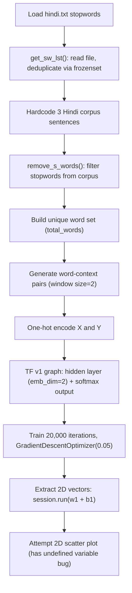

# Hindi Stop Words — Word2Vec Visualization

> **Repository**: [https://github.com/pypi-ahmad/Natural-Language-Processing-Projects](https://github.com/pypi-ahmad/Natural-Language-Processing-Projects)

## 1. Project Overview

This notebook loads a Hindi stopword list from a text file, demonstrates stopword removal on a small hardcoded Hindi corpus, builds a custom Word2Vec-style word embedding using TensorFlow v1 (manual one-hidden-layer neural network with softmax output), and attempts to plot the 2D word vectors. It imports gensim but never uses it.

## 2. Dataset

| Item | Value |
|------|-------|
| File | `hindi.txt` |
| Source path | `data/NLP Projects 34 - Stop words in 28 Languages/hindi.txt` |
| Kaggle source | https://www.kaggle.com/heeraldedhia/stop-words-in-28-languages/download |
| Format | One stopword per line, UTF-8 encoded |

A copy of `hindi.txt` also exists in the project folder itself.

## 3. Pipeline Overview

1. **Data directory setup** — resolve path via `_find_data_dir()`
2. **Import libraries** — pandas, numpy, matplotlib, gensim, `tensorflow.compat.v1 as tf`
3. **Load data** — `pd.read_csv(DATA_DIR / 'hindi.txt')`
4. **Inspect data** — `df.head()`, `df.isnull().sum()`, `df.columns`
5. **Define `get_sw_lst()`** — reads stopword file, returns deduplicated list via `frozenset`
6. **Load stopwords** — `s_words = get_sw_lst(file_path)`
7. **Display sample** — `s_words[:5]`, print total count
8. **Define hardcoded corpus** — 3 Hindi sentences about education
9. **Define hardcoded stopword list** — 10 Hindi stopwords in `stop_words` variable
10. **Define `remove_s_words(c)`** — removes stopwords from corpus sentences
11. **Apply stopword removal** — `corpus = remove_s_words(corpus)`
12. **Build unique word set** — `total_words` from cleaned corpus
13. **Build word-context pairs** — sliding window of size 2, stored in `data` list
14. **Create DataFrame** — columns `input` and `label` from word-context pairs
15. **Build word index** — `word_dict` mapping word → integer
16. **Disable TF v2 behavior** — `tf.disable_v2_behavior()`
17. **Define one-hot encoding** — `to_one_hot_enc(d)` function
18. **Build TF v1 graph** — one hidden layer (`w1`, `b1`), output layer (`w2`, `b2`), softmax, cross-entropy loss, `GradientDescentOptimizer(0.05)`
19. **Train** — 20,000 iterations, print loss every 3,000
20. **Extract vectors** — `vec = session.run(w1 + b1)`
21. **Create vector DataFrame** — `df_new` with columns `word`, `x1`, `x2`
22. **Attempt scatter plot** — annotate words on 2D chart (**contains bug**)
23. **Define `disp_html()`** — styled HTML display function (**contains bug**)
24. **Display Hindi text** — call `disp_html()` with sample text

## 4. Workflow Diagram



## 5. Core Logic Breakdown

### `get_sw_lst(stop_file_path)`
Opens file with `encoding="utf-8"`, reads lines, strips whitespace, deduplicates via `frozenset`, returns list.

### `remove_s_words(c)`
Iterates corpus sentences, splits on spaces, removes any token in `stop_words` list using `list.remove()`.

### Word-Context Pair Generation
```python
size = 2
for s in sent:
    for idx, w in enumerate(s):
        for neighbor in s[max(idx - size, 0): min(idx + size, len(s) + 1)]:
            if neighbor != w:
                data.append([w, neighbor])
```
Sliding window of ±2 words around each target word.

### TF v1 Neural Network
- Input: one-hot vector of `one_hot_dim = len(total_words)`
- Hidden layer: `w1` shape `[one_hot_dim, 2]`, bias `b1` — produces 2D embeddings
- Output layer: `w2` shape `[2, one_hot_dim]`, bias `b2` — softmax predictions
- Loss: `tf.reduce_mean(-tf.reduce_sum(y_label * tf.log(pred), axis=[1]))`
- Optimizer: `tf.train.GradientDescentOptimizer(0.05)`
- Training: 20,000 iterations on full batch

### `to_one_hot_enc(d)`
Creates zero vector of size `one_hot_dim`, sets index `d` to 1.

### `disp_html(s, fc, font, fontsize)`
Renders styled HTML in notebook. Has a bug: uses `str(fc)` for font-size but `fc` is the font color, not size.

## 6. Model / Output Details

The "model" is a manually-built single-hidden-layer network that produces 2D word embeddings for Hindi words. The embedding vectors are stored in DataFrame `df_new` with columns `word`, `x1`, `x2`. No model is saved to disk.

## 7. Project Structure

```
NLP Projects 34 - Stop words in 28 Languages/
├── hindi-stop-words-w2v(1).ipynb   # Main notebook
├── hindi.txt                       # Local copy of stopword file
├── test_hindi_stopwords.py         # Test file (61 lines)
├── Link to dataset .txt            # Kaggle download URL
└── README.md
data/NLP Projects 34 - Stop words in 28 Languages/
├── hindi.txt                       # Dataset stopword file
└── Link to dataset .txt
```

## 8. Setup & Installation

```
pip install pandas numpy matplotlib gensim tensorflow
```

Note: The notebook uses `tensorflow.compat.v1` and calls `tf.disable_v2_behavior()`, so it requires TensorFlow 2.x with v1 compatibility mode.

## 9. How to Run

1. Place `hindi.txt` in `data/NLP Projects 34 - Stop words in 28 Languages/`
2. Open `hindi-stop-words-w2v(1).ipynb` in Jupyter
3. **The scatter plot cell will fail** due to an undefined variable `vectors` — see Limitations
4. The TF v1 training cells will run if TF v1 compat mode is available

## 10. Testing

| Item | Value |
|------|-------|
| Test file | `test_hindi_stopwords.py` |
| Line count | 61 |
| Framework | pytest |

**Test classes:**

- `TestDataLoading` — checks `hindi.txt` exists, is non-empty, loads stopwords list with >5 entries
- `TestPreprocessing` — verifies stopwords are strings, non-empty, and >5 unique entries
- `TestModel` — tests stopword removal on a sample Hindi sentence
- `TestPrediction` — tests word-to-index dictionary creation from stopword list

Run:
```
pytest "NLP Projects 34 - Stop words in 28 Languages/test_hindi_stopwords.py" -v
```

## 11. Limitations

1. **Undefined variable `vectors` in scatter plot cell** — the code references `np.amin(vectors, ...)` and `np.amax(vectors, ...)` but the variable is named `vec` (from `vec = session.run(w1 + b1)`); raises `NameError`
2. **`disp_html()` font-size bug** — uses `str(fc)` for the CSS `font-size` property, but `fc` is the font color parameter; the `fontsize` parameter is never used in the CSS
3. **gensim is imported but never used** — `from gensim.models import Word2Vec` is dead code; the Word2Vec-style training is done manually with TF v1
4. **Hardcoded corpus** — only 3 short Hindi sentences; the model is illustrative, not useful
5. **Hardcoded stopword list for removal** — `stop_words` in the removal demo is a manually-defined 10-word list, not the full file-loaded `s_words` list
6. **`remove_s_words()` uses `list.remove()`** — only removes the first occurrence of each stopword per sentence
7. **TF v1 compatibility required** — `tf.disable_v2_behavior()` and `tf.placeholder` require TF v1 compat mode
8. **No model saving** — the trained word vectors are not persisted
