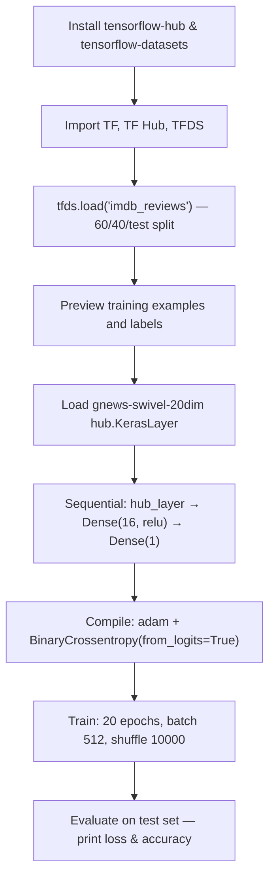

# Text Classification with TensorFlow

> **Repository**: [https://github.com/pypi-ahmad/Natural-Language-Processing-Projects](https://github.com/pypi-ahmad/Natural-Language-Processing-Projects)

## 1. Project Overview

This notebook builds a text classification model for IMDB movie reviews using TensorFlow, TensorFlow Hub, and TensorFlow Datasets. It uses a pre-trained embedding layer from TF Hub and trains a sequential model to classify reviews as positive or negative.

## 2. Dataset

| Source | Split | Description |
|--------|-------|-------------|
| `tfds.load(name="imdb_reviews")` | `train[:60%]` — training | 15,000 samples |
| `tfds.load(name="imdb_reviews")` | `train[60%:]` — validation | 10,000 samples |
| `tfds.load(name="imdb_reviews")` | `test` — test | 25,000 samples |

The dataset is loaded directly via `tensorflow_datasets` — no local CSV files are used.

Data path (convention): `data/NLP Projecct 9.Textclassification/` (empty — data is downloaded by `tfds`).

## 3. Pipeline Overview

1. Install `tensorflow-hub` and `tensorflow-datasets` via pip
2. Import `tensorflow`, `tensorflow_hub`, and `tensorflow_datasets`
3. Load IMDB reviews with a 60/40 train/validation split plus a separate test set using `tfds.load`
4. Preview first 10 training examples and labels
5. Load pre-trained TF Hub embedding layer (`gnews-swivel-20dim`) as a `hub.KerasLayer`
6. Build a `tf.keras.Sequential` model: Hub embedding → `Dense(16, activation='relu')` → `Dense(1)` (no activation)
7. Compile with `optimizer='adam'` and `BinaryCrossentropy(from_logits=True)`
8. Train for 20 epochs with `train_data.shuffle(10000).batch(512)` and `validation_data.batch(512)`
9. Evaluate on test set and print loss and accuracy

## 4. Workflow Diagram



## 5. Core Logic Breakdown

### Data loading
```python
train_data, validation_data, test_data = tfds.load(
    name="imdb_reviews",
    split=('train[:60%]', 'train[60%:]', 'test'),
    as_supervised=True
)
```
This produces a 60/40 split of the 25,000 training samples, plus the full 25,000-sample test set.

### Pre-trained embedding
```python
embedd = "https://tfhub.dev/google/tf2-preview/gnews-swivel-20dim/1"
hub_layer = hub.KerasLayer(embedd, input_shape=[], dtype=tf.string, trainable=True)
```

### Model architecture
```python
model = tf.keras.Sequential()
model.add(hub_layer)
model.add(tf.keras.layers.Dense(16, activation='relu'))
model.add(tf.keras.layers.Dense(1))
```
The final layer is `Dense(1)` with **no sigmoid activation**. Binary classification is handled by `from_logits=True` in the loss function.

### Compilation and training
```python
model.compile(
    optimizer='adam',
    loss=tf.keras.losses.BinaryCrossentropy(from_logits=True),
    metrics=['accuracy']
)
model_text = model.fit(
    train_data.shuffle(10000).batch(512),
    epochs=20,
    validation_data=validation_data.batch(512),
    verbose=1
)
```

### Evaluation
```python
results = model.evaluate(test_data.batch(512), verbose=2)
for names, val in zip(model.metrics_names, results):
    print("%s: %.3f" % (names, val))
```

## 6. Model / Output Details

| Detail | Value |
|--------|-------|
| Architecture | Sequential: TF Hub embedding → Dense(16, relu) → Dense(1) |
| Embedding | `gnews-swivel-20dim` (20-dimensional, trainable) |
| Loss | `BinaryCrossentropy(from_logits=True)` |
| Optimizer | Adam |
| Epochs | 20 |
| Batch size | 512 |
| Output | Printed loss and accuracy on test set |

No accuracy/loss curves are plotted. No model is saved to disk.

## 7. Project Structure

```
NLP Projecct 9.Textclassification/
├── textClassification.ipynb         # Main notebook
├── test_text_classification.py      # Test file (41 lines)
└── README.md
```

No local data files — IMDB reviews are downloaded by `tensorflow_datasets`.

## 8. Setup & Installation

```bash
pip install tensorflow tensorflow-hub tensorflow-datasets
```

Packages imported in the notebook: `tensorflow`, `tensorflow_hub`, `tensorflow_datasets`.

## 9. How to Run

1. Install dependencies listed above.
2. Open `textClassification.ipynb` and run all cells sequentially.
3. Internet access is required on first run to download the IMDB dataset and the TF Hub embedding model.

## 10. Testing

Test file: `test_text_classification.py` (41 lines)

| Test Class | Description |
|------------|-------------|
| `TestProjectStructure` | Verifies project directory exists, notebook exists, notebook is valid JSON, and contains code cells |
| `TestPreprocessing` | Tests basic regex text cleaning and whitespace tokenization (standalone, no data dependency) |

All tests are marked `@pytest.mark.no_local_data`.

Run:
```bash
pytest "NLP Projecct 9.Textclassification/test_text_classification.py" -v
```

## 11. Limitations

- **No plotting**: The training history (`model_text`) is stored but never used — no accuracy or loss curves are plotted.
- **No model saving**: The trained model is not exported or saved to disk.
- **Last cell is empty**: Cell 12 contains no code.
- **No text preprocessing**: Raw IMDB review text is passed directly to the hub embedding without any cleaning.
- **Large batch size**: Batch size of 512 may cause memory issues on machines with limited RAM/GPU.
- **Hardcoded TF Hub URL**: The embedding URL `https://tfhub.dev/google/tf2-preview/gnews-swivel-20dim/1` may become unavailable in future TF Hub versions.
