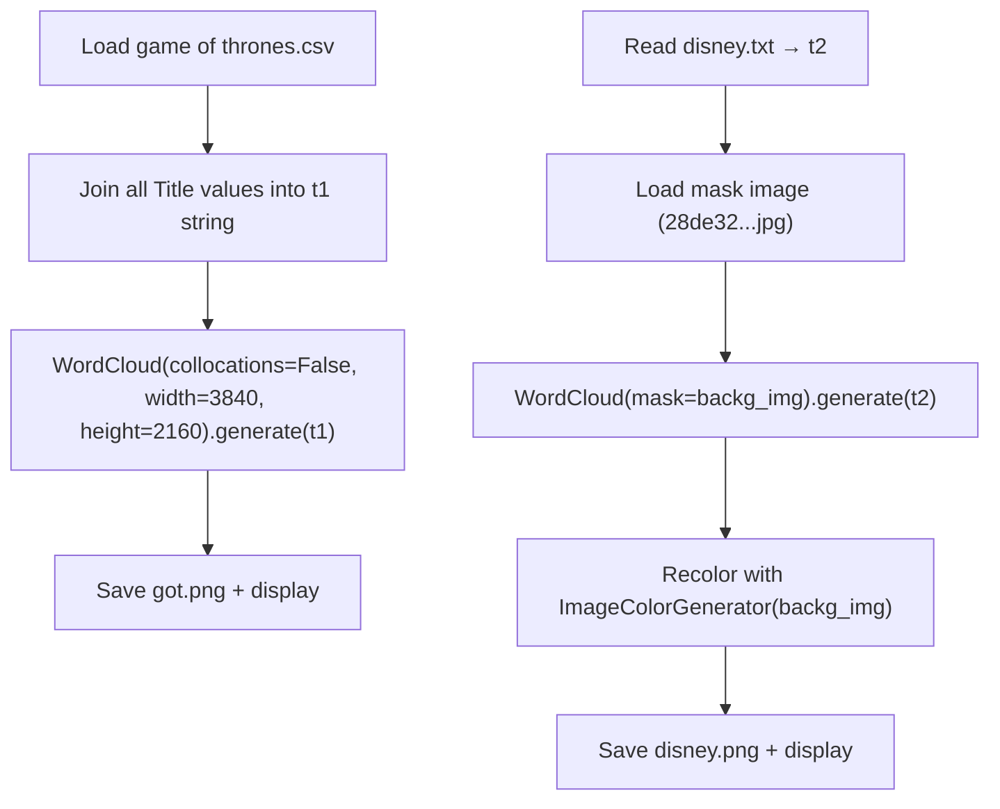

# Word Cloud Generation (Mislabeled as "Text Similarity")

> **Repository**: [https://github.com/pypi-ahmad/Natural-Language-Processing-Projects](https://github.com/pypi-ahmad/Natural-Language-Processing-Projects)

## 1. Project Overview

Despite the folder name "Text Similarity", this notebook generates **word clouds** — not text similarity analysis. It loads a Game of Thrones CSV file and a Disney text file, creates word clouds using the `wordcloud` library, and saves the results as PNG images. The `train.csv` and `test.csv` files exist in the data directory but are never loaded or used in the notebook.

## 2. Dataset

| Item | Value |
|------|-------|
| CSV file | `game of thrones.csv` |
| Text file | `disney.txt` |
| Mask image | `28de32146d9bfb991d0e859fca65f012.jpg` |
| Data path | `data/NLP Projects 35 - Text Similarity/` |
| Kaggle source | https://www.kaggle.com/rishisankineni/text-similarity/download |

**`game of thrones.csv`** — used for the `Title` column (all titles joined into one string for word cloud).

**`disney.txt`** — read as raw text for a second word cloud.

**`28de32146d9bfb991d0e859fca65f012.jpg`** — used as a mask image for the Disney word cloud shape.

**`train.csv` and `test.csv`** — present in data directory but never referenced in the notebook.

## 3. Pipeline Overview

1. **Data directory setup** — resolve path via `_find_data_dir()`
2. **Import libraries** — pandas, matplotlib, numpy, PIL, wordcloud (`WordCloud`, `ImageColorGenerator`)
3. **Load CSV** — `pd.read_csv(DATA_DIR / "game of thrones.csv")`
4. **Join titles** — `t1 = " ".join(title for title in df.Title)`
5. **Generate word cloud 1** — `WordCloud(collocations=False, background_color='white', width=3840, height=2160).generate(t1)`
6. **Save image** — `wc1.to_file('got.png')`
7. **Display word cloud 1** — `plt.imshow(wc1, interpolation='bilinear')`
8. **Read Disney text** — `t2 = open(DATA_DIR / 'disney.txt', 'r').read()`
9. **Load mask image** — `np.array(Image.open(DATA_DIR / '28de32146d9bfb991d0e859fca65f012.jpg'))`
10. **Generate word cloud 2** — `WordCloud(background_color='white', mask=backg_img, width=3840, height=2160).generate(t2)`
11. **Recolor** — `wc2.recolor(color_func=ImageColorGenerator(backg_img))`
12. **Save image** — `wc2.to_file('disney.png')`
13. **Display word cloud 2** — `plt.imshow(wc2, interpolation='bilinear')`

## 4. Workflow Diagram



## 5. Core Logic Breakdown

### Word Cloud 1: Game of Thrones Titles
```python
t1 = " ".join(title for title in df.Title)
wc1 = WordCloud(collocations=False, background_color='white', width=3840, height=2160).generate(t1)
wc1.to_file('got.png')
```
Joins all `Title` column values, generates a simple white-background word cloud at 4K resolution with `collocations=False`.

### Word Cloud 2: Disney (Masked)
```python
t2 = open(str(DATA_DIR / 'disney.txt'), 'r').read()
backg_img = np.array(Image.open(str(DATA_DIR / '28de32146d9bfb991d0e859fca65f012.jpg')))
wc2 = WordCloud(background_color='white', mask=backg_img, width=3840, height=2160).generate(t2)
img_c = ImageColorGenerator(backg_img)
wc2.recolor(color_func=img_c)
wc2.to_file('disney.png')
```
Reads Disney text, loads a JPEG as mask and color source, generates a shaped/colored word cloud.

## 6. Model / Output Details

No model is trained. The outputs are two PNG image files:
- `got.png` — word cloud from Game of Thrones episode titles
- `disney.png` — shaped word cloud from Disney text, colored to match the mask image

## 7. Project Structure

```
NLP Projects 35 - Text Similarity/
├── word-cloud-in-python-for-beginners.ipynb  # Main notebook (word cloud, not text similarity)
├── test_text_similarity.py                   # Test file (85 lines)
├── train.csv                                 # Unused in notebook
├── test.csv                                  # Unused in notebook
├── Link to dataset .txt                      # Kaggle download URL
└── README.md
data/NLP Projects 35 - Text Similarity/
├── game of thrones.csv                       # GoT episode data
├── disney.txt                                # Disney text for word cloud
├── 28de32146d9bfb991d0e859fca65f012.jpg      # Mask image
├── train.csv                                 # Unused
├── test.csv                                  # Unused
├── characters_v4.csv                         # Unused
├── GOT_episodes_v4.csv                       # Unused
├── houses_v1.csv                             # Unused
├── got_temp/                                 # Unused
├── DOWNLOAD_REQUIRED.txt
└── Link to dataset .txt
```

## 8. Setup & Installation

```
pip install pandas numpy matplotlib pillow wordcloud
```

## 9. How to Run

1. Place `game of thrones.csv`, `disney.txt`, and `28de32146d9bfb991d0e859fca65f012.jpg` in `data/NLP Projects 35 - Text Similarity/`
2. Open `word-cloud-in-python-for-beginners.ipynb` in Jupyter
3. Run all cells sequentially
4. Output images `got.png` and `disney.png` are saved to the working directory

## 10. Testing

| Item | Value |
|------|-------|
| Test file | `test_text_similarity.py` |
| Line count | 85 |
| Framework | pytest |

**Test classes:**

- `TestDataLoading` — checks `game of thrones.csv` and `disney.txt` exist and load, verifies `Title` column present, text is non-empty
- `TestPreprocessing` — tests tokenization on Disney text, checks `Summary` column in CSV, computes word frequency with regex
- `TestModel` — joins summaries and checks length, runs `TfidfVectorizer(max_features=50)` on `Summary` column
- `TestPrediction` — extracts top-10 most common words from Disney text via `Counter`

Run:
```
pytest "NLP Projects 35 - Text Similarity/test_text_similarity.py" -v
```

## 11. Limitations

1. **Folder name / content mismatch** — the folder is named "Text Similarity" but the notebook (`word-cloud-in-python-for-beginners.ipynb`) generates word clouds; no text similarity computation exists
2. **`train.csv` and `test.csv` are never used** — these files exist in both the project folder and data directory but are not referenced in any notebook cell
3. **Multiple unused data files** — `characters_v4.csv`, `GOT_episodes_v4.csv`, `houses_v1.csv`, `got_temp/` are in the data directory but unused
4. **Output images saved to working directory** — `got.png` and `disney.png` are saved relative to CWD, not to a defined output path
5. **File handle not closed** — `open(str(DATA_DIR / 'disney.txt'), 'r').read()` opens file without `with` statement
6. **No text similarity analysis** — despite the Kaggle dataset being for text similarity, the notebook only generates visualizations
