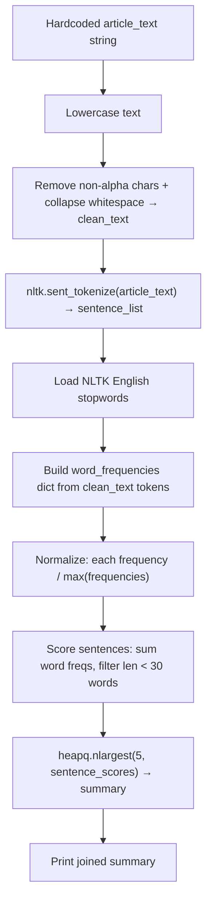

# Text Summarization using Word Frequency

> **Repository**: [https://github.com/pypi-ahmad/Natural-Language-Processing-Projects](https://github.com/pypi-ahmad/Natural-Language-Processing-Projects)

## 1. Project Overview

This notebook implements extractive text summarization by scoring sentences based on normalized word frequencies. It takes a hardcoded article about software engineering agility, preprocesses the text, builds a word frequency table, scores each sentence, and extracts the top 5 sentences using `heapq.nlargest`.

## 2. Dataset

There is no external dataset file. The input text is a hardcoded string assigned to `article_text` in the first code cell. The text is a passage about agility in software engineering (attributed to Ivar Jacobson).

The `data/NLP Projects 32 - Text Summarization using Word Frequency/` directory exists but is empty.

## 3. Pipeline Overview

1. **Define input text** — `article_text` assigned as a hardcoded string in code
2. **Import modules** — `re`, `nltk`
3. **Lowercase text** — `article_text = article_text.lower()`
4. **Clean text** — `re.sub('[^a-zA-Z]', ' ', article_text)` then `re.sub('\s+', ' ', clean_text)` to remove punctuation/numbers and collapse whitespace
5. **Sentence tokenization** — `nltk.sent_tokenize(article_text)` on the lowercased (not cleaned) text
6. **Stopword loading** — `nltk.corpus.stopwords.words('english')`
7. **Build word frequency dict** — iterate over `nltk.word_tokenize(clean_text)`, count non-stopword words
8. **Normalize frequencies** — divide each count by `maximum_frequency`
9. **Score sentences** — for each sentence in `sentence_list`, sum word frequencies for words present in `word_frequencies`, but only if `len(sentence.split(' ')) < 30`
10. **Extract summary** — `heapq.nlargest(5, sentence_scores, key=sentence_scores.get)`
11. **Print summary** — `" ".join(summary)`

## 4. Workflow Diagram



## 5. Core Logic Breakdown

### Text Cleaning
```python
clean_text = re.sub('[^a-zA-Z]', ' ', article_text)
clean_text = re.sub('\s+', ' ', clean_text)
```
Removes all non-alphabetic characters, collapses whitespace. Applied to the already-lowercased `article_text`.

### Word Frequency Calculation
```python
word_frequencies = {}
for word in nltk.word_tokenize(clean_text):
    if word not in stopwords:
        if word not in word_frequencies:
            word_frequencies[word] = 1
        else:
            word_frequencies[word] += 1
```
Counts each non-stopword token. Then normalizes by dividing all values by `max(word_frequencies.values())`.

### Sentence Scoring
```python
for sentence in sentence_list:
    for word in nltk.word_tokenize(sentence):
        if word in word_frequencies and len(sentence.split(' ')) < 30:
            ...
            sentence_scores[sentence] += word_frequencies[word]
```
Sentences longer than 30 space-separated tokens are excluded. Scores are cumulative normalized word frequencies.

### Summary Extraction
```python
summary = heapq.nlargest(5, sentence_scores, key=sentence_scores.get)
print(" ".join(summary))
```
Returns the 5 highest-scoring sentences.

## 6. Model / Output Details

This is not a trained model. The output is an extractive summary: the top 5 sentences from the input text, ranked by cumulative normalized word frequency. No model is saved.

## 7. Project Structure

```
NLP Projects 32 - Text Summarization using Word Frequency/
├── Text Summarization using Word Frequency - NLP.ipynb  # Main notebook
├── test_text_summarization_freq.py                      # Test file (53 lines)
└── README.md
```

## 8. Setup & Installation

```
pip install nltk
```

NLTK data required:
```python
import nltk
nltk.download('punkt')
nltk.download('stopwords')
```

## 9. How to Run

1. Open `Text Summarization using Word Frequency - NLP.ipynb` in Jupyter
2. Run all cells sequentially
3. Summary is printed in the last cell output

To summarize different text, replace the `article_text` string in the first code cell.

## 10. Testing

| Item | Value |
|------|-------|
| Test file | `test_text_summarization_freq.py` |
| Line count | 53 |
| Framework | pytest |

**Test classes:**

- `TestProjectStructure` — checks project directory exists, notebook exists, notebook is valid JSON with code cells
- `TestPreprocessing` — tests basic regex text cleaning and tokenization on sample strings

Both classes are marked with `@pytest.mark.no_local_data` since no external data files are needed.

Run:
```
pytest "NLP Projects 32 - Text Summarization using Word Frequency/test_text_summarization_freq.py" -v
```

## 11. Limitations

- Input text is hardcoded — there is no file I/O or parameterization for different inputs
- Sentence tokenization uses the lowercased `article_text` (preserving punctuation), but word lookup uses `clean_text` (punctuation removed); since `nltk.word_tokenize` on the sentence re-tokenizes with punctuation, some words may not match the cleaned frequency dict
- The sentence length filter (`len(sentence.split(' ')) < 30`) is hardcoded and applied per-word rather than once per sentence, which is redundant but not incorrect
- The number of summary sentences (5) is hardcoded in `heapq.nlargest`
- No evaluation metric is computed for the summary quality
