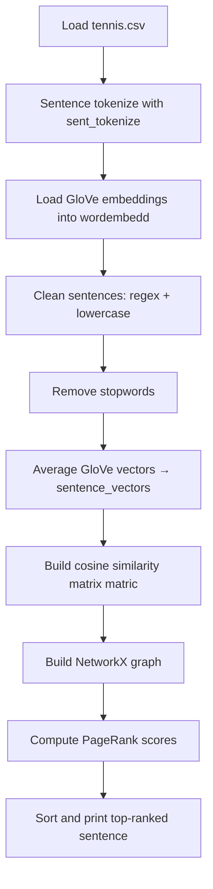

# Text Summarization

> **Repository**: [https://github.com/pypi-ahmad/Natural-Language-Processing-Projects](https://github.com/pypi-ahmad/Natural-Language-Processing-Projects)

## 1. Project Overview

This project implements extractive text summarization using GloVe word embeddings (100-dimensional), cosine similarity, and PageRank. It reads tennis-related articles, builds sentence vectors by averaging GloVe embeddings, constructs a similarity matrix, and ranks sentences using the PageRank algorithm from NetworkX.

## 2. Dataset

| Item | Value |
|------|-------|
| File | `tennis.csv` |
| Path | `data/NLP Projecct 10.TextSummarization/tennis.csv` |
| Key Column | `article_text` |
| Auxiliary File | `glove.6B.100d.txt` (GloVe word vectors, 100-dimensional) |

## 3. Pipeline Overview

1. **Data directory setup** — `_find_data_dir()` resolves path to data folder
2. **Import libraries** — pandas, numpy
3. **Load CSV** — `pd.read_csv("tennis.csv")` into `df`
4. **Inspect article** — access `df['article_text'][1]`
5. **Import NLTK** — stopwords, `sent_tokenize`, download `'stopwords'` and `'punkt'`; import `re`
6. **Sentence tokenization** — `sent_tokenize()` on each article, flatten into `sentences` list
7. **Load GloVe embeddings** — read `glove.6B.100d.txt` line by line into `wordembedd` dict
8. **Clean sentences** — regex `"[^a-zA-Z]"` replaces non-alpha with space, lowercase
9. **Remove stopwords** — `remove_stopwords(sen)` filters out NLTK English stopwords
10. **Build sentence vectors** — average GloVe vectors for each cleaned sentence into `sentence_vectors`
11. **Build similarity matrix** — `matric` populated with `cosine_similarity()` for all sentence pairs
12. **PageRank ranking** — build NetworkX graph from `matric`, compute `nx.pagerank()`, sort sentences by score
13. **Print summary** — output top-ranked sentence as summary

## 4. Workflow Diagram



## 5. Core Logic Breakdown

### `remove_stopwords(sen)`
Filters tokens in a split sentence against NLTK English stopwords. Returns joined string.

### Sentence vector construction
```python
temp = sum([wordembedd.get(w, np.zeros((100,))) for w in i.split()]) / (len(i.split()) + 0.001)
```
Averages GloVe vectors per sentence. Unknown words fall back to zero vectors. The `+0.001` prevents division by zero.

### Similarity matrix (`matric`)
```python
matric[i][j] = cosine_similarity(
    sentence_vectors[i].reshape(1, 100),
    sentence_vectors[j].reshape(1, 100)
)[0, 0]
```
Pairwise cosine similarity computed via `sklearn.metrics.pairwise.cosine_similarity`. Diagonal is left as zero (`if i != j`).

### PageRank ranking
```python
nx_graph = nx.from_numpy_array(matric)
scores = nx.pagerank(nx_graph)
ranked_sentences = sorted(((scores[i], s) for i, s in enumerate(sentences)), reverse=True)
```

## 6. Model / Output Details

No trained ML model. The output is the top-ranked sentence from the PageRank algorithm, printed as the article summary. The number of summary sentences is hardcoded to 1 (`range(1)`).

## 7. Project Structure

```
NLP Projecct 10.TextSummarization/
├── TextSummarization.ipynb
├── test_text_summarization.py
└── README.md

data/NLP Projecct 10.TextSummarization/
├── tennis.csv
└── glove.6B.100d.txt
```

## 8. Setup & Installation

```bash
pip install pandas numpy nltk scikit-learn networkx
```

NLTK data downloads (executed in the notebook):
```python
nltk.download('stopwords')
nltk.download('punkt')
```

GloVe embeddings must be downloaded separately from https://nlp.stanford.edu/data/glove.6B.zip and `glove.6B.100d.txt` placed in the data directory.

## 9. How to Run

1. Place `tennis.csv` and `glove.6B.100d.txt` in `data/NLP Projecct 10.TextSummarization/`
2. Open `TextSummarization.ipynb` and run all cells sequentially

## 10. Testing

| Item | Value |
|------|-------|
| Test file | `test_text_summarization.py` |
| Line count | 68 |
| Framework | pytest |

**Test classes:**

| Class | Tests | Description |
|-------|-------|-------------|
| `TestDataLoading` | 4 | File existence, load, non-empty, `article_text` column |
| `TestPreprocessing` | 3 | String dtype, content length, sentence splitting |
| `TestModel` | 2 | Word frequency extraction, sentence scoring |
| `TestPrediction` | 1 | Summary generation (length check) |

```bash
pytest "NLP Projecct 10.TextSummarization/test_text_summarization.py" -v
```

## 11. Limitations

- GloVe file (~822 MB unzipped) must be downloaded manually; the fallback random embedding branch is incomplete (no vectors are actually generated)
- Regex `"[^a-zA-Z]"` strips hyphens, apostrophes, and digits — may damage compound words
- Similarity matrix is built with an O(n²) nested Python loop; slow for large article sets
- Summary output is hardcoded to 1 sentence (`for i in range(1)`)
- Sentence cleaning uses `pd.Series.str.replace` without `regex=True` (deprecated behavior in newer pandas)
