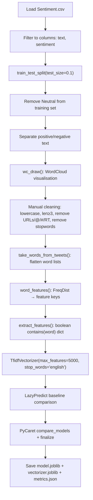

# Twitter Sentiment Analysis

> **Repository**: [https://github.com/pypi-ahmad/Natural-Language-Processing-Projects](https://github.com/pypi-ahmad/Natural-Language-Processing-Projects)

## 1. Project Overview

Classifies tweets about political candidates into Positive, Negative, or Neutral sentiments. The notebook builds an NLTK feature-extraction pipeline with word clouds, then vectorises with `TfidfVectorizer` and runs LazyPredict and PyCaret to select and persist the best classifier.

## 2. Dataset

| Item | Value |
|------|-------|
| File | `Sentiment.csv` |
| Path | `data/NLP Projecct 17.Twitter Sentiment Analysis/Sentiment.csv` |
| Key columns | `id`, `candidate`, `sentiment`, `text` |
| Label values | `Positive`, `Negative`, `Neutral` |

## 3. Pipeline Overview

| Step | Cell(s) | Description |
|------|---------|-------------|
| 1 | 1 | Data-directory resolution (`_find_data_dir()`) |
| 2 | 2–3 | Import pandas/numpy, load `Sentiment.csv`, filter to `['text', 'sentiment']` |
| 3 | 4–5 | `train_test_split(data, test_size=0.1)`, remove Neutral from `data_prep` |
| 4 | 6 | Separate `train_positive` and `train_negative` text series |
| 5 | 7–10 | Import WordCloud/matplotlib, define `wc_draw()`, plot positive and negative word clouds |
| 6 | 11 | Import NLTK, download stopwords |
| 7 | 12 | Manual text cleaning loop: lowercase words ≥ 3 chars, remove URLs/mentions/hashtags/RT, remove stopwords → `tweets` list of `(word_list, sentiment)` tuples |
| 8 | 13 | Separate `test_positive` and `test_negative` text series |
| 9 | 14 | `take_words_from_tweets(tweets)` — flatten all words from tweet tuples |
| 10 | 15–16 | `word_features(wordlist)` — build `FreqDist`, extract keys → `words_feature` |
| 11 | 17 | `extract_features(document)` — build boolean feature dict `{'contains(word)': True/False}` |
| 12 | 18 | Plot word cloud of `words_feature` |
| 13 | 20 | `TfidfVectorizer(max_features=5000, stop_words='english')` on all text |
| 14 | 21 | LazyPredict baseline comparison |
| 15 | 22 | PyCaret `setup` / `compare_models` / `finalize_model` |
| 16 | 24 | Save `model.joblib`, `vectorizer.joblib` (`_tfidf`), `metrics.json`; update `global_registry.json` |
| 17 | 25 | Define `predict_text(text)` inference function |
| 18 | 26 | Consistency assertions and summary |

## 4. Workflow Diagram



## 5. Core Logic Breakdown

### Word cloud drawing (Cell 8)
```python
def wc_draw(datas, color='black'):
    words = ' '.join(datas)
    cleaned_word = " ".join([word for word in words.split()
                             if 'http' not in word
                             and not word.startswith('@')
                             and not word.startswith('#')
                             and word != 'RT'])
    words = WordCloud(stopwords=STOPWORDS, background_color=color,
                      width=2500, height=2000).generate(cleaned_word)
    plt.figure(1, figsize=(13, 13))
    plt.imshow(words)
    plt.axis('off')
    plt.show()
```

### Manual cleaning loop (Cell 12)
```python
tweets = []
stopwords_set = set(stopwords.words("english"))
for index, row in train.iterrows():
    filtered = [e.lower() for e in row.text.split() if len(e) >= 3]
    cleaned = [word for word in filtered
               if 'http' not in word
               and not word.startswith('@')
               and not word.startswith('#')
               and word != 'RT']
    words_without_stopwords = [word for word in cleaned if not word in stopwords_set]
    tweets.append((words_without_stopwords, row.sentiment))
```

### NLTK feature functions (Cells 14–17)
```python
def take_words_from_tweets(tweets):
    all = []
    for (words, sentiment) in tweets:
        all.extend(words)
    return all

def word_features(wordlist):
    wordlist = nltk.FreqDist(wordlist)
    features = wordlist.keys()
    return features

def extract_features(document):
    document_words = set(document)
    features = {}
    for word in words_feature:
        features['contains(%s)' % word] = (word in document_words)
    return features
```
**Note:** `extract_features` is defined but never called in the notebook; the standardised ML pipeline uses `TfidfVectorizer` instead.

### Vectorisation (Cell 20)
```python
_tfidf = TfidfVectorizer(max_features=5000, stop_words='english')
_X_vectorized = _tfidf.fit_transform(_text_series)
```

### Inference (Cell 25)
```python
def predict_text(text):
    vec = _tfidf.transform([text])
    return final_model.predict(vec)
```

## 6. Model / Output Details

- **LazyPredict** selects best model by accuracy.
- **PyCaret** runs `compare_models(n_select=1)` with `session_id=42`, then `finalize_model`.
- Artifacts saved to `artifacts/twitter_sentiment/`:
  - `model.joblib` — finalized PyCaret model
  - `vectorizer.joblib` — fitted `TfidfVectorizer` (`_tfidf`)
  - `metrics.json` — accuracy, F1, precision, recall

## 7. Project Structure

```
NLP Projecct 17.Twitter Sentiment Analysis/
├── TwiterSentimentAnalysis.ipynb   # Main notebook
├── test_twitter_sentiment.py       # Test suite (95 lines)
├── Sentiment.csv                   # Dataset (local copy)
└── README.md
data/NLP Projecct 17.Twitter Sentiment Analysis/
└── Sentiment.csv
artifacts/twitter_sentiment/
├── model.joblib
├── vectorizer.joblib
└── metrics.json
```

## 8. Setup & Installation

```
pip install pandas numpy scikit-learn nltk wordcloud matplotlib lazypredict pycaret joblib
```

NLTK data required:
```python
import nltk
nltk.download('stopwords')
```

## 9. How to Run

1. Open `TwiterSentimentAnalysis.ipynb` in Jupyter.
2. Run all cells sequentially.
3. Artifacts are saved to `artifacts/twitter_sentiment/`.

## 10. Testing

| File | Classes | Line count |
|------|---------|------------|
| `test_twitter_sentiment.py` | `TestDataLoading`, `TestPreprocessing`, `TestModel`, `TestPrediction` | 95 |

Run:
```
pytest "NLP Projecct 17.Twitter Sentiment Analysis/test_twitter_sentiment.py" -v
```

## 11. Limitations

- `extract_features()` function is defined but never used — the notebook switches to `TfidfVectorizer` for the ML pipeline instead of using the NLTK boolean feature dict.
- `take_words_from_tweets` and `word_features` build frequency-based features that are only used for word cloud visualisation, not for model training.
- The variable `stopwords` is reassigned from the NLTK module to a `set` in Cell 12, shadowing the module-level import.
- The variable name `all` in `take_words_from_tweets` shadows the Python built-in `all()`.
- Neutral sentiments are removed from the training set (`data_prep`) but may still be present in the final vectorised data passed to LazyPredict/PyCaret (Cell 20 recombines `train + test`).
- The `wc_draw` function uses a hardcoded `plt.figure(1, ...)` which reuses the same figure number on repeated calls.
