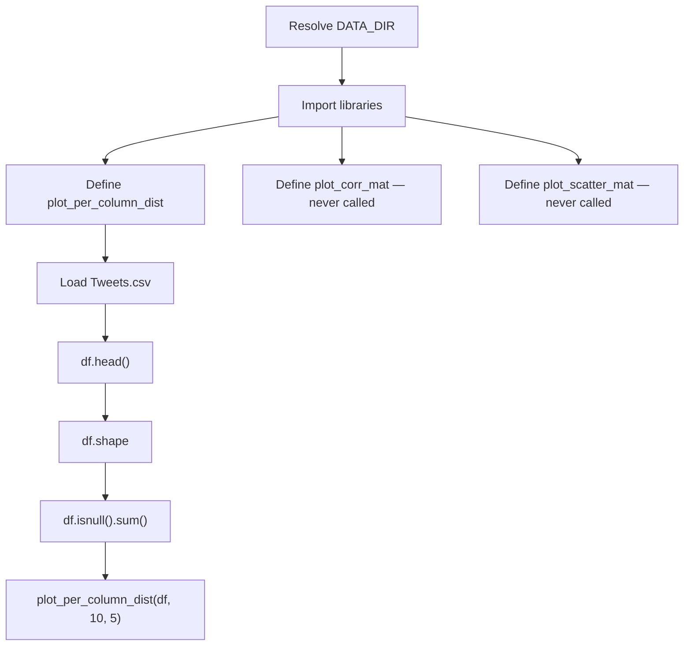

# Twitter US Airline Sentiment Analysis

> **Repository**: [https://github.com/pypi-ahmad/Natural-Language-Processing-Projects](https://github.com/pypi-ahmad/Natural-Language-Processing-Projects)

## 1. Project Overview

This project performs exploratory data analysis on the Twitter US Airline Sentiment dataset (`Tweets.csv`). The notebook loads the data, checks its shape and null values, and plots per-column distribution graphs. Three visualization functions are defined, but only one (`plot_per_column_dist`) is actually called; the other two (`plot_corr_mat`, `plot_scatter_mat`) are dead code.

## 2. Dataset

| Item | Value |
|------|-------|
| **File** | `Tweets.csv` |
| **Data path** | `data/NLP Projects 25 - Twitter Us Airline Sentiment Analysis/Tweets.csv` |
| **Key columns** | `airline_sentiment`, `airline`, `text` |
| **Also present** | `database.sqlite` (unused by the notebook) |

The dataset is loaded via:

```python
df = pd.read_csv(str(DATA_DIR / 'Tweets.csv'))
df.dataframeName = 'Tweets.csv'
```

## 3. Pipeline Overview

| Step | Cell(s) | Description |
|------|---------|-------------|
| 1 | 1 | Resolve `DATA_DIR` using `_find_data_dir()` |
| 2 | 2 | Import `numpy`, `pandas`, `warnings`, `matplotlib` |
| 3 | 3 | Define `plot_per_column_dist(df, n_graph_shown, n_graph_per_row)` |
| 4 | 4 | Define `plot_corr_mat(df, graph_width)` (never called) |
| 5 | 5 | Define `plot_scatter_mat(df, plot_size, text_size)` (never called) |
| 6 | 6 | Load `Tweets.csv` into `df` |
| 7 | 7 | `df.head()` |
| 8 | 8 | `df.shape` |
| 9 | 9 | `df.isnull().sum()` |
| 10 | 10 | Call `plot_per_column_dist(df, 10, 5)` |
| 11–13 | 11–13 | Empty cells |

## 4. Workflow Diagram



## 5. Core Logic Breakdown

### `plot_per_column_dist(df, n_graph_shown, n_graph_per_row)`

Filters columns with 1–50 unique values and plots bar charts (categorical) or histograms (numeric) for up to `n_graph_shown` columns.

### `plot_corr_mat(df, graph_width)`

Computes the correlation matrix and renders it with `plt.matshow`. Expects `df.dataframeName` to be set. **Defined but never called.**

### `plot_scatter_mat(df, plot_size, text_size)`

Generates a scatter matrix with KDE diagonals using `pd.plotting.scatter_matrix`. Limits to 10 numeric columns. **Defined but never called.**

## 6. Model / Output Details

No model is trained in this notebook. The notebook only performs EDA.

## 7. Project Structure

```
NLP Projects 25 - Twitter Us Airline Sentiment Analysis/
├── Twitter US Sentiment Analysis.ipynb   # Main notebook
├── Tweets.csv                            # Dataset (also in data/)
├── database.sqlite                       # SQLite DB (unused by notebook)
├── test_airline_sentiment.py             # Test file (122 lines)
└── README.md
```

## 8. Setup & Installation

```bash
pip install numpy pandas matplotlib
```

## 9. How to Run

1. Ensure `Tweets.csv` is present in the `data/NLP Projects 25 - Twitter Us Airline Sentiment Analysis/` directory (or the project directory).
2. Open `Twitter US Sentiment Analysis.ipynb` in Jupyter/VS Code.
3. Run all cells.

## 10. Testing

| File | Lines | Classes |
|------|-------|---------|
| `test_airline_sentiment.py` | 122 | `TestDataLoading`, `TestPreprocessing`, `TestModel`, `TestPrediction` |

```bash
pytest "NLP Projects 25 - Twitter Us Airline Sentiment Analysis/test_airline_sentiment.py" -v
```

Note: The test file tests model training (TfidfVectorizer + MultinomialNB) that does not exist in the notebook itself. The tests construct their own pipeline independently of the notebook code.

## 11. Limitations

- **Dead code**: `plot_corr_mat` and `plot_scatter_mat` are defined but never called.
- **No model training**: The notebook ends after a single EDA plot. Three cells at the end are empty.
- **`dataframeName` attribute**: `df.dataframeName = 'Tweets.csv'` is set but only used by the uncalled `plot_corr_mat`.
- **Duplicate data file**: `Tweets.csv` exists both in the project directory and in `data/`. The notebook reads from `DATA_DIR` (the `data/` copy).
