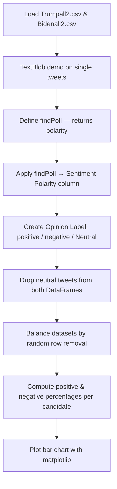

# Predict US Elections — Twitter Sentiment Analysis

> **Repository**: [https://github.com/pypi-ahmad/Natural-Language-Processing-Projects](https://github.com/pypi-ahmad/Natural-Language-Processing-Projects)

## 1. Project Overview

This notebook performs sentiment analysis on tweets about Donald Trump and Joe Biden using TextBlob. It computes positive/negative sentiment percentages for each candidate and visualizes the results as a bar chart using matplotlib.

## 2. Dataset

| File | Columns | Description |
|------|---------|-------------|
| `Trumpall2.csv` | `user`, `text` | Tweets mentioning Donald Trump |
| `Bidenall2.csv` | `user`, `text` | Tweets mentioning Joe Biden |

Data path: `data/NLP Projecct 7.Predict_US_election/`

## 3. Pipeline Overview

1. Load `Trumpall2.csv` and `Bidenall2.csv` with `pd.read_csv`
2. Import `TextBlob` and demonstrate single-tweet sentiment on `trump["text"][10]` and `biden["text"][500]`
3. Define `findPoll(review)` — returns `TextBlob(review).sentiment.polarity`
4. Apply `findPoll` to create `"Sentiment Polarity"` column in both DataFrames
5. Create `"Opinion Label"` column using `np.where(polarity > 0, "positive", "negative")`, then set `== 0` rows to `"Neutral"`
6. Drop neutral tweets (polarity == 0.0) from both DataFrames
7. Balance datasets by randomly dropping rows (`remove=324` for Trump, `remove=31` for Biden) with `np.random.seed(10)`
8. Compute positive/negative percentages via `groupby('Opinion Label').count()` with formulas `(count/1000)*10` and `(count/1000)*100`
9. Plot grouped bar chart with `matplotlib.pyplot.bar` comparing both candidates

## 4. Workflow Diagram



## 5. Core Logic Breakdown

### `findPoll(review)`
Returns `TextBlob(review).sentiment.polarity` — a float in [-1.0, 1.0].

### Opinion labeling
```python
trump["Opinion Label"] = np.where(trump["Sentiment Polarity"] > 0, "positive", "negative")
trump["Opinion Label"][trump["Sentiment Polarity"] == 0] = "Neutral"
```

### Percentage calculation
```python
count_Trump = df_trump.groupby('Opinion Label').count()
negative_percentage1 = (count_Trump['Sentiment Polarity'][0] / 1000) * 10
positive_percentage1 = (count_Trump['Sentiment Polarity'][1] / 1000) * 100
```
The same formula is applied for Biden. Note: the multipliers differ (`*10` for negative, `*100` for positive), which appears to be a bug in the original notebook.

### Visualization
`matplotlib.pyplot.bar` is used to plot positive and negative percentages for `['Joe Biden', 'Donald Trump']`. No seaborn plots are generated (seaborn is imported but not used for plotting).

## 6. Model / Output Details

No ML model is trained. The output is a sentiment comparison bar chart showing positive and negative tweet percentages for each candidate.

## 7. Project Structure

```
NLP Projecct 7.Predict_US_election/
├── PredictUSelection.ipynb          # Main notebook
├── test_predict_us_election.py      # Test file (103 lines)
├── README.md
├── Trumpall2.csv                    # Trump tweets (also in data/)
└── Bidenall2.csv                    # Biden tweets (also in data/)
```

## 8. Setup & Installation

```bash
pip install pandas numpy seaborn textblob matplotlib
```

Packages imported in the notebook: `pandas`, `numpy`, `seaborn`, `textblob`, `matplotlib`.

## 9. How to Run

1. Ensure data files are in `data/NLP Projecct 7.Predict_US_election/` (or the project directory).
2. Open `PredictUSelection.ipynb` and run all cells sequentially.

## 10. Testing

Test file: `test_predict_us_election.py` (103 lines)

| Test Class | Description |
|------------|-------------|
| `TestDataLoading` | Checks `Trumpall2.csv` and `Bidenall2.csv` exist, load correctly, contain `user`/`text` columns, and are non-empty |
| `TestPreprocessing` | Verifies `text` column dtype, non-empty strings, basic regex cleaning, and that `user` has multiple classes |
| `TestModel` | Fits `TfidfVectorizer` + `MultinomialNB` on a 200-row subset (not from the notebook — test-only validation) |
| `TestPrediction` | Checks prediction output shape and `predict_proba` sums to 1.0 |

Run:
```bash
pytest "NLP Projecct 7.Predict_US_election/test_predict_us_election.py" -v
```

## 11. Limitations

- **Inconsistent percentage multipliers**: negative uses `(count/1000)*10`, positive uses `(count/1000)*100` — likely a bug.
- **Biden neutral-drop bug**: `biden["Opinion Label"][trump["Sentiment Polarity"]==0]="Neutral"` uses `trump`'s index instead of `biden`'s. The neutral-drop step also references `reviews1` instead of `reviews2` for Biden.
- **seaborn imported but unused**: `seaborn` is imported but no seaborn plot is created.
- **Hardcoded balance values**: `remove=324` and `remove=31` are hardcoded rather than computed from the data.
- **`np.random.seed(10)` called twice**: Seed is re-set before each balance operation rather than once.
- **No text preprocessing**: Raw tweet text is passed directly to TextBlob without cleaning URLs, mentions, or special characters.
