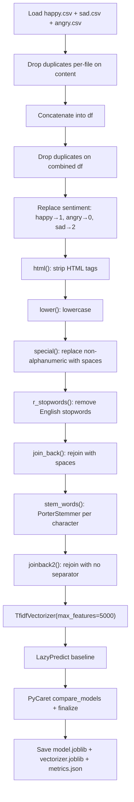

# NLP for WhatsApp Status — Sentiment Analysis

> **Repository**: [https://github.com/pypi-ahmad/Natural-Language-Processing-Projects](https://github.com/pypi-ahmad/Natural-Language-Processing-Projects)

## 1. Project Overview

Classifies WhatsApp status messages into three sentiments (happy, sad, angry). The notebook loads three separate CSV files, concatenates them, applies manual text cleaning and character-level Porter stemming, then runs LazyPredict and PyCaret to select the best classifier.

## 2. Dataset

| Item | Value |
|------|-------|
| Files | `happy.csv`, `sad.csv`, `angry.csv` |
| Path | `data/NLP Projecct 16.NLP for whatsapp chats/` |
| Key columns | `content`, `sentiment` |
| Label encoding | `happy → 1`, `angry → 0`, `sad → 2` |

## 3. Pipeline Overview

| Step | Cell(s) | Description |
|------|---------|-------------|
| 1 | 0 | Data-directory resolution (`_find_data_dir()`) |
| 2 | 1–2 | Import pandas/numpy, load `sad.csv`, `happy.csv`, `angry.csv` |
| 3 | 3–6 | Print shapes, inspect heads of each dataframe |
| 4 | 7 | Drop duplicates from each dataframe on `content` column |
| 5 | 8–10 | Concatenate into `df`, inspect with `df.info()` |
| 6 | 11 | Drop duplicates again on combined `df` |
| 7 | 12 | `df['sentiment'].value_counts()` |
| 8 | 13–14 | Replace sentiment labels: `{'happy':1, 'angry':0, 'sad':2}` |
| 9 | 15 | `html(text)` — strip HTML tags with `re.sub` |
| 10 | 16 | `lower(text)` — lowercase |
| 11 | 17 | `special(text)` — replace non-alphanumeric chars with spaces |
| 12 | 18 | Import NLTK stopwords and `PorterStemmer` |
| 13 | 19 | `r_stopwords(text)` — remove stopwords from split text |
| 14 | 20 | `join_back(list_input)` — rejoin with spaces |
| 15 | 21 | `stem_words(text)` — Porter-stem each **character** (iterates over `text` as string) |
| 16 | 22 | `joinback2(list_input)` — rejoin with no separator |
| 17 | 24–25 | `X = df['content']`, `y = df.iloc[:,-1].values` |
| 18 | 27 | `TfidfVectorizer(max_features=5000, stop_words='english')` on cleaned text |
| 19 | 28 | LazyPredict baseline comparison |
| 20 | 29 | PyCaret `setup` / `compare_models` / `finalize_model` |
| 21 | 31 | Save `model.joblib`, `vectorizer.joblib` (`_tfidf`), `metrics.json`; update `global_registry.json` |
| 22 | 32 | Define `predict_text(text)` inference function |
| 23 | 33 | Consistency assertions and summary |

## 4. Workflow Diagram



## 5. Core Logic Breakdown

### Cleaning functions (Cells 15–17)
```python
def html(text):
    clean = re.compile('<.*?>')
    return re.sub(clean, '', text)

def lower(text):
    return text.lower()

def special(text):
    x = ''
    for i in text:
        if i.isalnum():
            x = x + i
        else:
            x = x + ' '
    return x
```

### Stopword removal (Cell 19)
```python
def r_stopwords(text):
    x = []
    for i in text.split():
        if i not in stopwords.words('english'):
            x.append(i)
    y = x[:]
    x.clear()
    return y
```

### Stemming — character-level (Cell 21)
```python
ps = PorterStemmer()
y = []
def stem_words(text):
    for i in text:        # iterates over characters, not words
        y.append(ps.stem(i))
    z = y[:]
    y.clear()
    return z
```
**Note:** `text` at this point is a string, so `for i in text` iterates over individual characters. Each character is passed to `ps.stem()`, which returns the character unchanged. This is effectively a no-op that converts the string to a list of characters.

### Rejoin (Cell 22)
```python
def joinback2(list_input):
    return "".join(list_input)   # no separator — reconstructs original string
```

### Vectorisation (Cell 27)
```python
_tfidf = TfidfVectorizer(max_features=5000, stop_words='english')
_X_vectorized = _tfidf.fit_transform(_text_clean)
```

### Inference (Cell 32)
```python
def predict_text(text):
    vec = _tfidf.transform([text])
    return final_model.predict(vec)
```

## 6. Model / Output Details

- **LazyPredict** selects best model by accuracy.
- **PyCaret** runs `compare_models(n_select=1)` with `session_id=42`, then `finalize_model`.
- Artifacts saved to `artifacts/whatsapp_sentiment/`:
  - `model.joblib` — finalized PyCaret model
  - `vectorizer.joblib` — fitted `TfidfVectorizer` (`_tfidf`)
  - `metrics.json` — accuracy, F1, precision, recall

## 7. Project Structure

```
NLP Projecct 16.NLP for whatsapp chats/
├── NLP for whatsapp status.ipynb   # Main notebook
├── test_whatsapp_sentiment.py      # Test suite (66 lines)
├── happy.csv                       # Dataset (local copy)
├── sad.csv                         # Dataset (local copy)
├── angry.csv                       # Dataset (local copy)
└── README.md
data/NLP Projecct 16.NLP for whatsapp chats/
├── happy.csv
├── sad.csv
└── angry.csv
artifacts/whatsapp_sentiment/
├── model.joblib
├── vectorizer.joblib
└── metrics.json
```

## 8. Setup & Installation

```
pip install pandas numpy scikit-learn nltk lazypredict pycaret joblib
```

NLTK data required:
```python
import nltk
nltk.download('stopwords')
```

## 9. How to Run

1. Open `NLP for whatsapp status.ipynb` in Jupyter.
2. Run all cells sequentially.
3. Artifacts are saved to `artifacts/whatsapp_sentiment/`.

## 10. Testing

| File | Classes | Line count |
|------|---------|------------|
| `test_whatsapp_sentiment.py` | `TestDataLoading`, `TestPreprocessing`, `TestModel`, `TestPrediction` | 66 |

Run:
```
pytest "NLP Projecct 16.NLP for whatsapp chats/test_whatsapp_sentiment.py" -v
```

## 11. Limitations

- `stem_words()` iterates over characters, not words — stemming is applied per-character, making it a no-op. The function returns a list of single characters that `joinback2` reassembles into the original string.
- The global mutable list `y = []` used in `stem_words()` is a side-effect pattern that would break under concurrent calls.
- `r_stopwords()` calls `stopwords.words('english')` on every invocation for every word — no caching.
- Duplicates are dropped twice: once per individual dataframe and again on the combined `df`.
- `joinback2` uses `"".join()` (no separator) while `join_back` uses `" ".join()` (space separator) — after `stem_words` converts to characters, the no-separator join reconstructs the pre-stemming string.
- The sentiment mapping uses integers (`0, 1, 2`) that have no ordinal meaning (angry=0, happy=1, sad=2).
