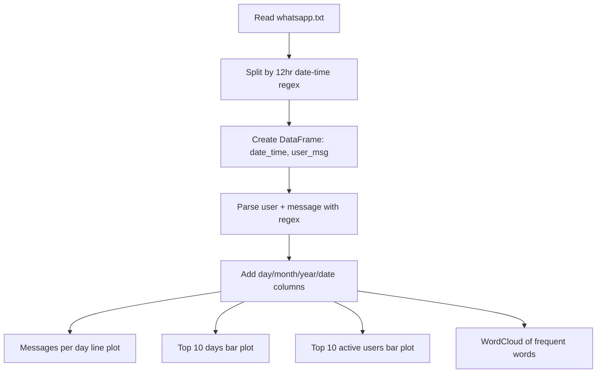

# WhatsApp Group Chat Analysis

> **Repository**: [https://github.com/pypi-ahmad/Natural-Language-Processing-Projects](https://github.com/pypi-ahmad/Natural-Language-Processing-Projects)

## 1. Project Overview

This project parses a WhatsApp group chat export file (`whatsapp.txt`), extracts messages with timestamps and usernames using regex, and produces visualizations: a messages-per-day line plot, top-10 days bar plot, top-10 users bar plot, and a WordCloud of most-used words.

## 2. Dataset

| Item | Value |
|------|-------|
| File | `whatsapp.txt` |
| Path | `data/NLP Projecct 13.WhatsApp Group Chat Analysis/whatsapp.txt` |
| Format | WhatsApp chat export (12-hour time format) |

## 3. Pipeline Overview

1. **Data directory setup** — `_find_data_dir()` resolves path
2. **Import libraries** — re, datetime, numpy, pandas, matplotlib, seaborn, wordcloud (WordCloud, STOPWORDS), emoji, itertools, Counter
3. **Define parsing config** — `key="12hr"`, `split_formats` dict with regex patterns, `datetime_formats` dict
4. **Read and parse file** — read `whatsapp.txt`, join lines, split by date-time regex, extract date-time matches, create DataFrame with columns `date_time` and `user_msg`
5. **Parse users and messages** — convert `date_time` to datetime, split `user_msg` with regex `([\w\W]+?):\s` into `user` and `message` columns, drop `user_msg`
6. **Inspect data** — `df.info()`, `df.sample(10)`, check empty messages
7. **Add time columns** — `day` (weekday abbrev), `month` (month abbrev), `year`, `date`
8. **Messages per day** — copy df to `df1`, add `message_count` column, groupby `date` and sum
9. **Line plot** — messages per day over time, saved as `msg_plots.svg`
10. **Top 10 days** — sort `df1` by `message_count` descending, take head(10)
11. **Bar plot** — top 10 days by message count, saved as `top10_days.svg`
12. **Top 10 users** — filter out `"group_notification"`, groupby `user`, count messages, head(10) → `top10df`
13. **Add initials** — extract first letter of first and last name; hardcoded overrides at indices 7 and 8
14. **Bar plot** — top 10 users by initials
15. **WordCloud** — iterate `df3.message.values`, tokenize and lowercase, generate `WordCloud(width=600, height=600, background_color='white', stopwords=stopwords, min_font_size=8)`
16. **Display wordcloud** — `wordcloud.to_image()`

## 4. Workflow Diagram



## 5. Core Logic Breakdown

### Chat parsing regex (12hr format)
```python
split_formats = {
    '12hr': '\d{1,2}/\d{1,2}/\d{2,4},\s\d{1,2}:\d{2}\s[APap][mM]\s-\s',
    '24hr': '\d{1,2}/\d{1,2}/\d{2,4},\s\d{1,2}:\d{2}\s-\s',
    'custom': ''
}
```

### User/message split
```python
a = re.split('([\w\W]+?):\s', i)
```
Lazy match to first `username:` pattern. Non-matching lines are labeled `"group_notification"`.

### Message frequency aggregation
```python
df1 = df.copy()
df1['message_count'] = [1] * df1.shape[0]
df1.drop(columns='year', inplace=True)
df1 = df1.groupby('date').sum().reset_index()
```

### WordCloud generation
```python
wordcloud = WordCloud(width=600, height=600,
                      background_color='white',
                      stopwords=stopwords,
                      min_font_size=8).generate(comment_words)
```

Custom stopwords are added via `STOPWORDS.update([...])` including: `'group'`, `'link'`, `'invite'`, `'joined'`, `'message'`, `'deleted'`, `'yeah'`, `'hai'`, `'yes'`, `'okay'`, `'ok'`, `'will'`, `'use'`, `'using'`, `'one'`, `'know'`, `'guy'`, `'group'`, `'media'`, `'omitted'`.

### DataFrame columns (final)
`date_time`, `user`, `message`, `day`, `month`, `year`, `date`

## 6. Model / Output Details

No ML model. Outputs are visualizations:
1. Line plot — messages per day over time (`msg_plots.svg`)
2. Bar plot — top 10 days by message count (`top10_days.svg`)
3. Bar plot — top 10 active users by initials
4. WordCloud image of most-used words

No heatmap is generated in this notebook.

## 7. Project Structure

```
NLP Projecct 13.WhatsApp Group Chat Analysis/
├── WhatsappGroupChatAnalysis.ipynb
├── test_whatsapp_analysis.py
└── README.md

data/NLP Projecct 13.WhatsApp Group Chat Analysis/
└── whatsapp.txt
```

## 8. Setup & Installation

```bash
pip install pandas numpy matplotlib seaborn wordcloud emoji
```

## 9. How to Run

1. Place `whatsapp.txt` in `data/NLP Projecct 13.WhatsApp Group Chat Analysis/`
2. Open `WhatsappGroupChatAnalysis.ipynb` and run all cells sequentially

## 10. Testing

| Item | Value |
|------|-------|
| Test file | `test_whatsapp_analysis.py` |
| Line count | 50 |
| Framework | pytest |

**Test classes:**

| Class | Tests | Description |
|-------|-------|-------------|
| `TestDataLoading` | 3 | File exists, not empty, loads as text |
| `TestPreprocessing` | 3 | Tokenization, lowercasing, word frequency |
| `TestModel` | 2 | Vocabulary size, character distribution |
| `TestPrediction` | 1 | N-gram (bigram) generation |

```bash
pytest "NLP Projecct 13.WhatsApp Group Chat Analysis/test_whatsapp_analysis.py" -v
```

## 11. Limitations

- `df3` is referenced in the WordCloud cell but is never defined in the notebook — causes `NameError` at runtime
- `STOPWORDS.update(...)` returns `None`, so `stopwords` is assigned `None` — the WordCloud receives `None` as its stopwords parameter
- Total group members is hardcoded as `237` in the user count printout
- Initials extraction (`split()[0][0]` + `split()[1][0]`) assumes all usernames have at least two space-separated parts — will crash on single-word names
- `top10df.initials[7] = "Me"` and `[8] = "DT"` are hardcoded index overrides specific to the original author's data
- Plot SVG files are saved to the current working directory, not a configurable output path
