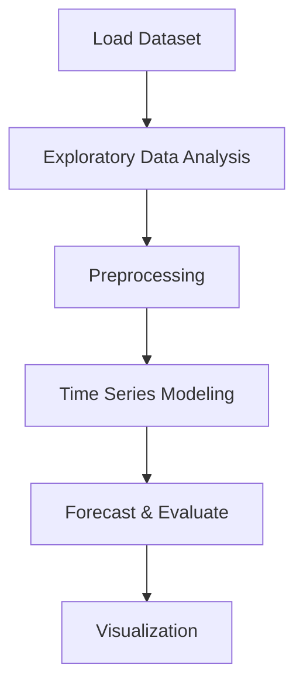

# Predicting the price of bitcoin


## Project Overview

**Predicting the price of bitcoin** is a **Time Series Forecasting** project in the **Regression** category.

> Automated time series pipeline with PyCaret:

**Target variable:** `Close`
**Models:** PyCaret

## Dataset

| Property | Value |
|----------|-------|
| Type | Timeseries |
| Source | Local |
| Path | `data/bitcoin_price_prediction/btcusd_1-min_data.csv` |
| Target | `Close` |

```python
from core.data_loader import load_dataset
df = load_dataset('predicting_the_price_of_bitcoin')
```

## Pipeline Files

| File | Lines |
|------|-------|
| `pipeline.py` | 167 |
| `train.py` | 131 |
| `evaluate.py` | 131 |
| `bitcoin_price_prediction.ipynb` | 11 code / 12 markdown cells |
| `test_predicting_the_price_of_bitcoin.py` | test suite |

## ML Workflow



## Core Logic

### Preprocessing

- Datetime feature extraction

### Visualizations

- Decomposition plot

## Models

| Model | Type |
|-------|------|
| PyCaret | AutoML Framework |

## Reproducibility

```python
random.seed(42); np.random.seed(42); os.environ['PYTHONHASHSEED'] = '42'
```

```bash
python pipeline.py --seed 123    # custom seed
python pipeline.py --reproduce   # locked seed=42
```

## Project Structure

```
Regression/Predicting the price of bitcoin/
  Dataset Link.pdf
  Predicting the price of bitcoin.pdf
  README.md
  bitcoin_price_prediction.ipynb
  evaluate.py
  pipeline.py
  test_predicting_the_price_of_bitcoin.py
  train.py
```

## How to Run

```bash
cd "Regression/Predicting the price of bitcoin"
python pipeline.py
python train.py       # training only
python evaluate.py    # evaluation only
```

## Testing

```bash
pytest "Regression/Predicting the price of bitcoin/test_predicting_the_price_of_bitcoin.py" -v
```

## Setup

```bash
pip install matplotlib numpy pandas pycaret scikit-learn seaborn statsmodels
```

## Limitations

- Forecast accuracy depends on the train/test split point chosen

---
*README auto-generated from `bitcoin_price_prediction.ipynb` analysis.*