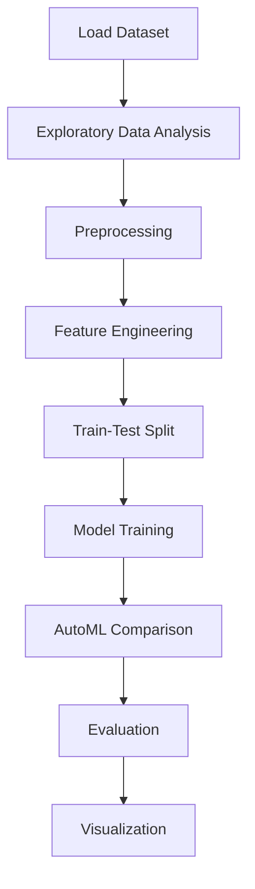

# Predicting car prices using the car features


## Project Overview

**Predicting car prices using the car features** is a **Regression** project in the **Regression** category.

> A Chinese automobile company Geely Auto aspires to enter the US market by setting up their manufacturing unit there and producing cars locally to give competition to their US and European counterparts.

**Target variable:** `const`
**Models:** LinearRegression

## Dataset

| Property | Value |
|----------|-------|
| Type | Tabular |
| Source | Local |
| Path | `data/car_price_prediction/CarPrice_Assignment.csv` |
| Target | `const` |

```python
from core.data_loader import load_dataset
df = load_dataset('predicting_car_prices_using_the_car_features')
```

## Pipeline Files

| File | Lines |
|------|-------|
| `pipeline.py` | 624 |
| `train.py` | 476 |
| `evaluate.py` | 483 |
| `car_price_prediction.ipynb` | 69 code / 45 markdown cells |
| `test_predicting_car_prices_using_the_car_features.py` | test suite |

## ML Workflow



## Core Logic

### Preprocessing

- One-hot encoding
- MinMaxScaler normalization
- Outlier removal
- Train-test split

### Feature Engineering

Feature engineering steps detected in notebook code cells.

### Visualizations

- Correlation heatmap
- Histograms / distributions
- Count plots
- Box plots
- Pair plots
- Bar charts
- Scatter plots

### Helper Functions

- `plot_count()`
- `scatter()`
- `pp()`
- `dummies()`
- `build_model()`
- `checkVIF()`

## Models

| Model | Type |
|-------|------|
| LinearRegression | Linear Regressor |

AutoML is toggled via the `USE_AUTOML` flag in pipeline scripts.

## Reproducibility

```python
random.seed(42); np.random.seed(42); os.environ['PYTHONHASHSEED'] = '42'
```

```bash
python pipeline.py --seed 123    # custom seed
python pipeline.py --reproduce   # locked seed=42
```

## Project Structure

```
Regression/Predicting car prices using the car features/
  Dataset Link.pdf
  Predicting car prices.pdf
  README.md
  car_price_prediction.ipynb
  evaluate.py
  pipeline.py
  test_predicting_car_prices_using_the_car_features.py
  train.py
```

## How to Run

```bash
cd "Regression/Predicting car prices using the car features"
python pipeline.py
python train.py       # training only
python evaluate.py    # evaluation only
```

## Testing

```bash
pytest "Regression/Predicting car prices using the car features/test_predicting_car_prices_using_the_car_features.py" -v
```

## Setup

```bash
pip install matplotlib numpy pandas scikit-learn seaborn
```

---
*README auto-generated from `car_price_prediction.ipynb` analysis.*