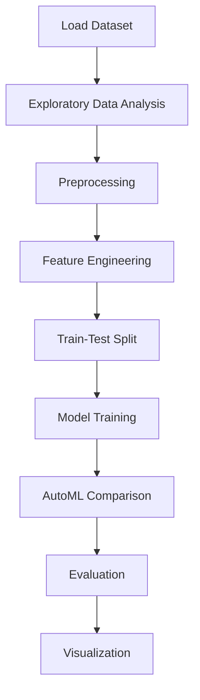

# Crop yield prediction


## Project Overview

**Crop yield prediction** is a **Regression** project in the **Regression** category.

> The science of training machines to learn and produce models for future predictions is widely used, and not for nothing.

**Target variable:** `Value`
**Models:** LazyRegressor, PyCaret

## Dataset

| Property | Value |
|----------|-------|
| Type | Tabular |
| Source | Local |
| Path | `data/crop_yield_prediction/yield_df.csv` |
| Target | `Value` |

```python
from core.data_loader import load_dataset
df = load_dataset('crop_yield_prediction')
```

## Pipeline Files

| File | Lines |
|------|-------|
| `pipeline.py` | 351 |
| `train.py` | 247 |
| `evaluate.py` | 247 |
| `crop_yield_prediction.ipynb` | 54 code / 32 markdown cells |
| `test_crop_yield_prediction.py` | test suite |

## ML Workflow



## Core Logic

### Preprocessing

- Missing value imputation
- One-hot encoding
- MinMaxScaler normalization
- Train-test split

### Feature Engineering

Feature engineering steps detected in notebook code cells.

### Visualizations

- Correlation heatmap

## Models

| Model | Type |
|-------|------|
| LazyRegressor | AutoML Benchmark (30+ regressors) |
| PyCaret | AutoML Framework |

AutoML is toggled via the `USE_AUTOML` flag in pipeline scripts.
**LazyPredict** (`LazyRegressor`) benchmarks 30+ models automatically.
**PyCaret** `compare_models()` runs cross-validated comparison.

## Reproducibility

```python
random.seed(42); np.random.seed(42); os.environ['PYTHONHASHSEED'] = '42'
```

```bash
python pipeline.py --seed 123    # custom seed
python pipeline.py --reproduce   # locked seed=42
```

## Project Structure

```
Regression/Crop yield prediction/
  Crop Yeild Prediction.pdf
  Dataset Link.pdf
  README.md
  crop_yield_prediction.ipynb
  evaluate.py
  pipeline.py
  test_crop_yield_prediction.py
  train.py
```

## How to Run

```bash
cd "Regression/Crop yield prediction"
python pipeline.py
python train.py       # training only
python evaluate.py    # evaluation only
```

## Testing

```bash
pytest "Regression/Crop yield prediction/test_crop_yield_prediction.py" -v
```

## Setup

```bash
pip install lazypredict matplotlib numpy pandas pycaret scikit-learn seaborn
```

---
*README auto-generated from `crop_yield_prediction.ipynb` analysis.*