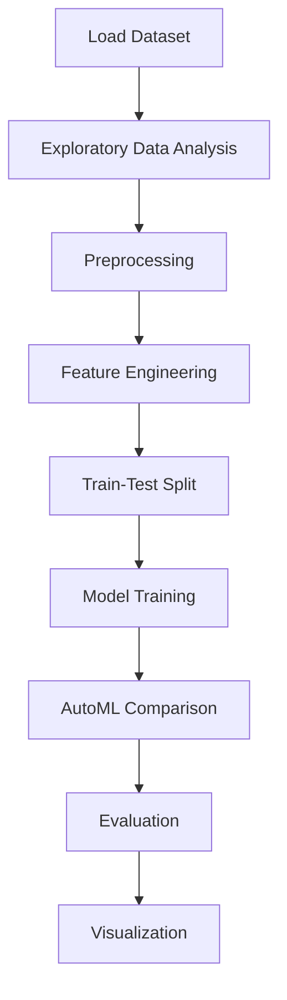

# Predicting diabetes using the prima indians diabetes dataset


## Project Overview

**Predicting diabetes using the prima indians diabetes dataset** is a **Regression** project in the **Regression** category.

> Dataset ini tersedia di kaggle website: https://www.kaggle.com/uciml/pima-indians-diabetes-database, Dataset ini berasal dari National Institute of Diabetes and Digestive and Ginjal Diseases. Tujuan dari dataset adalah untuk memprediksi secara diagnostik apakah pasien memiliki diabetes, berdasarkan pengukuran diagnostik tertentu yang termasuk dalam dataset. Secara khusus, semua pasien di sini adalah wanita yang berumur 21 tahun dari Prima Indian Heritage.

**Target variable:** `Outcome`
**Models:** LazyClassifier, PyCaret

## Dataset

| Property | Value |
|----------|-------|
| Type | Tabular |
| Source | Local |
| Path | `data/diabetes_prediction/diabetes.csv` |
| Target | `Outcome` |

```python
from core.data_loader import load_dataset
df = load_dataset('predicting_diabetes_using_the_prima_indians_diabetes_dataset')
```

## Pipeline Files

| File | Lines |
|------|-------|
| `pipeline.py` | 310 |
| `train.py` | 288 |
| `evaluate.py` | 288 |
| `diabetes_prediction.ipynb` | 22 code / 20 markdown cells |
| `test_predicting_diabetes_using_the_prima_indians_diabetes_dataset.py` | test suite |

## ML Workflow



## Core Logic

### Preprocessing

- Missing value imputation
- One-hot encoding
- Train-test split

### Feature Engineering

Feature engineering steps detected in notebook code cells.

### Visualizations

- Histograms / distributions
- Count plots
- Box plots
- Pair plots
- Bar charts
- Scatter plots

## Models

| Model | Type |
|-------|------|
| LazyClassifier | AutoML Benchmark (30+ classifiers) |
| PyCaret | AutoML Framework |

AutoML is toggled via the `USE_AUTOML` flag in pipeline scripts.
**LazyPredict** (`LazyClassifier`) benchmarks 30+ models automatically.
**PyCaret** `compare_models()` runs cross-validated comparison.

## Reproducibility

```python
random.seed(42); np.random.seed(42); os.environ['PYTHONHASHSEED'] = '42'
```

```bash
python pipeline.py --seed 123    # custom seed
python pipeline.py --reproduce   # locked seed=42
```

## Project Structure

```
Regression/Predicting diabetes using the prima indians diabetes dataset/
  Dataset Link.pdf
  Predicting diabetes using the prima india dataset.pdf
  README.md
  diabetes_prediction.ipynb
  evaluate.py
  pipeline.py
  test_predicting_diabetes_using_the_prima_indians_diabetes_dataset.py
  train.py
```

## How to Run

```bash
cd "Regression/Predicting diabetes using the prima indians diabetes dataset"
python pipeline.py
python train.py       # training only
python evaluate.py    # evaluation only
```

## Testing

```bash
pytest "Regression/Predicting diabetes using the prima indians diabetes dataset/test_predicting_diabetes_using_the_prima_indians_diabetes_dataset.py" -v
```

## Setup

```bash
pip install lazypredict matplotlib numpy pandas pycaret scikit-learn seaborn
```

---
*README auto-generated from `diabetes_prediction.ipynb` analysis.*