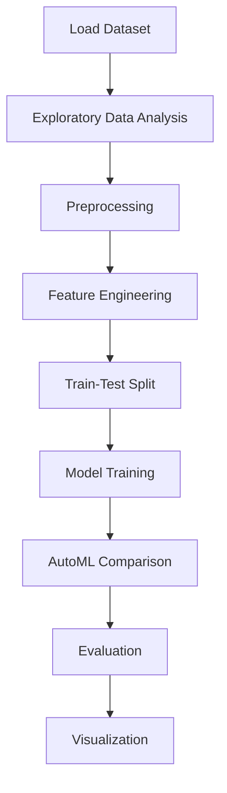

# Employee Future Prediction


## Project Overview

**Employee Future Prediction** is a **Regression** project in the **Regression** category.

> Quick automated comparison of multiple models to establish baselines.

**Target variable:** `LeaveOrNot`
**Models:** DecisionTree, GradientBoosting, LazyClassifier, LightGBM, LogisticRegression, NaiveBayes, PyCaret, RandomForest, XGBoost

## Dataset

| Property | Value |
|----------|-------|
| Type | Tabular |
| Source | Local |
| Path | `data/employee_future_prediction/Employee.csv` |
| Target | `LeaveOrNot` |

```python
from core.data_loader import load_dataset
df = load_dataset('employee_future_prediction')
```

## Pipeline Files

| File | Lines |
|------|-------|
| `pipeline.py` | 277 |
| `train.py` | 189 |
| `evaluate.py` | 231 |
| `employee_prediction.ipynb` | 22 code / 15 markdown cells |
| `test_employee_future_prediction.py` | test suite |

## ML Workflow



## Core Logic

### Preprocessing

- Label encoding
- One-hot encoding
- Train-test split

### Feature Engineering

Feature engineering steps detected in notebook code cells.

### Visualizations

- Correlation heatmap
- Count plots
- Confusion matrix

## Models

| Model | Type |
|-------|------|
| DecisionTree | Tree-Based |
| GradientBoosting | Ensemble / Boosting |
| LazyClassifier | AutoML Benchmark (30+ classifiers) |
| LightGBM | Ensemble / Boosting |
| LogisticRegression | Linear Classifier |
| NaiveBayes | Classifier |
| PyCaret | AutoML Framework |
| RandomForest | Tree-Based |
| XGBoost | Ensemble / Boosting |

AutoML is toggled via the `USE_AUTOML` flag in pipeline scripts.
**LazyPredict** (`LazyClassifier`) benchmarks 30+ models automatically.
**PyCaret** `compare_models()` runs cross-validated comparison.

## Reproducibility

```python
random.seed(42); np.random.seed(42); os.environ['PYTHONHASHSEED'] = '42'
```

```bash
python pipeline.py --seed 123    # custom seed
python pipeline.py --reproduce   # locked seed=42
```

## Project Structure

```
Regression/Employee Future Prediction/
  Dataset Link.pdf
  Employee Future Prediction.pdf
  README.md
  employee_prediction.ipynb
  evaluate.py
  pipeline.py
  test_employee_future_prediction.py
  train.py
```

## How to Run

```bash
cd "Regression/Employee Future Prediction"
python pipeline.py
python train.py       # training only
python evaluate.py    # evaluation only
```

## Testing

```bash
pytest "Regression/Employee Future Prediction/test_employee_future_prediction.py" -v
```

## Setup

```bash
pip install lazypredict lightgbm matplotlib numpy pandas pycaret scikit-learn seaborn xgboost
```

---
*README auto-generated from `employee_prediction.ipynb` analysis.*