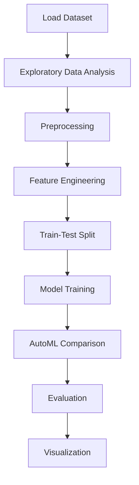

# Predicting energy usage in buildings


## Project Overview

**Predicting energy usage in buildings** is a **Regression** project in the **Regression** category.

> Quick automated comparison of multiple models to establish baselines.

**Target variable:** `Appliances`
**Models:** LazyClassifier, PyCaret

## Dataset

| Property | Value |
|----------|-------|
| Type | Tabular |
| Source | Local |
| Path | `data/energy_usage_prediction/KAG_energydata_complete.csv` |
| Target | `Appliances` |

```python
from core.data_loader import load_dataset
df = load_dataset('predicting_energy_usage_in_buildings')
```

## Pipeline Files

| File | Lines |
|------|-------|
| `pipeline.py` | 411 |
| `train.py` | 308 |
| `evaluate.py` | 308 |
| `energy_prediction.ipynb` | 42 code / 13 markdown cells |
| `test_predicting_energy_usage_in_buildings.py` | test suite |

## ML Workflow



## Core Logic

### Preprocessing

- Missing value imputation
- StandardScaler normalization
- Datetime feature extraction
- Train-test split

### Feature Engineering

Feature engineering steps detected in notebook code cells.

### Visualizations

- Correlation heatmap
- Histograms / distributions
- Scatter plots

### Helper Functions

- `get_redundant_pairs()`
- `get_top_abs_correlations()`

## Models

| Model | Type |
|-------|------|
| LazyClassifier | AutoML Benchmark (30+ classifiers) |
| PyCaret | AutoML Framework |

AutoML is toggled via the `USE_AUTOML` flag in pipeline scripts.
**LazyPredict** (`LazyClassifier`) benchmarks 30+ models automatically.
**PyCaret** `compare_models()` runs cross-validated comparison.

## Reproducibility

```python
random.seed(42); np.random.seed(42); os.environ['PYTHONHASHSEED'] = '42'
```

```bash
python pipeline.py --seed 123    # custom seed
python pipeline.py --reproduce   # locked seed=42
```

## Project Structure

```
Regression/Predicting energy usage in buildings/
  Dataset Link.pdf
  Predicting Energy usage in buildings.pdf
  README.md
  energy_prediction.ipynb
  evaluate.py
  pipeline.py
  test_predicting_energy_usage_in_buildings.py
  train.py
```

## How to Run

```bash
cd "Regression/Predicting energy usage in buildings"
python pipeline.py
python train.py       # training only
python evaluate.py    # evaluation only
```

## Testing

```bash
pytest "Regression/Predicting energy usage in buildings/test_predicting_energy_usage_in_buildings.py" -v
```

## Setup

```bash
pip install lazypredict matplotlib numpy pandas pycaret scikit-learn seaborn
```

---
*README auto-generated from `energy_prediction.ipynb` analysis.*