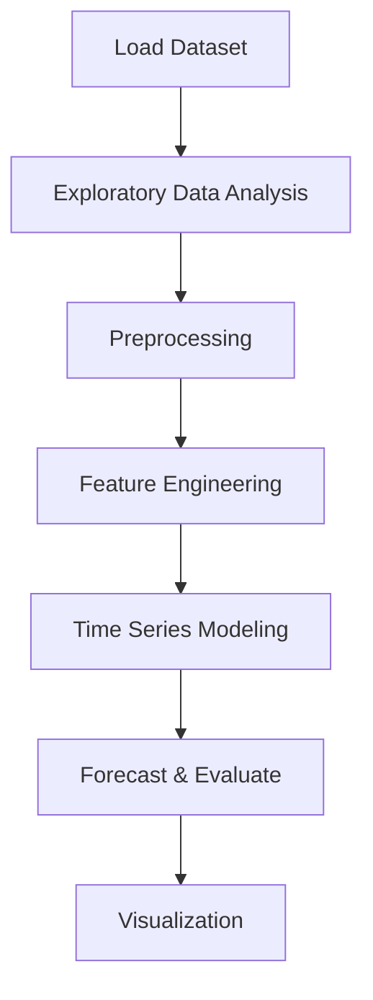

# Prediction Future Sales


## Project Overview

**Prediction Future Sales** is a **Time Series Forecasting** project in the **Regression** category.

> Our Main Objective is to predict sales of store in a week. As in dataset size and time related data are given as feature, so analyze if sales are impacted by time-based factors and space- based factor. Most importantly how inclusion of holidays in a week soars the sales in store?

**Target variable:** `Weekly_Sales`
**Models:** ARIMA, LinearRegression, RandomForest, RandomForestRegressor

## Dataset

| Property | Value |
|----------|-------|
| Type | Timeseries |
| Source | Local |
| Path | `data/future_sales_prediction/Walmart_Sales.csv` |
| Target | `Weekly_Sales` |

```python
from core.data_loader import load_dataset
df = load_dataset('prediction_future_sales')
```

## Pipeline Files

| File | Lines |
|------|-------|
| `pipeline.py` | 678 |
| `train.py` | 532 |
| `evaluate.py` | 532 |
| `sales_forecasting.ipynb` | 98 code / 71 markdown cells |
| `test_prediction_future_sales.py` | test suite |

## ML Workflow



## Core Logic

### Preprocessing

- Missing value imputation
- RobustScaler normalization
- Datetime feature extraction
- Train-test split

### Feature Engineering

Feature engineering steps detected in notebook code cells.

### Visualizations

- Correlation heatmap
- Box plots
- Bar charts
- Scatter plots
- Feature importance
- Decomposition plot

### Helper Functions

- `wmae_test()`

## Models

| Model | Type |
|-------|------|
| ARIMA | Autoregressive Time Series |
| LinearRegression | Linear Regressor |
| RandomForest | Tree-Based |
| RandomForestRegressor | Ensemble Regressor |

## Reproducibility

```python
random.seed(42); np.random.seed(42); os.environ['PYTHONHASHSEED'] = '42'
```

```bash
python pipeline.py --seed 123    # custom seed
python pipeline.py --reproduce   # locked seed=42
```

## Project Structure

```
Regression/Prediction Future Sales/
  Dataset Link.pdf
  Predicting Future Sales.pdf
  README.md
  evaluate.py
  pipeline.py
  sales_forecasting.ipynb
  test_prediction_future_sales.py
  train.py
```

## How to Run

```bash
cd "Regression/Prediction Future Sales"
python pipeline.py
python train.py       # training only
python evaluate.py    # evaluation only
```

## Testing

```bash
pytest "Regression/Prediction Future Sales/test_prediction_future_sales.py" -v
```

## Setup

```bash
pip install matplotlib numpy pandas scikit-learn seaborn statsmodels
```

## Limitations

- Forecast accuracy depends on the train/test split point chosen

---
*README auto-generated from `sales_forecasting.ipynb` analysis.*