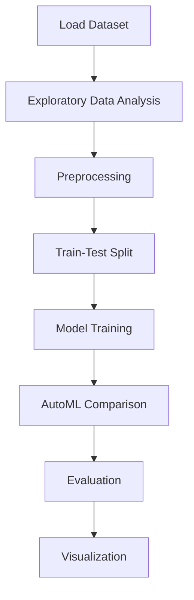

# Hotel Booking Cancellation Prediction


## Project Overview

**Hotel Booking Cancellation Prediction** is a **Regression** project in the **Regression** category.

> Quick automated comparison of multiple models to establish baselines.

**Target variable:** `is_canceled`
**Models:** DecisionTree, GradientBoosting, LazyClassifier, LightGBM, LogisticRegression, PyCaret, RandomForest, XGBoost

## Dataset

| Property | Value |
|----------|-------|
| Type | Tabular |
| Source | Local |
| Path | `data/hotel_booking_cancellation/hotel_bookings.csv` |
| Target | `is_canceled` |

```python
from core.data_loader import load_dataset
df = load_dataset('hotel_booking_cancellation_prediction')
```

## Pipeline Files

| File | Lines |
|------|-------|
| `pipeline.py` | 456 |
| `train.py` | 372 |
| `evaluate.py` | 372 |
| `hotel_booking_prediction.ipynb` | 58 code / 20 markdown cells |
| `test_hotel_booking_cancellation_prediction.py` | test suite |

## ML Workflow



## Core Logic

### Preprocessing

- Missing value imputation
- StandardScaler normalization
- Log transformation
- Datetime feature extraction
- Train-test split

### Visualizations

- Correlation heatmap
- Bar charts
- Confusion matrix

## Models

| Model | Type |
|-------|------|
| DecisionTree | Tree-Based |
| GradientBoosting | Ensemble / Boosting |
| LazyClassifier | AutoML Benchmark (30+ classifiers) |
| LightGBM | Ensemble / Boosting |
| LogisticRegression | Linear Classifier |
| PyCaret | AutoML Framework |
| RandomForest | Tree-Based |
| XGBoost | Ensemble / Boosting |

AutoML is toggled via the `USE_AUTOML` flag in pipeline scripts.
**LazyPredict** (`LazyClassifier`) benchmarks 30+ models automatically.
**PyCaret** `compare_models()` runs cross-validated comparison.

## Reproducibility

```python
random.seed(42); np.random.seed(42); os.environ['PYTHONHASHSEED'] = '42'
```

```bash
python pipeline.py --seed 123    # custom seed
python pipeline.py --reproduce   # locked seed=42
```

## Project Structure

```
Regression/Hotel Booking Cancellation Prediction/
  Dataset Link.pdf
  Hotel Booking Prediction.pdf
  README.md
  evaluate.py
  hotel_booking_prediction.ipynb
  pipeline.py
  test_hotel_booking_cancellation_prediction.py
  train.py
```

## How to Run

```bash
cd "Regression/Hotel Booking Cancellation Prediction"
python pipeline.py
python train.py       # training only
python evaluate.py    # evaluation only
```

## Testing

```bash
pytest "Regression/Hotel Booking Cancellation Prediction/test_hotel_booking_cancellation_prediction.py" -v
```

## Setup

```bash
pip install lazypredict lightgbm matplotlib numpy pandas pycaret scikit-learn seaborn xgboost
```

---
*README auto-generated from `hotel_booking_prediction.ipynb` analysis.*