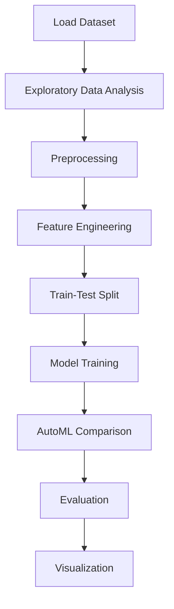

# House Price prediction


## Project Overview

**House Price prediction** is a **Regression** project in the **Regression** category.

> As these classes are written for general purpose, you can easily adapt them and/or extend them for your regression problems.

**Target variable:** `SalePrice`
**Models:** GradientBoosting, Lasso, LazyRegressor, PyCaret, RandomForest, Ridge, XGBoost

## Dataset

| Property | Value |
|----------|-------|
| Type | Tabular |
| Source | Local |
| Path | `data/house_price_prediction/train.csv` |
| Target | `SalePrice` |

```python
from core.data_loader import load_dataset
df = load_dataset('house_price_prediction')
```

## Pipeline Files

| File | Lines |
|------|-------|
| `pipeline.py` | 415 |
| `train.py` | 389 |
| `evaluate.py` | 389 |
| `House_Prices_Prediction.ipynb` | 45 code / 54 markdown cells |
| `test_house_price_prediction.py` | test suite |

## ML Workflow



## Core Logic

### Preprocessing

- Missing value imputation
- Label encoding
- One-hot encoding
- RobustScaler normalization
- Outlier removal
- Log transformation
- Train-test split

### Feature Engineering

Feature engineering steps detected in notebook code cells.

### Visualizations

- Correlation heatmap
- Histograms / distributions
- Bar charts
- Scatter plots

## Models

| Model | Type |
|-------|------|
| GradientBoosting | Ensemble / Boosting |
| Lasso | Regularized Regressor |
| LazyRegressor | AutoML Benchmark (30+ regressors) |
| PyCaret | AutoML Framework |
| RandomForest | Tree-Based |
| Ridge | Regularized Regressor |
| XGBoost | Ensemble / Boosting |

AutoML is toggled via the `USE_AUTOML` flag in pipeline scripts.
**LazyPredict** (`LazyRegressor`) benchmarks 30+ models automatically.
**PyCaret** `compare_models()` runs cross-validated comparison.

## Reproducibility

```python
random.seed(42); np.random.seed(42); os.environ['PYTHONHASHSEED'] = '42'
```

```bash
python pipeline.py --seed 123    # custom seed
python pipeline.py --reproduce   # locked seed=42
```

## Project Structure

```
Regression/House Price prediction/
  Dataset Link.pdf
  House Price Prediction.pdf
  House_Prices_Prediction.ipynb
  README.md
  evaluate.py
  pipeline.py
  submission.csv
  test_house_price_prediction.py
  train.py
```

## How to Run

```bash
cd "Regression/House Price prediction"
python pipeline.py
python train.py       # training only
python evaluate.py    # evaluation only
```

## Testing

```bash
pytest "Regression/House Price prediction/test_house_price_prediction.py" -v
```

## Setup

```bash
pip install lazypredict matplotlib numpy pandas pycaret scikit-learn seaborn xgboost
```

---
*README auto-generated from `House_Prices_Prediction.ipynb` analysis.*