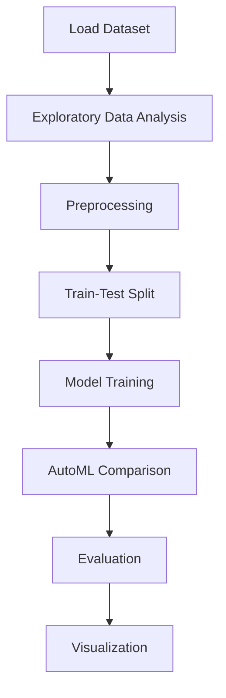

# Insurance premium prediction


## Project Overview

**Insurance premium prediction** is a **Regression** project in the **Regression** category.

> Quick automated comparison of multiple models to establish baselines.

**Target variable:** `charges`
**Models:** LazyRegressor, LinearRegression, PyCaret

## Dataset

| Property | Value |
|----------|-------|
| Type | Tabular |
| Source | Local |
| Path | `data/insurance_premium_prediction/insurance.csv` |
| Target | `charges` |

```python
from core.data_loader import load_dataset
df = load_dataset('insurance_premium_prediction')
```

## Pipeline Files

| File | Lines |
|------|-------|
| `pipeline.py` | 283 |
| `train.py` | 218 |
| `evaluate.py` | 218 |
| `predicting_insurance_premium.ipynb` | 32 code / 2 markdown cells |
| `test_insurance_premium_prediction.py` | test suite |

## ML Workflow



## Core Logic

### Preprocessing

- Missing value imputation
- StandardScaler normalization
- Train-test split

### Visualizations

- Correlation heatmap
- Histograms / distributions
- Pair plots
- Scatter plots

## Models

| Model | Type |
|-------|------|
| LazyRegressor | AutoML Benchmark (30+ regressors) |
| LinearRegression | Linear Regressor |
| PyCaret | AutoML Framework |

AutoML is toggled via the `USE_AUTOML` flag in pipeline scripts.
**LazyPredict** (`LazyRegressor`) benchmarks 30+ models automatically.
**PyCaret** `compare_models()` runs cross-validated comparison.

## Reproducibility

```python
random.seed(42); np.random.seed(42); os.environ['PYTHONHASHSEED'] = '42'
```

```bash
python pipeline.py --seed 123    # custom seed
python pipeline.py --reproduce   # locked seed=42
```

## Project Structure

```
Regression/Insurance premium prediction/
  Dataset Link.pdf
  Insurance Premium Prediction.pdf
  README.md
  evaluate.py
  pipeline.py
  predicting_insurance_premium.ipynb
  test_insurance_premium_prediction.py
  train.py
```

## How to Run

```bash
cd "Regression/Insurance premium prediction"
python pipeline.py
python train.py       # training only
python evaluate.py    # evaluation only
```

## Testing

```bash
pytest "Regression/Insurance premium prediction/test_insurance_premium_prediction.py" -v
```

## Setup

```bash
pip install lazypredict matplotlib numpy pandas pycaret scikit-learn seaborn
```

---
*README auto-generated from `predicting_insurance_premium.ipynb` analysis.*