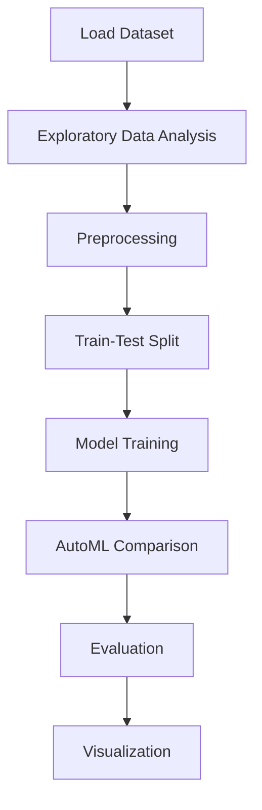

# Job Salary prediction


## Project Overview

**Job Salary prediction** is a **Regression** project in the **Regression** category.

> Quick automated comparison of multiple models to establish baselines.

**Target variable:** `SalaryNormalized`
**Models:** LazyRegressor, PyCaret, RandomForest, RandomForestRegressor

## Dataset

| Property | Value |
|----------|-------|
| Type | Tabular |
| Source | Local |
| Path | `data/job_salary_prediction/adzuna_global_job_listings_2025.csv` |
| Target | `SalaryNormalized` |

```python
from core.data_loader import load_dataset
df = load_dataset('job_salary_prediction')
```

## Pipeline Files

| File | Lines |
|------|-------|
| `pipeline.py` | 243 |
| `train.py` | 206 |
| `evaluate.py` | 206 |
| `job_salary_prediction.ipynb` | 20 code / 7 markdown cells |
| `test_job_salary_prediction.py` | test suite |

## ML Workflow



## Core Logic

### Preprocessing

- Missing value imputation
- Train-test split

### Visualizations

- Histograms / distributions

## Models

| Model | Type |
|-------|------|
| LazyRegressor | AutoML Benchmark (30+ regressors) |
| PyCaret | AutoML Framework |
| RandomForest | Tree-Based |
| RandomForestRegressor | Ensemble Regressor |

AutoML is toggled via the `USE_AUTOML` flag in pipeline scripts.
**LazyPredict** (`LazyRegressor`) benchmarks 30+ models automatically.
**PyCaret** `compare_models()` runs cross-validated comparison.

## Reproducibility

```python
random.seed(42); np.random.seed(42); os.environ['PYTHONHASHSEED'] = '42'
```

```bash
python pipeline.py --seed 123    # custom seed
python pipeline.py --reproduce   # locked seed=42
```

## Project Structure

```
Regression/Job Salary prediction/
  Dataset Link.pdf
  Job Salary Prediction.pdf
  README.md
  evaluate.py
  job_salary_prediction.ipynb
  pipeline.py
  test_job_salary_prediction.py
  train.py
```

## How to Run

```bash
cd "Regression/Job Salary prediction"
python pipeline.py
python train.py       # training only
python evaluate.py    # evaluation only
```

## Testing

```bash
pytest "Regression/Job Salary prediction/test_job_salary_prediction.py" -v
```

## Setup

```bash
pip install lazypredict matplotlib numpy pandas pycaret scikit-learn seaborn
```

---
*README auto-generated from `job_salary_prediction.ipynb` analysis.*