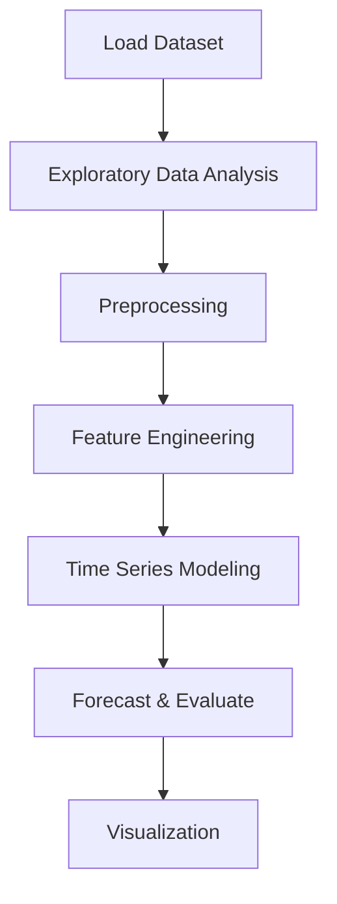

# Predicting rainfall amount


## Project Overview

**Predicting rainfall amount** is a **Time Series Forecasting** project in the **Regression** category.

> The dataset contains about 10 years of daily weather observations from different locations across Australia. Observations were drawn from numerous weather stations.

**Target variable:** `RainTomorrow`
**Models:** LSTM, NeuralNetwork

## Dataset

| Property | Value |
|----------|-------|
| Type | Timeseries |
| Source | Local |
| Path | `data/rainfall_prediction/weatherAUS.csv` |
| Target | `RainTomorrow` |

```python
from core.data_loader import load_dataset
df = load_dataset('predicting_rainfall_amount')
```

## Pipeline Files

| File | Lines |
|------|-------|
| `pipeline.py` | 380 |
| `train.py` | 337 |
| `evaluate.py` | 349 |
| `rain_prediction.ipynb` | 33 code / 16 markdown cells |
| `test_predicting_rainfall_amount.py` | test suite |

## ML Workflow



## Core Logic

### Preprocessing

- Missing value imputation
- Label encoding
- StandardScaler normalization
- Outlier removal
- Datetime feature extraction
- Train-test split

### Feature Engineering

Feature engineering steps detected in notebook code cells.

### Visualizations

- Correlation heatmap
- Count plots
- Bar charts
- Scatter plots
- Confusion matrix

## Models

| Model | Type |
|-------|------|
| LSTM | Recurrent Neural Network |
| NeuralNetwork | Neural Network |

## Reproducibility

```python
random.seed(42); np.random.seed(42); os.environ['PYTHONHASHSEED'] = '42'
```

```bash
python pipeline.py --seed 123    # custom seed
python pipeline.py --reproduce   # locked seed=42
```

## Project Structure

```
Regression/Predicting rainfall amount/
  Dataset Link.pdf
  Predicting Rainfall Amount.pdf
  README.md
  evaluate.py
  pipeline.py
  rain_prediction.ipynb
  test_predicting_rainfall_amount.py
  train.py
```

## How to Run

```bash
cd "Regression/Predicting rainfall amount"
python pipeline.py
python train.py       # training only
python evaluate.py    # evaluation only
```

## Testing

```bash
pytest "Regression/Predicting rainfall amount/test_predicting_rainfall_amount.py" -v
```

## Setup

```bash
pip install matplotlib numpy pandas scikit-learn seaborn statsmodels tensorflow
```

## Limitations

- Forecast accuracy depends on the train/test split point chosen

---
*README auto-generated from `rain_prediction.ipynb` analysis.*