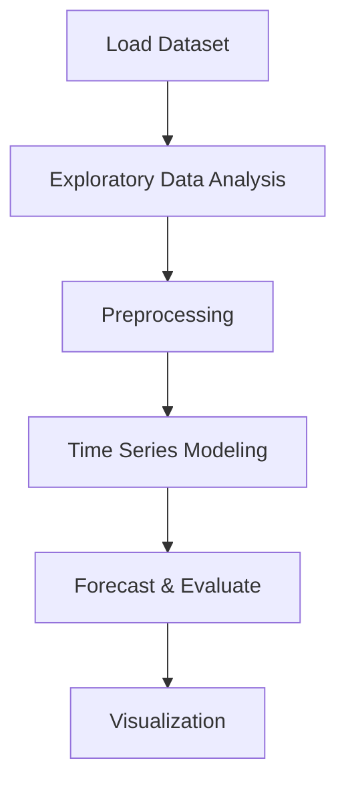

# Stock price prediction


## Project Overview

**Stock price prediction** is a **Time Series Forecasting** project in the **Regression** category.
**Target variable:** `Close`
**Models:** LinearRegression

## Dataset

| Property | Value |
|----------|-------|
| Type | Timeseries |
| Source | Local |
| Path | `data/stock_price_prediction_netflix/NFLX.csv` |
| Target | `Close` |

```python
from core.data_loader import load_dataset
df = load_dataset('stock_price_prediction')
```

## Pipeline Files

| File | Lines |
|------|-------|
| `pipeline.py` | 132 |
| `train.py` | 83 |
| `evaluate.py` | 102 |
| `netflix_stock_price_prediction.ipynb` | 15 code / 4 markdown cells |
| `test_stock_price_prediction.py` | test suite |

## ML Workflow



## Core Logic

### Preprocessing

- Missing value imputation
- Train-test split

## Models

| Model | Type |
|-------|------|
| LinearRegression | Linear Regressor |

## Reproducibility

```python
random.seed(42); np.random.seed(42); os.environ['PYTHONHASHSEED'] = '42'
```

```bash
python pipeline.py --seed 123    # custom seed
python pipeline.py --reproduce   # locked seed=42
```

## Project Structure

```
Regression/Stock price prediction/
  Dataset Link.pdf
  Netflix Stock Price Prediction.pdf
  README.md
  evaluate.py
  netflix_stock_price_prediction.ipynb
  pipeline.py
  test_stock_price_prediction.py
  train.py
```

## How to Run

```bash
cd "Regression/Stock price prediction"
python pipeline.py
python train.py       # training only
python evaluate.py    # evaluation only
```

## Testing

```bash
pytest "Regression/Stock price prediction/test_stock_price_prediction.py" -v
```

## Setup

```bash
pip install matplotlib numpy pandas scikit-learn seaborn statsmodels
```

## Limitations

- Forecast accuracy depends on the train/test split point chosen

---
*README auto-generated from `netflix_stock_price_prediction.ipynb` analysis.*