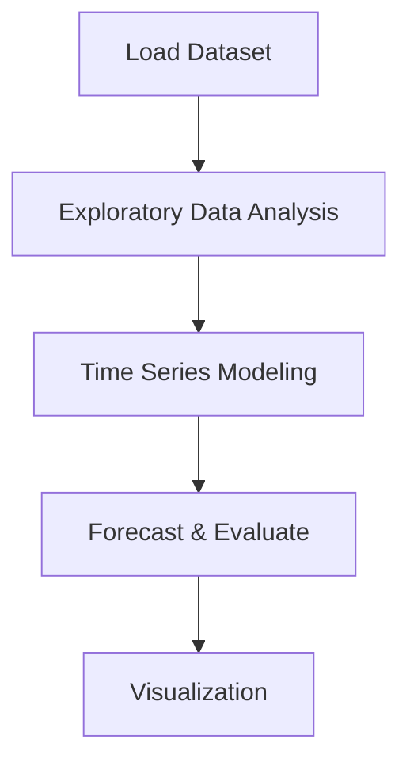

# Cryptocurrency Price Forecasting


## Project Overview

**Cryptocurrency Price Forecasting** is a **Time Series Forecasting** project in the **Time Series Analysis** category.

> Cryptocurrencies are fast becoming rivals to traditional currency across the world. The digital currencies are available to purchase in many different places, making it accessible to everyone, and with retailers accepting various cryptocurrencies it could be a sign that money as we know it is about to go through a major change.

**Target variable:** `Close`
**Models:** ARIMA, PyCaret

## Dataset

| Property | Value |
|----------|-------|
| Type | Timeseries |
| Source | Local |
| Path | `data/cryptocurrency_forecasting/data.csv` |
| Target | `Close` |

```python
from core.data_loader import load_dataset
df = load_dataset('cryptocurrency_price_forecasting')
```

## Pipeline Files

| File | Lines |
|------|-------|
| `pipeline.py` | 184 |
| `train.py` | 143 |
| `evaluate.py` | 172 |
| `code.ipynb` | 15 code / 26 markdown cells |
| `test_cryptocurrency_price_forecasting.py` | test suite |

## ML Workflow



## Core Logic

### Visualizations

- ACF / PACF plots
- Decomposition plot

## Models

| Model | Type |
|-------|------|
| ARIMA | Autoregressive Time Series |
| PyCaret | AutoML Framework |

## Reproducibility

```python
random.seed(42); np.random.seed(42); os.environ['PYTHONHASHSEED'] = '42'
```

```bash
python pipeline.py --seed 123    # custom seed
python pipeline.py --reproduce   # locked seed=42
```

## Project Structure

```
Time Series Analysis/Cryptocurrency Price Forecasting/
  Cryptocurrency price forecasting.pdf
  README.md
  code.ipynb
  data.csv
  evaluate.py
  guideline.txt
  pipeline.py
  test_cryptocurrency_price_forecasting.py
  train.py
```

## How to Run

```bash
cd "Time Series Analysis/Cryptocurrency Price Forecasting"
python pipeline.py
python train.py       # training only
python evaluate.py    # evaluation only
```

## Testing

```bash
pytest "Time Series Analysis/Cryptocurrency Price Forecasting/test_cryptocurrency_price_forecasting.py" -v
```

## Setup

```bash
pip install matplotlib numpy pandas pycaret scikit-learn seaborn statsmodels
```

## Limitations

- Forecast accuracy depends on the train/test split point chosen

---
*README auto-generated from `code.ipynb` analysis.*