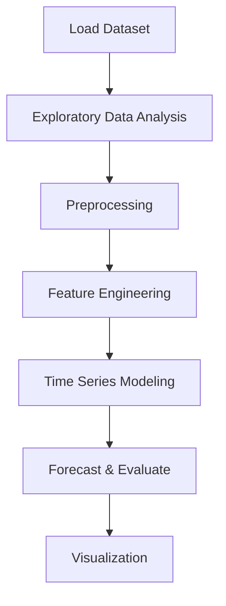

# Gold Price Forecasting


## Project Overview

**Gold Price Forecasting** is a **Time Series Forecasting** project in the **Time Series Analysis** category.

> Importing libraries and reading data from csv file

**Target variable:** `Adj Close`

## Dataset

| Property | Value |
|----------|-------|
| Type | Timeseries |
| Source | Local |
| Path | `data/gold_price_forecasting/data.csv` |
| Target | `Adj Close` |

```python
from core.data_loader import load_dataset
df = load_dataset('gold_price_forecasting')
```

## Pipeline Files

| File | Lines |
|------|-------|
| `pipeline.py` | 197 |
| `code.ipynb` | 15 code / 20 markdown cells |
| `test_gold_price_forecasting.py` | test suite |

## ML Workflow



## Core Logic

### Preprocessing

- Datetime feature extraction

### Feature Engineering

Feature engineering steps detected in notebook code cells.

### Visualizations

- Correlation heatmap

## Models

This project focuses on exploratory data analysis without explicit ML modeling.

## Reproducibility

```python
random.seed(42); np.random.seed(42); os.environ['PYTHONHASHSEED'] = '42'
```

```bash
python pipeline.py --seed 123    # custom seed
python pipeline.py --reproduce   # locked seed=42
```

## Project Structure

```
Time Series Analysis/Gold Price Forecasting/
  Gold Price Forecasting.pdf
  README.md
  code.ipynb
  data.csv
  guideline.txt
  pipeline.py
  test_gold_price_forecasting.py
```

## How to Run

```bash
cd "Time Series Analysis/Gold Price Forecasting"
python pipeline.py
```

## Testing

```bash
pytest "Time Series Analysis/Gold Price Forecasting/test_gold_price_forecasting.py" -v
```

## Setup

```bash
pip install matplotlib numpy pandas scikit-learn seaborn statsmodels
```

## Limitations

- Forecast accuracy depends on the train/test split point chosen

---
*README auto-generated from `code.ipynb` analysis.*