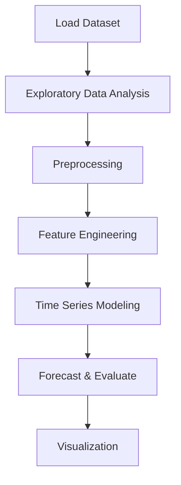

# Mini-Course Sales Forecasting


## Project Overview

**Mini-Course Sales Forecasting** is a **Time Series Forecasting** project in the **Time Series Analysis** category.

> In this notebook, we have to forecast sales of each product from each store in each country in the entirety of 2022. We are using historical data from January 1st, 2017 until December 31st, 2021 to train our models.

**Target variable:** `id`
**Models:** GradientBoosting, Lasso, LightGBM, RandomForest, Ridge, XGBoost

## Dataset

| Property | Value |
|----------|-------|
| Type | Timeseries |
| Source | Local |
| Path | `data/mini_course_sales_forecasting/train.csv` |
| Target | `id` |

```python
from core.data_loader import load_dataset
df = load_dataset('mini_course_sales_forecasting')
```

## Pipeline Files

| File | Lines |
|------|-------|
| `pipeline.py` | 367 |
| `evaluate.py` | 308 |
| `code.ipynb` | 24 code / 44 markdown cells |
| `test_minicourse_sales_forecasting.py` | test suite |

## ML Workflow



## Core Logic

### Preprocessing

- Missing value imputation
- One-hot encoding
- StandardScaler normalization
- MinMaxScaler normalization
- Log transformation
- Datetime feature extraction

### Feature Engineering

Feature engineering steps detected in notebook code cells.

### Visualizations

- Count plots
- ROC curve
- Dendrogram

### Helper Functions

- `smape()`
- `multipliers()`

## Models

| Model | Type |
|-------|------|
| GradientBoosting | Ensemble / Boosting |
| Lasso | Regularized Regressor |
| LightGBM | Ensemble / Boosting |
| RandomForest | Tree-Based |
| Ridge | Regularized Regressor |
| XGBoost | Ensemble / Boosting |

## Reproducibility

```python
random.seed(42); np.random.seed(42); os.environ['PYTHONHASHSEED'] = '42'
```

```bash
python pipeline.py --seed 123    # custom seed
python pipeline.py --reproduce   # locked seed=42
```

## Project Structure

```
Time Series Analysis/Mini-Course Sales Forecasting/
  Mini course sales forecasting.pdf
  README.md
  code.ipynb
  data/
  evaluate.py
  guideline.txt
  pipeline.py
  test_minicourse_sales_forecasting.py
```

## How to Run

```bash
cd "Time Series Analysis/Mini-Course Sales Forecasting"
python pipeline.py
python evaluate.py    # evaluation only
```

## Testing

```bash
pytest "Time Series Analysis/Mini-Course Sales Forecasting/test_minicourse_sales_forecasting.py" -v
```

## Setup

```bash
pip install lightgbm matplotlib numpy pandas scikit-learn seaborn statsmodels xgboost
```

## Limitations

- Forecast accuracy depends on the train/test split point chosen

---
*README auto-generated from `code.ipynb` analysis.*