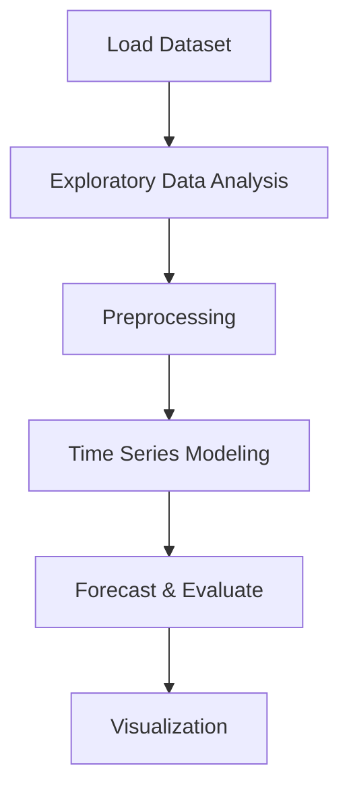

# Smart Home_s Temperature Forecasting


## Project Overview

**Smart Home_s Temperature Forecasting** is a **Time Series Forecasting** project in the **Time Series Analysis** category.

> Reading train and test data set from CSV file

**Target variable:** `Indoor_temperature_room`
**Models:** RandomForest

## Dataset

| Property | Value |
|----------|-------|
| Type | Timeseries |
| Source | Local |
| Path | `data/smart_home_temperature/train.csv` |
| Target | `Indoor_temperature_room` |

```python
from core.data_loader import load_dataset
df = load_dataset('smart_home_s_temperature_forecasting')
```

## Pipeline Files

| File | Lines |
|------|-------|
| `pipeline.py` | 101 |
| `code.ipynb` | 14 code / 17 markdown cells |
| `test_smart_home_s_temperature_forecasting.py` | test suite |

## ML Workflow



## Core Logic

### Preprocessing

- Missing value imputation
- Label encoding
- One-hot encoding
- StandardScaler normalization
- Train-test split

### Visualizations

- Correlation heatmap
- Histograms / distributions

## Models

| Model | Type |
|-------|------|
| RandomForest | Tree-Based |

## Reproducibility

```python
random.seed(42); np.random.seed(42); os.environ['PYTHONHASHSEED'] = '42'
```

```bash
python pipeline.py --seed 123    # custom seed
python pipeline.py --reproduce   # locked seed=42
```

## Project Structure

```
Time Series Analysis/Smart Home_s Temperature Forecasting/
  README.md
  Smart homes temperature forecasting.pdf
  code.ipynb
  data/
  guideline.txt
  pipeline.py
  test_smart_home_s_temperature_forecasting.py
```

## How to Run

```bash
cd "Time Series Analysis/Smart Home_s Temperature Forecasting"
python pipeline.py
```

## Testing

```bash
pytest "Time Series Analysis/Smart Home_s Temperature Forecasting/test_smart_home_s_temperature_forecasting.py" -v
```

## Setup

```bash
pip install matplotlib numpy pandas scikit-learn seaborn statsmodels
```

## Limitations

- Forecast accuracy depends on the train/test split point chosen

---
*README auto-generated from `code.ipynb` analysis.*