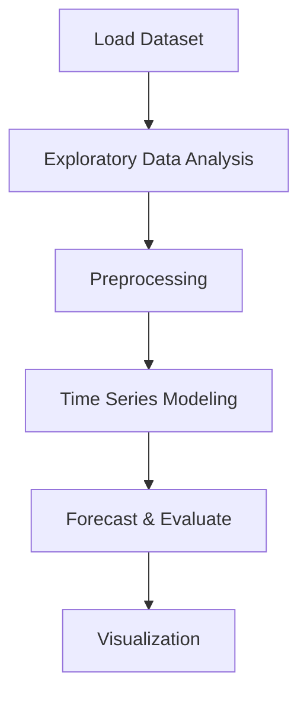

# Solar Power Generation Forecasting


## Project Overview

**Solar Power Generation Forecasting** is a **Time Series Forecasting** project in the **Time Series Analysis** category.

> The code reads two CSV files, one for the generation data and another for the weather sensor data of "Plant 1". It drops the 'PLANT_ID' column from both datasets and converts the 'DATE_TIME' column to a datetime format for proper date handling.

**Models:** PyCaret

## Dataset

| Property | Value |
|----------|-------|
| Type | Timeseries |
| Source | Local |
| Path | `data/solar_power_forecasting/Plant_1_Generation_Data.csv` |

```python
from core.data_loader import load_dataset
df = load_dataset('solar_power_generation_forecasting')
```

## Pipeline Files

| File | Lines |
|------|-------|
| `pipeline.py` | 238 |
| `train.py` | 238 |
| `evaluate.py` | 238 |
| `code.ipynb` | 15 code / 26 markdown cells |
| `test_solar_power_generation_forecasting.py` | test suite |

## ML Workflow



## Core Logic

### Preprocessing

- Datetime feature extraction

## Models

| Model | Type |
|-------|------|
| PyCaret | AutoML Framework |

## Reproducibility

```python
random.seed(42); np.random.seed(42); os.environ['PYTHONHASHSEED'] = '42'
```

```bash
python pipeline.py --seed 123    # custom seed
python pipeline.py --reproduce   # locked seed=42
```

## Project Structure

```
Time Series Analysis/Solar Power Generation Forecasting/
  README.md
  Solar power generation forecasting.pdf
  code.ipynb
  data/
  evaluate.py
  guideline.txt
  pipeline.py
  test_solar_power_generation_forecasting.py
  train.py
```

## How to Run

```bash
cd "Time Series Analysis/Solar Power Generation Forecasting"
python pipeline.py
python train.py       # training only
python evaluate.py    # evaluation only
```

## Testing

```bash
pytest "Time Series Analysis/Solar Power Generation Forecasting/test_solar_power_generation_forecasting.py" -v
```

## Setup

```bash
pip install matplotlib numpy pandas pycaret scikit-learn seaborn statsmodels
```

## Limitations

- Forecast accuracy depends on the train/test split point chosen

---
*README auto-generated from `code.ipynb` analysis.*