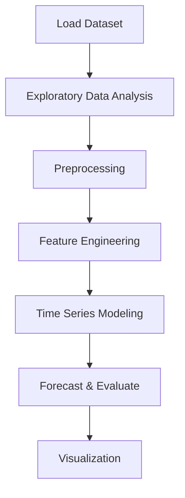

# Store Item Demand Forecasting


## Project Overview

**Store Item Demand Forecasting** is a **Time Series Forecasting** project in the **Time Series Analysis** category.

> The code reads two CSV files, 'train.csv' and 'test.csv', and parses the 'date' column as dates during the reading process. It then concatenates the data from both files into a single DataFrame 'df', stacking them vertically. The 'head()' function is used to display the first few rows of the combined DataFrame.

**Target variable:** `sales`
**Models:** ARIMA, LightGBM, PyCaret

## Dataset

| Property | Value |
|----------|-------|
| Type | Timeseries |
| Source | Local |
| Path | `data/store_item_demand_forecasting/train.csv` |
| Target | `sales` |

```python
from core.data_loader import load_dataset
df = load_dataset('store_item_demand_forecasting')
```

## Pipeline Files

| File | Lines |
|------|-------|
| `pipeline.py` | 249 |
| `train.py` | 220 |
| `evaluate.py` | 220 |
| `code.ipynb` | 29 code / 33 markdown cells |
| `test_store_item_demand_forecasting.py` | test suite |

## ML Workflow



## Core Logic

### Preprocessing

- One-hot encoding
- Log transformation
- Datetime feature extraction

### Feature Engineering

Feature engineering steps detected in notebook code cells.

### Visualizations

- Decomposition plot

### Helper Functions

- `random_noise()`
- `lag_features()`
- `roll_mean_features()`
- `ewm_features()`
- `smape()`
- `lgbm_smape()`

## Models

| Model | Type |
|-------|------|
| ARIMA | Autoregressive Time Series |
| LightGBM | Ensemble / Boosting |
| PyCaret | AutoML Framework |

## Reproducibility

```python
random.seed(42); np.random.seed(42); os.environ['PYTHONHASHSEED'] = '42'
```

```bash
python pipeline.py --seed 123    # custom seed
python pipeline.py --reproduce   # locked seed=42
```

## Project Structure

```
Time Series Analysis/Store Item Demand Forecasting/
  README.md
  Store Item Demand Forecasting.pdf
  code.ipynb
  data/
  evaluate.py
  guideline.txt
  pipeline.py
  test_store_item_demand_forecasting.py
  train.py
```

## How to Run

```bash
cd "Time Series Analysis/Store Item Demand Forecasting"
python pipeline.py
python train.py       # training only
python evaluate.py    # evaluation only
```

## Testing

```bash
pytest "Time Series Analysis/Store Item Demand Forecasting/test_store_item_demand_forecasting.py" -v
```

## Setup

```bash
pip install lightgbm matplotlib numpy pandas pycaret scikit-learn seaborn statsmodels
```

## Limitations

- Forecast accuracy depends on the train/test split point chosen

---
*README auto-generated from `code.ipynb` analysis.*