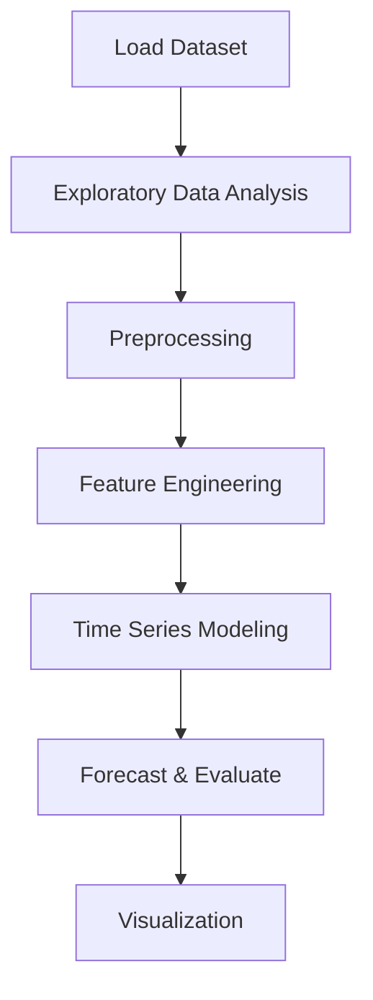

# Weather Forecasting


## Project Overview

**Weather Forecasting** is a **Time Series Forecasting** project in the **Time Series Analysis** category.

> The code creates a heatmap to visualize missing values in the DataFrame "df" and prints the percentage of missing values for each column in descending order. This helps to identify the columns with the highest percentage of missing data.

**Target variable:** `Next_Tmax`

## Dataset

| Property | Value |
|----------|-------|
| Type | Timeseries |
| Source | Local |
| Path | `data/weather_forecasting/data.csv` |
| Target | `Next_Tmax` |

```python
from core.data_loader import load_dataset
df = load_dataset('weather_forecasting')
```

## Pipeline Files

| File | Lines |
|------|-------|
| `pipeline.py` | 187 |
| `train.py` | 154 |
| `evaluate.py` | 154 |
| `code.ipynb` | 20 code / 23 markdown cells |
| `test_weather_forecasting.py` | test suite |

## ML Workflow



## Core Logic

### Preprocessing

- Missing value imputation
- StandardScaler normalization
- Train-test split

### Feature Engineering

Feature engineering steps detected in notebook code cells.

### Visualizations

- Correlation heatmap

### Helper Functions

- `feature_engineering()`
- `imputation()`
- `encodage()`
- `preprocessing()`

## Models

This project focuses on exploratory data analysis without explicit ML modeling.

## Reproducibility

```python
random.seed(42); np.random.seed(42); os.environ['PYTHONHASHSEED'] = '42'
```

```bash
python pipeline.py --seed 123    # custom seed
python pipeline.py --reproduce   # locked seed=42
```

## Project Structure

```
Time Series Analysis/Weather Forecasting/
  README.md
  Weather forecasting.pdf
  code.ipynb
  data.csv
  evaluate.py
  guideline.txt
  pipeline.py
  test_weather_forecasting.py
  train.py
```

## How to Run

```bash
cd "Time Series Analysis/Weather Forecasting"
python pipeline.py
python train.py       # training only
python evaluate.py    # evaluation only
```

## Testing

```bash
pytest "Time Series Analysis/Weather Forecasting/test_weather_forecasting.py" -v
```

## Setup

```bash
pip install matplotlib numpy pandas scikit-learn seaborn statsmodels
```

## Limitations

- Forecast accuracy depends on the train/test split point chosen

---
*README auto-generated from `code.ipynb` analysis.*